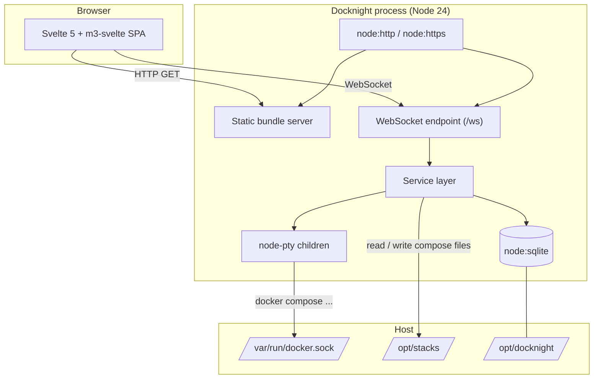

# Foundation and Runtime - Spec Proposal

| Item       | Detail                           |
|------------|----------------------------------|
| Author     | heavycaffeiner(Dong Hyun Kim)    |
| Created    | 2026-08-09                       |
| Status     | **Draft** / In Review / Approved |
| Reviewers  |                                  |

---

## 1. Summary

Docknight is a self-hosted web manager for `docker compose` stacks. This proposal defines the
foundation every other Docknight proposal builds on: the repository layout, the build and package
toolchain, process configuration, the data directory, the SQLite store with its migration runner,
logging, HTTP serving, the startup and shutdown sequence, and the container image. It contains no
user-facing feature; it is the substrate that proposals 1 through 7 assume.

## 2. Background & Motivation

Running a handful of compose stacks on one host is easy from a shell and stops being easy the moment
there are twenty of them, or the moment the person operating them is not at a terminal. The usual
answers are either a general container dashboard that treats compose as an afterthought, or a
platform that imports the stacks into its own database and becomes the only way to touch them again.

Docknight takes a narrower position. A stack is a directory containing a compose file. Docknight
reads and writes those files in place and shells out to the `docker compose` CLI to act on them, so
everything remains fully operable from a shell with Docknight stopped. That property is the product
decision that constrains this proposal: nothing may become authoritative in the database that also
exists on disk.

Three consequences follow, and this document fixes all three.

- The process is small and long-lived: one Node process serving a browser client, one embedded
  database holding only what has no file to live in, and short-lived child processes doing the actual
  container work. There is no queue, no worker, no cache tier.
- The database is a configuration store, not a system of record. Five tables, a few dozen rows, and
  no query that a prepared statement cannot express. Anything heavier than an embedded engine would
  be infrastructure that the application does not earn.
- Failure handling matters more than throughput. The operations Docknight performs are destructive:
  overwriting a compose file, removing a stack directory, restarting a running service. A design that
  is fast but truncates a file on a full disk is worse than useless, so atomic writes, explicit
  timeouts, and an ordered shutdown are foundation-level requirements rather than later hardening.

## 3. Goals & Non-Goals

### 3.1 Goals

- [ ] Define a single-package repository layout with `backend/`, `frontend/`, and `common/` sources
      building to one deployable artifact.
- [ ] Fix the toolchain: Node 24 LTS, TypeScript 7, pnpm, Vite, Svelte 5, m3-svelte.
- [ ] Define process configuration precedence (CLI argument, environment variable, default) and the
      full list of configuration keys.
- [ ] Define the data directory layout and its creation and validation rules.
- [ ] Define the SQLite schema, the migration runner, and the connection settings.
- [ ] Define the logging module, its levels, and its redaction rule.
- [ ] Define HTTP serving of the built frontend, the SPA fallback route, and optional TLS.
- [ ] Define startup ordering, the periodic refresh timer, and graceful shutdown.
- [ ] Define the container image, its healthcheck, and PUID/PGID file ownership handling.
- [ ] Define the version check that feeds `latestVersion` into the `info` event.
- [ ] Define the self upgrade: how the running container is replaced with a newer image, and the two
      methods that drive it.

### 3.2 Non-Goals

- [ ] Any WebSocket message, authentication rule, stack operation, terminal, agent link, or UI
      screen. Those belong to proposals 1 through 7.
- [ ] Database backends other than SQLite. No feature in this project needs a server database, and
      supporting a second engine doubles the migration surface for no gain.
- [ ] Windows and macOS as deployment targets. Development on Windows is expected to work through a
      Linux container or WSL, but is not supported or tested.
- [ ] Native Podman API integration. Podman compatibility is achieved through `podman-docker`, which
      provides a `docker` shim on `PATH`.
- [ ] Clustering, horizontal scaling, or multiple Docknight processes sharing one data directory.

## 4. Technical Design

### 4.1 Architecture Overview

One Node process serves everything: the static frontend bundle, the WebSocket endpoint, the SQLite
store, and the child processes that drive `docker compose`.



Source layout, one pnpm package at the repository root:

```
docknight/
  package.json            single manifest, single lockfile (pnpm-lock.yaml)
  tsconfig.json           strict, module nodenext, target es2024
  vite.config.ts          frontend build only
  common/                 code imported by both sides: protocol types, compose helpers, constants
  backend/
    index.ts              entry point
    server.ts             process wiring and lifecycle
    config.ts             argument and environment parsing
    db/
      index.ts            connection, pragmas, statement helpers
      migrations/         NNN-name.ts, applied in numeric order
    log.ts
    ...                   modules introduced by proposals 1 to 5
  frontend/
    index.html
    src/                  Svelte application, see proposals 6 and 7
    public/
  docker/
    Dockerfile
    healthcheck.ts
  docs/proposals/         these documents
```

`common/` may not import from `backend/` or `frontend/`, and may not use Node-only APIs. This is
enforced by an ESLint `no-restricted-imports` rule rather than by separate packages, because the
whole tree compiles as one project.

Build outputs:

- `dist/frontend/` from `vite build`, containing hashed assets plus `index.html`.
- The backend is not bundled. It is executed by Node directly from TypeScript sources through the
  type-stripping runtime, so no separate backend build step exists. See section 6.2 for the
  toolchain constraint this places on backend code.

### 4.2 Data Model Changes

New database, created on first start at `${dataDir}/docknight.db`.

Migration `001-initial`:

```sql
CREATE TABLE setting (
    key   TEXT PRIMARY KEY,
    value TEXT NOT NULL,           -- JSON encoded
    type  TEXT                     -- grouping tag, e.g. 'general'
) STRICT;

CREATE TABLE user (
    id             INTEGER PRIMARY KEY,
    username       TEXT NOT NULL UNIQUE,
    password_hash  TEXT NOT NULL,   -- scrypt, see proposal 2
    active         INTEGER NOT NULL DEFAULT 1,
    totp_secret    TEXT,            -- base32, NULL until 2FA is set up
    totp_enabled   INTEGER NOT NULL DEFAULT 0,
    totp_last_step INTEGER          -- last accepted RFC 6238 counter, replay guard
) STRICT;

CREATE TABLE session (
    id           INTEGER PRIMARY KEY,
    user_id      INTEGER NOT NULL REFERENCES user(id) ON DELETE CASCADE,
    token_hash   TEXT NOT NULL UNIQUE,
    created_at   INTEGER NOT NULL,  -- unix seconds
    last_used_at INTEGER NOT NULL,
    expires_at   INTEGER NOT NULL
) STRICT;

CREATE INDEX session_user_id ON session(user_id);

CREATE TABLE agent (
    id       INTEGER PRIMARY KEY,
    url      TEXT NOT NULL UNIQUE,
    username TEXT NOT NULL,
    secret   TEXT NOT NULL,        -- AES-256-GCM ciphertext, see proposal 5
    name     TEXT,
    active   INTEGER NOT NULL DEFAULT 1
) STRICT;
```

The bookkeeping table is not part of any migration, because the runner has to read it before it can
apply the first one. The runner creates it directly, before the first migration and idempotently:

```sql
CREATE TABLE IF NOT EXISTS migration (
    version    INTEGER PRIMARY KEY,
    name       TEXT NOT NULL,
    applied_at INTEGER NOT NULL
) STRICT;
```

Schema decisions worth stating, because later work depends on them:

- `setting.key` is the primary key. There is no surrogate identifier, because nothing references a
  setting row.
- The TOTP replay guard stores the accepted RFC 6238 counter step, not the accepted code. A counter
  comparison stays correct across a secret change and rejects a code replayed inside its own window;
  comparing the previous code does neither.
- `session` exists so that revocation is a delete. Password change removes every row for the user,
  and a single device can be signed out without touching the others.
- `agent.secret` holds an encrypted password rather than a hash, because the value has to be replayed
  when connecting to that agent. Encryption is specified in proposal 5.
- There is no table for stacks. Stacks are directories and the filesystem is authoritative.

### 4.3 Core Logic

#### 4.3.1 Configuration

`backend/config.ts` exports `loadConfig(argv: string[], env: NodeJS.ProcessEnv): Config`. Precedence
is CLI argument, then environment variable, then default. Unknown CLI arguments are a fatal error;
unknown environment variables are ignored.

| Config key         | CLI                    | Environment                   | Default                | Notes                                                    |
|--------------------|------------------------|-------------------------------|------------------------|----------------------------------------------------------|
| `port`             | `--port`               | `DOCKNIGHT_PORT`              | `5001`                 | 1 to 65535                                               |
| `hostname`         | `--hostname`           | `DOCKNIGHT_HOSTNAME`          | unset, binds all       |                                                          |
| `dataDir`          | `--data-dir`           | `DOCKNIGHT_DATA_DIR`          | `/app/data`            | resolved to an absolute path                             |
| `stacksDir`        | `--stacks-dir`         | `DOCKNIGHT_STACKS_DIR`        | `/opt/stacks`          | resolved to an absolute path                             |
| `enableConsole`    | `--enable-console`     | `DOCKNIGHT_ENABLE_CONSOLE`    | `false`                | host shell, see proposal 4                               |
| `sslKey`           | `--ssl-key`            | `DOCKNIGHT_SSL_KEY`           | unset                  | requires `sslCert`                                       |
| `sslCert`          | `--ssl-cert`           | `DOCKNIGHT_SSL_CERT`          | unset                  | requires `sslKey`                                        |
| `sslKeyPassphrase` | `--ssl-key-passphrase` | `DOCKNIGHT_SSL_KEY_PASSPHRASE`| unset                  |                                                          |
| `logLevel`         | `--log-level`          | `DOCKNIGHT_LOG_LEVEL`         | `info`                 | `debug`, `info`, `warn`, `error`                          |
| `puid` / `pgid`    | none                   | `PUID` / `PGID`               | unset                  | both must be set to take effect                          |

Validation rules, all of which abort startup with a non-zero exit when violated:

- `port` parses as an integer in range.
- Exactly zero or both of `sslKey` and `sslCert` are set.
- `dataDir` and `stacksDir`, after resolution, are not equal and neither is a parent of the other.
  A user who points both at one directory would otherwise see the database file treated as a stack
  candidate on every scan.
- `PUID` and `PGID`, when set, both parse as non-negative integers.

`Config` is frozen after construction and passed explicitly to every module that needs it. No module
reads `process.env` outside `config.ts`.

#### 4.3.2 Data directory

On startup, in this order:

1. `mkdir -p ${dataDir}`.
2. `lstat` the result. If it is not a directory, abort.
3. Write and delete a probe file `${dataDir}/.write-probe` to confirm the directory is writable.
   Abort on failure with a message naming the path. A read-only bind mount is the most common
   deployment mistake and a later SQLite error does not name the cause clearly.
4. `mkdir -p ${stacksDir}` and repeat steps 2 and 3 for it.

The data directory holds:

```
/app/data/                inside the container, backed by /opt/docknight on the host
  docknight.db          SQLite database
  docknight.db-wal      WAL, present while running
  docknight.db-shm
  agent-key             32 random bytes, mode 0600, see proposal 5
```

`/opt/docknight` is the application's directory on the host, in the same sense that `/opt/stacks` is
the stacks directory, and it is bind-mounted to `/app/data` inside the container. The two paths
differ on purpose: the container path is an implementation detail of the image, and nothing outside
the process ever reads these files, so there is no reason to constrain the host to name the directory
the same way.

The host directory also holds the operator's own `compose.yaml`, the file that deploys Docknight.
Docknight creates and reads only the four files above plus its write probe; it never enumerates the
directory, so anything else kept there is untouched.

`/opt/stacks` is the opposite case and is covered in 4.3.9: it must carry the identical path inside
and outside the container.

The configuration rule in 4.3.1 already forbids `dataDir` and `stacksDir` from overlapping, so the
default pair `/app/data` and `/opt/stacks` is valid and a deployment that points both at one path is
rejected at startup.

Both defaults are absolute paths because the deployed form is a container. A development run outside
one cannot create them without privileges, so the development scripts pass `--data-dir` and
`--stacks-dir` pointing into the working tree. That is a script argument, not a second default.

#### 4.3.3 Database access

`backend/db/index.ts` opens a single `DatabaseSync` from `node:sqlite`. One connection, no pool: the
process is single-threaded and SQLite serialises writes regardless.

Pragmas applied at open, in order:

```
PRAGMA journal_mode = WAL;
PRAGMA foreign_keys = ON;
PRAGMA synchronous = NORMAL;
PRAGMA busy_timeout = 5000;
```

WAL with `synchronous = NORMAL` survives a process crash without corruption and survives a host power
loss with at most the last transaction lost, which is the correct trade for settings and session
rows.

The module exports prepared-statement helpers rather than a query builder:

```ts
/** Run a statement that returns no rows. Throws SqliteError on constraint violation. */
export function run(sql: string, params?: Record<string, SQLInputValue>): void;

/** Return the first row, or undefined when the statement matches nothing. */
export function one<T>(sql: string, params?: Record<string, SQLInputValue>): T | undefined;

/** Return all matching rows. */
export function all<T>(sql: string, params?: Record<string, SQLInputValue>): T[];

/** Run fn inside an IMMEDIATE transaction. Commits on return, rolls back on throw. */
export function tx<T>(fn: () => T): T;
```

All parameters are bound. String concatenation into SQL is forbidden and is caught by an ESLint rule
on template literals passed to these four functions.

#### 4.3.4 Migration runner

Migrations are TypeScript modules in `backend/db/migrations/`, named `NNN-kebab-name.ts`, each
exporting `up(db: DatabaseSync): void`. There is no `down`. Downgrades are handled by restoring a
backup of the data directory, which is the only thing that reliably works once a release has been
running.

```
runMigrations(db):
    CREATE TABLE IF NOT EXISTS migration (...)      # the runner's own bookkeeping, not a migration
    applied  := set of versions in the migration table
    modules  := import.meta.glob of ./migrations/*.ts, sorted ascending by NNN
    if any version in applied is absent from modules:
        log a warning naming the versions and continue   # older binary against a newer database
    for module in modules where module.version not in applied:
        BEGIN IMMEDIATE
        module.up(db)
        INSERT INTO migration(version, name, applied_at) VALUES (...)
        COMMIT                                            # rollback and rethrow on any error
        log info "applied migration NNN-name"
```

A migration that throws aborts startup. Partial application is impossible because DDL in SQLite is
transactional.

#### 4.3.5 Logging

`backend/log.ts` exports `log.debug|info|warn|error(scope: string, ...args: unknown[])`. One line per
call on stdout for `debug` and `info`, stderr for `warn` and `error`:

```
2026-08-09T11:02:31.004Z INFO  [server] listening on 0.0.0.0:5001
```

Level filtering comes from `config.logLevel`. Values are formatted with `node:util`'s `inspect` at
depth 3. Two rules the module enforces by construction:

- Any object passed through is scanned for keys matching `/pass|secret|token|authorization/i` and
  those values are replaced with `"[redacted]"` before formatting. Callers cannot leak a credential
  by logging a request object.
- The logger never throws. A formatting failure logs the raw string form and continues.

#### 4.3.6 HTTP serving

`node:http`, or `node:https` when both TLS options are set. Three handlers, in order:

1. `GET /robots.txt` returns `User-agent: *\nDisallow: /` as `text/plain`.
2. Static files from `dist/frontend/`. Hashed assets get `Cache-Control: public, max-age=31536000,
   immutable`; `index.html` gets `Cache-Control: no-cache`. Pre-compressed `.br` and `.gz` neighbours
   are served when the request's `Accept-Encoding` allows.
3. Any other `GET` returns `index.html` with status 200, so client-side routes deep-link correctly.
   Non-`GET` methods that reach this point return 405.

Security headers on every response: `X-Content-Type-Options: nosniff`, `Referrer-Policy: same-origin`,
`X-Frame-Options: SAMEORIGIN`.

The WebSocket upgrade on `/ws` is claimed before the static handler and is specified in proposal 1.

#### 4.3.7 Startup and shutdown

```
main():
    config := loadConfig(process.argv, process.env)
    initLogging(config.logLevel)
    prepareDirectories(config)              # 4.3.2
    db := openDatabase(config)              # 4.3.3
    runMigrations(db)                       # 4.3.4
    needSetup := (SELECT count(*) FROM user) == 0
    services := buildServices(config, db)   # proposals 2 to 5
    server := createHttpServer(config, services)
    server.listen(config.port, config.hostname)
    services.stacks.startRefreshTimer()     # proposal 3, every 10 s
    startVersionCheck(config)               # 4.3.10, every 48 h
    installSignalHandlers(server, services)
```

`installSignalHandlers` binds `SIGINT` and `SIGTERM` to a shutdown that runs at most once:

```
shutdown(signal):
    log info "shutdown requested by " + signal
    stop accepting new connections
    stop the refresh timer and the version check timer
    close every WebSocket with code 1001                                # proposal 1
    terminate every managed pty child, SIGTERM then SIGKILL after 5 s   # proposal 4
    close every outbound agent link                                     # proposal 5
    PRAGMA wal_checkpoint(TRUNCATE); close the database
    exit 0
    # a hard 30 s timer calls process.exit(1) if any step hangs
```

The order is load-bearing: children are terminated before the database closes, so a child that
triggers a write during teardown cannot hit a closed handle.

`unhandledRejection` and `uncaughtException` are logged with a stack trace and do not exit the
process. A single failed compose command must not take down a manager that other stacks depend on.

#### 4.3.8 File ownership (PUID / PGID)

When both `PUID` and `PGID` are set, every directory and file Docknight creates inside `stacksDir` is
`chown`ed to that uid and gid immediately after creation, before the operation reports success. The
process itself keeps running as whatever user started it. This exists so that compose files written
by a root-run container remain editable by the host user.

#### 4.3.9 Container image

The base is `node:24-alpine`, in three stages:

1. `frontend`, pinned to `$BUILDPLATFORM`: `pnpm install --frozen-lockfile --ignore-scripts` and
   `pnpm build:frontend`. The bundle is architecture-independent, so building it natively keeps it
   out of the emulator when the target platform differs from the builder's.
2. `deps`, on the target platform: production dependencies only. node-pty publishes prebuilds linked
   against glibc, so on musl it is compiled from source, which is what `apk add python3 make g++` and
   `npm_config_build_from_source=true` are for.
3. `runtime`: `apk add docker-cli docker-cli-compose`, the application sources, `node_modules` from
   `deps`, and `dist/frontend/` from `frontend`.

Image contract:

- `EXPOSE 5001`.
- `VOLUME /app/data`.
- `HEALTHCHECK` runs a small script that opens a TCP connection to the configured port and exits
  non-zero on failure. It performs no authentication and touches no application state.
- `DOCKNIGHT_IS_CONTAINER=1` is set. The server reads it and reports it in the `info` event.
- Published to `ghcr.io/heavycaffeiner/docknight` for `linux/amd64` and `linux/arm64`.

CI builds the image on every commit and every pull request, and pushes only on a push to a branch of
this repository. A pull request from a fork has no write token, so gating the registry login and the
push on the event keeps the build itself running there rather than failing at the login step.

The reference deployment lives in `/opt/docknight` on the host and looks like this:

```yaml
services:
  docknight:
    image: ghcr.io/heavycaffeiner/docknight:latest
    restart: unless-stopped
    ports:
      - 5001:5001
    volumes:
      - /var/run/docker.sock:/var/run/docker.sock
      - /opt/docknight:/app/data
      - /opt/stacks:/opt/stacks
    environment:
      - DOCKNIGHT_STACKS_DIR=/opt/stacks
```

The two bind mounts follow different rules and the difference is not cosmetic.

`/opt/stacks` must carry the identical path on both sides. Compose files reference host paths and the
daemon resolves them on the host, so a stacks directory mounted at a different path inside the
container makes every relative bind mount in every managed stack resolve somewhere else, silently and
without an error. The startup checks cannot detect this, which is why it is stated here and in the
deployment documentation.

`/opt/docknight` to `/app/data` may differ freely. Nothing outside the process reads the database or
the key file, so the container path is an implementation detail of the image and the host path is the
operator's choice.

#### 4.3.10 Version check

The running version is compared against a published manifest so that the interface can say a newer
release exists. It is a single `fetch` on a timer and holds no other responsibility.

```
startVersionCheck(config):
    check(config)                              # once at startup
    every 48 hours: check(config)

check(config):
    if Settings.get("checkUpdate") is false: return
    manifest := await fetch(VERSION_MANIFEST_URL)      # 10 s timeout, JSON
    candidate := manifest.stable
    if Settings.get("checkBeta") and manifest.beta is newer than manifest.stable:
        candidate := manifest.beta
    if candidate parses as a version:
        latestVersion := candidate
        if candidate is newer than the running version and Settings.get("autoUpgrade"):
            startUpgrade(config, null)         # 4.3.11, no connection to stream to
    # any failure logs at info and leaves latestVersion unchanged; this is never fatal
```

`config` is threaded through because the upgrade needs it. Nothing else in the check reads it.

The manifest is `version.json` at the root of the repository's default branch, holding `stable` and
optionally `beta`. It is a plain file rather than a release API call so that no token is involved and
a fork can point `DOCKNIGHT_VERSION_MANIFEST_URL` somewhere else.

`latestVersion` is process state, not a database row, and it is included in the `info` event defined
in proposal 1. It starts undefined, so a fresh process reports nothing until the first check
completes rather than reporting that it is current.

Two properties follow from the settings being read inside `check` rather than at startup: turning
`checkUpdate` off stops the next request without a restart, and turning `checkBeta` on takes effect at
the next interval. The check performs no request at all while `checkUpdate` is false, which is what
makes the setting meaningful to an operator who does not want the process reaching the network.

#### 4.3.11 Self upgrade

Replacing the running container with a newer image, from inside that container.

A container cannot recreate itself. `docker compose up` stops the old container first, which kills
the CLI issuing the command before it ever starts the replacement. The work is therefore split: the
slow half runs here, and the half that ends this process runs somewhere else.

Resolving the deployment first, because every step needs to know what to recreate:

```
resolveTarget(config):
    if not config.isContainer:            return "upgradeNotContainer"
    if /var/run/docker.sock is absent:    return "upgradeNoSocket"
    id := self container id               # /proc/self/mountinfo, then /proc/self/cgroup,
                                          # then the hostname if it looks like a short id
    if id is unknown:                     return "upgradeSelfUnknown"
    config := docker inspect --format "{{json .Config}}" id
    read the image and the com.docker.compose.{project,service,project.working_dir,
        project.config_files} labels
    if any is missing, or a path is not absolute and single-line:
                                          return "upgradeNotCompose"
    return the target
```

Every failure is a translation key describing how the container was started, not a fault. The paths
are checked because they are interpolated into the helper's shell string; they are also POSIX
single-quoted there, so a path is data either way.

```
startUpgrade(config, conn):
    target := resolveTarget(config) or throw with the reason as the i18n key
    run `docker compose ... pull <service>` in the "upgrade" terminal, streamed to conn
    when it exits 0:
        docker run --detach --rm \
            -v /var/run/docker.sock:/var/run/docker.sock \
            -v <each directory holding a compose file>:<same path> \
            --entrypoint sh <the same image> \
            -c "sleep 3; exec docker compose ... up --detach <service>"
    return the terminal name
```

The pull is the only half free to fail; a failed pull leaves the running container exactly as it
was. The helper is launched from the image Docknight already runs, which is what makes it available
without a second image to maintain: it carries the Docker CLI and the Compose plugin. The three
second delay lets the old container release its published ports before the replacement binds them.

`upgrade.status` reports whether the upgrade is available, the resolved image, whether a run is in
flight, and the translation key of the last failure. That last field exists because the terminal is
deleted from the registry when the process exits, so a failure that happened after the operator
navigated away has nowhere else to be reported.

`autoUpgrade` runs the same path from the version check with no connection to stream to, skipping it
when one is already in flight.

## 5. API Design

### 5-1. New / Modified

The only wire API here is the pair of upgrade methods, registered as proposal 1 defines:

```ts
"upgrade.status": {
    params: undefined;
    result: {
        supported: boolean;
        /** Translation key naming why it is unavailable. Present only when unsupported. */
        reason?: string;
        /** The image the container runs, so the operator can see what is about to be pulled. */
        image?: string;
        running: boolean;
        terminal: string;
        /** Translation key of the last failure, kept after the terminal has been deleted. */
        lastError?: string;
    };
}
"upgrade.start": { params: undefined; result: { terminal: string } }
```

`upgrade.start` resolves once the pull has started, not once the upgrade is done: the process is
killed partway through by design, so there is no later moment at which a response could be sent.

The rest of the exported surface is internal:

```ts
// backend/config.ts

/**
 * Parse process arguments and environment into a validated, frozen configuration.
 * Precedence per key: CLI argument, then environment variable, then default.
 *
 * @throws ConfigError when a value fails to parse or a cross-field rule is violated.
 *         The message names the offending key and the value that was rejected.
 */
export function loadConfig(argv: string[], env: NodeJS.ProcessEnv): Readonly<Config>;
```

```ts
// backend/db/index.ts

/**
 * Open the SQLite database at `${dataDir}/docknight.db`, apply the connection pragmas,
 * and return the handle. Creates the file when absent.
 */
export function openDatabase(config: Readonly<Config>): DatabaseSync;

/**
 * Apply every migration whose version is absent from the migration table, in ascending
 * version order, each inside its own IMMEDIATE transaction.
 *
 * Versions present in the table but absent from the source tree are logged as a warning
 * and ignored, so that a rolled-back binary still starts against a newer database.
 *
 * @throws MigrationError wrapping the original error, naming the failed version.
 */
export function runMigrations(db: DatabaseSync): void;
```

```ts
// backend/server.ts

/** Wire configuration, database, services and HTTP together, and begin listening. */
export async function start(config: Readonly<Config>): Promise<RunningServer>;

/** Idempotent ordered shutdown. Resolves once every resource is released. */
export interface RunningServer { stop(signal: string): Promise<void>; }
```

### 5-2. Error Handling

Startup errors abort the process. Runtime errors in this layer are logged and surfaced to callers as
thrown exceptions; the mapping to protocol error codes is proposal 1's concern.

| Error                | Condition                                                            | Behaviour                |
|----------------------|----------------------------------------------------------------------|--------------------------|
| `ConfigError`        | Unknown CLI argument, unparseable value, or violated cross-field rule | Log to stderr, exit 1    |
| `DataDirError`       | Data or stacks directory missing, not a directory, or not writable    | Log to stderr, exit 1    |
| `MigrationError`     | A migration threw; the transaction was rolled back                    | Log to stderr, exit 1    |
| `SqliteError`        | Constraint violation at runtime                                       | Propagated to the caller |
| `EADDRINUSE`         | Configured port already bound                                         | Log to stderr, exit 1    |
| Unhandled rejection  | Any                                                                   | Log with stack, continue |

## 6. Implementation Plan

### 6-1. Milestones

| Phase   | Task                                                                                                              | Estimated Duration | Owner          |
|---------|-------------------------------------------------------------------------------------------------------------------|--------------------|----------------|
| Phase 1 | Repository skeleton: `package.json`, `tsconfig.json`, ESLint with the import and SQL rules, pnpm workspace, scripts | TBD                | heavycaffeiner |
| Phase 2 | `config.ts` with the full key table and every validation rule, plus its unit tests                                 | TBD                | heavycaffeiner |
| Phase 3 | `log.ts` including the redaction filter                                                                            | TBD                | heavycaffeiner |
| Phase 4 | Data directory preparation and the write probe                                                                     | TBD                | heavycaffeiner |
| Phase 5 | `db/index.ts`, pragmas, statement helpers, `tx`, and the migration runner                                          | TBD                | heavycaffeiner |
| Phase 6 | Migration `001-initial` creating `setting`, `user`, `session` and `agent`                                          | TBD                | heavycaffeiner |
| Phase 7 | HTTP server, static serving with pre-compressed assets, SPA fallback, security headers                             | TBD                | heavycaffeiner |
| Phase 8 | Startup sequence, signal handlers, ordered shutdown with the hard timer                                            | TBD                | heavycaffeiner |
| Phase 9 | `docker/Dockerfile`, healthcheck, `compose.yaml` sample, PUID/PGID handling                                        | TBD                | heavycaffeiner |
| Phase 10| Version check timer and its two settings                                                                           | TBD                | heavycaffeiner |
| Phase 11| Self upgrade: deployment resolution, the pull, the handoff container, and `autoUpgrade`             | TBD                | heavycaffeiner |

Phases 2 through 4 are independent of each other. Phase 5 depends on Phase 4. Phases 7 and 8 depend
on Phase 5. Proposal 1 can start once Phase 8 lands.

### 6-2. Dependencies

Runtime, Node 24 LTS:

| Package | Purpose                                                                                            | Why not the standard library |
|---------|----------------------------------------------------------------------------------------------------|------------------------------|
| none    | HTTP, TLS, filesystem, crypto, SQLite, and argument parsing (`node:util` `parseArgs`) are all built in | Not applicable            |

Development:

| Package                                                 | Purpose                                        |
|---------------------------------------------------------|------------------------------------------------|
| `typescript` 7.x                                        | Type checking. Emit is not used for the backend |
| `vite` 7.x                                              | Frontend build and dev server                   |
| `@sveltejs/vite-plugin-svelte`                          | Svelte 5 compilation                            |
| `svelte` 5.x                                            | Frontend framework                              |
| `m3-svelte`                                             | Material 3 component set, see proposal 6        |
| `eslint`, `typescript-eslint`, `eslint-plugin-svelte`   | Lint                                            |
| `stylelint`                                             | Spacing token enforcement, see proposal 6       |
| `@types/node`                                           | Node type definitions                           |

Toolchain constraints that follow from running the backend without a build step:

- Backend and `common/` code may use no TypeScript feature requiring code generation: no enums, no
  parameter properties, no namespaces, and `import type` for type-only imports. This is enforced by
  `verbatimModuleSyntax` plus an ESLint rule. If a future Node release changes the rules, the
  fallback is an `esbuild` bundle step; nothing in the design depends on which is used.
- `node:sqlite` is the SQLite binding, which removes the native module compile step from every
  supported architecture.
- pnpm is the only supported package manager. `packageManager` is pinned in `package.json` and
  `engines.node` is `>= 24`.

External requirements at runtime:

- Docker Engine 20 or newer with the Compose v2 plugin, reachable through `/var/run/docker.sock`.
- Or Podman with `podman-docker` installed, which supplies the `docker` shim on `PATH`.

## 7. References

- Node SQLite API: https://nodejs.org/api/sqlite.html
- Node type stripping: https://nodejs.org/api/typescript.html
- Node `util.parseArgs`: https://nodejs.org/api/util.html#utilparseargsconfig
- SQLite WAL mode: https://sqlite.org/wal.html
- SQLite `STRICT` tables: https://sqlite.org/stricttables.html
- SQLite pragma reference: https://sqlite.org/pragma.html
- Compose file specification: https://github.com/compose-spec/compose-spec
- Docker Engine install: https://docs.docker.com/engine/install/
- Podman docker compatibility: https://podman.io/docs
- Companion proposals: `docknight-1-transport`, `docknight-2-auth`, `docknight-3-stack`,
  `docknight-4-terminal`, `docknight-5-agent`, `docknight-6-frontend-shell`,
  `docknight-7-frontend-features`
