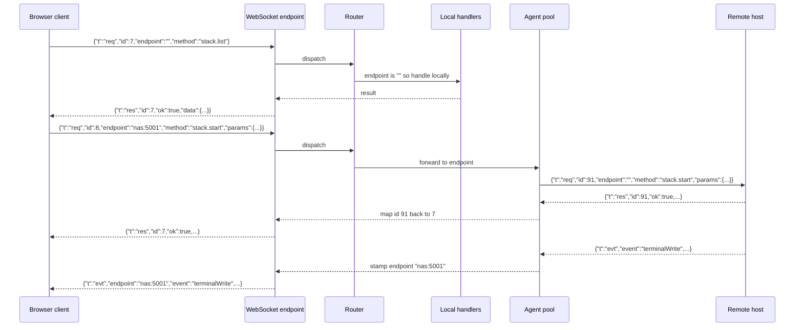

# Realtime Transport Protocol - Spec Proposal

| Item       | Detail                           |
|------------|----------------------------------|
| Author     | heavycaffeiner(Dong Hyun Kim)    |
| Created    | 2026-08-09                       |
| Status     | **Draft** / In Review / Approved |
| Reviewers  |                                  |

---

## 1. Summary

Docknight's browser client and its server speak a single WebSocket protocol carrying three message
kinds: request, response, and event. This proposal specifies the endpoint, the frame format, request
correlation and cancellation, endpoint routing for multi-host forwarding, the complete method and
event namespaces, the closed set of error codes, client reconnection, and flow control for terminal
output. Every other proposal describes its features in terms defined here.

## 2. Background & Motivation

Almost everything Docknight does is either a command that produces streamed output or a state change
that other viewers must see immediately. Deploying a stack streams a pull progress bar for two
minutes. A container's status changes because someone restarted it from a shell. A second browser tab
must not show a stale list. A request-response HTTP API would need polling for all of it, so the
transport is a persistent bidirectional connection and the question is only what runs on top.

Three properties decide the design.

- Most interactions are request and response with a result the caller waits for. A plain event bus
  would force every call site to invent its own correlation, so correlation is built into the
  envelope.
- Some interactions are pure server-to-client pushes: terminal bytes, status changes, list snapshots.
  These need no correlation and must not be forced into a request shape.
- Docknight can manage stacks on other Docknight hosts. That means a request may have to be forwarded
  one hop and its response mapped back, and an event arriving from another host must be labelled with
  where it came from. If the host is not a first-class field in the envelope, every payload ends up
  carrying it ad hoc and every handler ends up unwrapping it.

A general-purpose realtime library would supply reconnection and acknowledgement callbacks, and would
also supply transport negotiation, its own packet encoding, room management, and a client bundle
larger than the protocol it carries. None of the extra surface is used here, and acknowledgement
callbacks in particular give no deadline, so a forwarded request to an unresponsive host leaves a
spinner running forever. A protocol of three message shapes, declared once as TypeScript types that
both sides import, is smaller than the integration would be and makes a method mismatch a type error
instead of a silent no-op.

## 3. Goals & Non-Goals

### 3.1 Goals

- [ ] Define the WebSocket endpoint, its upgrade handling, and its origin check.
- [ ] Define the three message envelopes and their encoding.
- [ ] Define request correlation, timeouts, and cancellation.
- [ ] Define the `endpoint` field and its three routing modes: local, one host, all hosts.
- [ ] Define the complete method namespace and the complete event namespace.
- [ ] Define the error shape and the closed set of error codes.
- [ ] Define client reconnection, backoff, and post-reconnect resynchronisation.
- [ ] Define flow control and backpressure for high-rate terminal output.
- [ ] Define protocol versioning and the compatibility rule between hosts.

### 3.2 Non-Goals

- [ ] The semantics of any individual method. Each is specified in the proposal that owns it.
- [ ] Authentication rules. This proposal defines only that unauthenticated requests are rejected
      with `unauthorized`; proposal 2 defines when a connection becomes authenticated.
- [ ] A public REST API. Docknight has no HTTP API other than static assets; automation is out of
      scope.
- [ ] Binary framing, compression, or a schema-compiled encoding. Terminal output is the only
      high-rate stream and it is text.

## 4. Technical Design

### 4.1 Architecture Overview



Modules:

- `common/protocol.ts` holds the envelope types, the method map, the event map, the error codes, and
  `PROTOCOL_VERSION`. Both sides import it, so a method added on one side without the other fails to
  type check.
- `backend/ws/server.ts` owns the upgrade, the per-connection state, and the send queue.
- `backend/ws/router.ts` owns dispatch: authentication gate, endpoint routing, handler invocation,
  error mapping.
- `frontend/src/lib/connection.svelte.ts` owns the client: connect, reconnect, `request()`, event
  subscription.

### 4.2 Data Model Changes

No change. The protocol is stateless with respect to the database. Connection state lives in memory
for the lifetime of the socket.

### 4.3 Core Logic

#### 4.3.1 Endpoint and upgrade

One endpoint: `GET /ws`, upgraded from the same HTTP server defined in proposal 0.

Upgrade checks, in order. Any failure responds `400 Bad Request` and destroys the socket without
completing the handshake:

1. If an `Origin` header is present, its host must equal the request `Host`. A missing `Origin` header
   is allowed, because non-browser clients, meaning host-to-host links, do not send one. This is what
   prevents a page on another origin from driving Docknight through the browser's ambient
   credentials.
2. The `X-Docknight-Endpoint` request header, when present, marks the connection as an inbound
   management link from another Docknight host, and its value becomes the connection's `endpoint`
   label. Absent means a browser client.
3. The `X-Docknight-Protocol` header, when present, must parse as an integer equal to
   `PROTOCOL_VERSION`. Absent is treated as a browser client, which always matches because it was
   served by this same process.

Per-connection state:

```ts
interface Conn {
    id: string;              // random 12-char id, used only in logs
    socket: WebSocket;
    userId: number | null;    // null until authenticated, see proposal 2
    sessionId: number | null; // the session row this connection presented, set with userId
    endpoint: string;        // "" for browser clients, host:port for inbound management links
    isAgentLink: boolean;
    joinedTerminals: Set<string>;   // proposal 4
    inflight: Map<number, AbortController>;
    openedAt: number;
}
```

#### 4.3.2 Envelopes

Text frames containing UTF-8 JSON. One message per frame. `JSON.parse` failure, a non-object result,
or an unknown `t` closes the connection with code 1003.

```ts
export const PROTOCOL_VERSION = 1;

export type ClientMessage =
    | { t: "req"; id: number; endpoint: string; method: string; params?: unknown }
    | { t: "cancel"; id: number }
    | { t: "ping" };

export type ServerMessage =
    | { t: "res"; id: number; ok: true; data: unknown }
    | { t: "res"; id: number; ok: false; error: ProtocolError }
    | { t: "evt"; endpoint: string; event: string; data: unknown }
    | { t: "pong" };

export interface ProtocolError {
    code: ErrorCode;        // closed set, see 5-2
    message: string;        // English, for logs and as a fallback
    i18n?: string;          // translation key the UI prefers when present
    values?: Record<string, string | number>;   // interpolation values for i18n
}
```

Field rules:

- `id` is assigned by the client, is a positive integer, and is unique among that connection's
  outstanding requests. The server echoes it unchanged. Reusing an id that is still in flight is
  answered with `error.duplicateRequestId`.
- `endpoint` is `""` for the local host, `"host:port"` for a specific remote host, or `"*"` for a
  broadcast to every connected host.
- `params` is omitted rather than `null` when a method takes no arguments.
- Every `evt` carries `endpoint`, so the client always knows which host an event describes without
  inspecting the payload. The label goes in the envelope; payloads are never mutated to carry it.
- `ping` and `pong` carry nothing and need no authentication. They duplicate the protocol-level
  keepalive because a browser answers protocol pings inside the WebSocket implementation, where page
  code cannot see them. A client that suspects its socket died while the device was asleep sends
  `ping` and treats silence as a dead socket. Both were added after the fact and are additive, so
  `PROTOCOL_VERSION` is unchanged.

Message size is capped at 1 MiB inbound. A larger frame closes the connection with code 1009.

#### 4.3.3 Dispatch

```
onMessage(conn, raw):
    msg := parse(raw)                       # close 1003 on failure

    if msg.t == "ping":
        conn.lastPongAt := now
        send { t: "pong" }
        return

    if msg.t == "cancel":
        conn.inflight.get(msg.id)?.abort()
        return                              # no response is sent for a cancel

    if conn.inflight.has(msg.id):
        send error(msg.id, "duplicateRequestId"); return

    descriptor := METHODS[msg.method]
    if descriptor is undefined:
        send error(msg.id, "unknownMethod"); return

    if descriptor.requiresAuth and conn.userId is null:
        send error(msg.id, "unauthorized"); return

    if msg.endpoint != "" and descriptor.routable is false:
        send error(msg.id, "notRoutable"); return
        # agent.add, auth.login and similar always execute on the receiving host

    params := descriptor.parse(msg.params)  # throws ValidationError, mapped to "invalidParams"

    controller := new AbortController()
    conn.inflight.set(msg.id, controller)
    try:
        if msg.endpoint == "*":
            broadcastToAgents(msg.method, params)     # fire and forget
            result := { dispatched: true }
        else if msg.endpoint == "" or msg.endpoint == conn.endpoint:
            result := await descriptor.handle(conn, params, controller.signal)
        else:
            result := await agentPool.request(msg.endpoint, msg.method, params, controller.signal)
        send { t: "res", id: msg.id, ok: true, data: result }
    catch e:
        if e is AbortError: return                    # the client asked; stay silent
        send { t: "res", id: msg.id, ok: false, error: toProtocolError(e) }
    finally:
        conn.inflight.delete(msg.id)
```

The `msg.endpoint == conn.endpoint` branch handles the inbound management link case: a manager
forwards a request stamped with the remote host's own label, and that host recognises it as local.

Handlers run concurrently. Ordering between two requests on one connection is not guaranteed and no
feature depends on it; the operations that must not overlap, such as two compose commands on one
stack, are serialised by a per-stack lock in proposal 3, not by the transport.

#### 4.3.4 Timeouts

Two independent deadlines:

- Client side: `request()` rejects locally with `error.timeout` after 30 seconds by default. Methods
  that legitimately run long, meaning `stack.deploy`, `stack.update`, `stack.start`, `stack.stop`,
  `stack.restart`, `stack.down`, and `stack.delete`, pass `{ timeout: 0 }` and rely on progress
  arriving through the terminal event stream instead. When a local timeout fires the client sends
  `{"t":"cancel","id":N}` so the server can stop work it no longer needs.
- Forwarding side: `agentPool.request` rejects with `error.agentTimeout` after 60 seconds for
  ordinary methods and never for the long-running set above. A dead link rejects immediately with
  `error.agentUnreachable` rather than waiting for a deadline.

#### 4.3.5 Events

Events are server to client only. The complete list:

| Event           | Payload                                                     | Emitted when                                            |
|-----------------|-------------------------------------------------------------|---------------------------------------------------------|
| `info`          | `{ version, latestVersion?, protocolVersion, isContainer, primaryHostname }` | On connect, and after settings change    |
| `setup`         | `{}`                                                        | On connect when no user exists                          |
| `autoLogin`     | `{}`                                                        | On connect when authentication is disabled              |
| `refresh`       | `{}`                                                        | The client must reload the page                         |
| `stackList`     | `{ stacks: Record<string, StackSummary> }`                   | Every refresh tick and after any stack mutation         |
| `agentList`     | `{ agents: Record<string, AgentSummary> }`                   | After login and after any host-configuration mutation   |
| `agentStatus`   | `{ status: "connecting" \| "online" \| "offline", message? }`| A management link changes state                        |
| `terminalWrite` | `{ terminal: string, data: string }`                         | A joined pty produced output                            |
| `terminalExit`  | `{ terminal: string, exitCode: number }`                     | A joined pty exited                                     |

Events are addressed by connection, never broadcast blindly: `stackList` goes only to authenticated
connections, and `terminalWrite` goes only to connections in that terminal's join set.

#### 4.3.6 Client connection lifecycle

```
connect():
    url := (location.protocol == "https:" ? "wss:" : "ws:") + "//" + location.host + "/ws"
    socket := new WebSocket(url)

    onopen:
        attempt := 0
        state := "connected"
        if a stored session token exists: request("auth.loginByToken", { token })
        else: state := "needLogin"

    onclose / onerror:
        state := "disconnected"
        reject every pending request with error.disconnected
        attempt := attempt + 1
        retryAt := now + min(30_000, 500 * 2 ** (attempt - 1)) + jitter of up to 500 ms
        connect() at retryAt
```

Two rules make reconnection correct rather than merely automatic:

- Pending requests are rejected, never silently retried. A `stack.delete` that was in flight when the
  socket dropped may or may not have run; retrying it automatically is the wrong default. The UI
  reports the failure and the next `stackList` event shows the true state.
- After a successful re-login the client discards its cached stack list, host list, and settings and
  waits for the server's `stackList` and `agentList` events. Terminal views re-issue `terminal.join`,
  which replays the server-side scrollback buffer defined in proposal 4.

A phone drops the socket every time the user switches apps, so the rest of this section is about
making that invisible rather than merely survivable.

- **Requests are held, not failed.** A request made while the socket is down waits up to 15 seconds
  for a usable one before it gives up. Nothing is retried this way, because nothing was sent. A
  request that needs authentication also waits for the post-open handshake to settle, so a frame
  cannot land in a connection the server still considers anonymous.
- **Silence is probed, not trusted.** A socket can outlive the network under it, and the protocol-level
  pong a browser answers with is invisible to page code. The client sends `{ t: "ping" }` every 25
  seconds and drops the socket if nothing at all arrives within 8 seconds of a probe. The drop closes
  with 4000 rather than waiting on a closing handshake the dead peer will never finish.
- **Resume is event-driven.** `visibilitychange` to visible, `pageshow`, `focus`, and `online` each
  probe an open socket or start a fresh connect, throttled to one per second because waking a device
  fires several at once. Waiting out a backoff computed before the device slept is the thing this
  avoids.
- **The backoff deadline is a wall-clock instant.** A backgrounded tab has its timers throttled, so a
  countdown that decrements once per tick is wrong by however long the device was asleep. `retryIn` is
  recomputed from `retryAt` on every tick.
- **A short drop never reaches the user.** The banner is driven by a `degraded` flag set 2 seconds
  after a drop, not by the socket state, so a reconnect the user would not have noticed does not flash
  a warning at them.
- **Views rejoin on a generation counter.** `connection.generation` is bumped once each new socket has
  settled. A terminal pane keyed on it re-issues `terminal.join` and skips the `terminal.leave` in its
  teardown, because leaving on a reconnect would read as the last viewer departing and close the shell
  the rejoin is about to ask for.

The client also reloads the whole page when a received `info` event reports a `version` different
from the one it started with, because the served bundle no longer matches the server.

#### 4.3.7 Backpressure

Terminal output is the only stream that can outrun a client. Two mechanisms:

- Coalescing. Output chunks for one terminal are accumulated and flushed on a 16 millisecond timer,
  so a container printing thousands of short lines produces at most 62 frames per second per terminal
  instead of one frame per write.
- Bounded queue. Before each send the connection checks `socket.bufferedAmount`. Above 4 MiB, further
  `terminalWrite` events for that connection are dropped and a counter is incremented; when the
  buffer drains below 1 MiB a single synthetic write is emitted reading
  `\r\n[docknight] output truncated, N bytes dropped\r\n`. Responses and non-terminal events are
  never dropped. Above 16 MiB the connection is closed with code 1013, because at that point the
  client is not reading at all.

Dropping terminal bytes is acceptable and truncation is announced; dropping a response is not, which
is why the two are treated differently.

#### 4.3.8 Keepalive

The server sends a WebSocket ping every 20 seconds. A connection that has not answered within 60
seconds is closed with code 1001 and its resources released, which is what removes stale terminal
join sets. Browsers answer pings inside the WebSocket implementation, so no client code is required.
Host-to-host links apply the same rule in both directions.

#### 4.3.9 Versioning

`PROTOCOL_VERSION` is an integer, currently 1, bumped whenever a method is removed, a method's
parameters change incompatibly, or an event payload changes incompatibly. Adding a method, adding an
optional parameter, or adding an event does not bump it.

An outbound management link sends `X-Docknight-Protocol: <n>`. The remote host rejects a mismatch
during upgrade, and the manager surfaces it as an `agentStatus` event with
`message: "unsupported protocol version"` and stops retrying that host until its configuration
changes. The wire contract is versioned separately from the product release number, so a release that
changes no messages needs no compatibility handling.

## 5. API Design

### 5-1. New / Modified

The method table. `auth` means the connection must be authenticated; `route` means the method may
carry a non-empty `endpoint`. The owning proposal specifies parameters and results.

| Method                  | auth | route | Owner       |
|-------------------------|------|-------|-------------|
| `auth.setup`            | no   | no    | proposal 2  |
| `auth.login`            | no   | no    | proposal 2  |
| `auth.loginByToken`     | no   | no    | proposal 2  |
| `auth.logout`           | yes  | no    | proposal 2  |
| `auth.changePassword`   | yes  | no    | proposal 2  |
| `auth.disconnectOthers` | yes  | no    | proposal 2  |
| `auth.totp.begin`       | yes  | no    | proposal 2  |
| `auth.totp.enable`      | yes  | no    | proposal 2  |
| `auth.totp.disable`     | yes  | no    | proposal 2  |
| `settings.get`          | yes  | no    | proposal 2  |
| `settings.set`          | yes  | no    | proposal 2  |
| `stack.list`            | yes  | yes   | proposal 3  |
| `stack.get`             | yes  | yes   | proposal 3  |
| `stack.save`            | yes  | yes   | proposal 3  |
| `stack.deploy`          | yes  | yes   | proposal 3  |
| `stack.start`           | yes  | yes   | proposal 3  |
| `stack.stop`            | yes  | yes   | proposal 3  |
| `stack.restart`         | yes  | yes   | proposal 3  |
| `stack.down`            | yes  | yes   | proposal 3  |
| `stack.update`          | yes  | yes   | proposal 3  |
| `stack.delete`          | yes  | yes   | proposal 3  |
| `stack.serviceStatus`   | yes  | yes   | proposal 3  |
| `service.start`         | yes  | yes   | proposal 3  |
| `service.stop`          | yes  | yes   | proposal 3  |
| `service.restart`       | yes  | yes   | proposal 3  |
| `docker.stats`          | yes  | yes   | proposal 3  |
| `docker.networks`       | yes  | yes   | proposal 3  |
| `docker.composerize`    | yes  | no    | proposal 7  |
| `terminal.join`         | yes  | yes   | proposal 4  |
| `terminal.leave`        | yes  | yes   | proposal 4  |
| `terminal.input`        | yes  | yes   | proposal 4  |
| `terminal.resize`       | yes  | yes   | proposal 4  |
| `terminal.exec`         | yes  | yes   | proposal 4  |
| `terminal.main`         | yes  | yes   | proposal 4  |
| `terminal.mainEnabled`  | yes  | yes   | proposal 4  |
| `agent.list`            | yes  | no    | proposal 5  |
| `agent.add`             | yes  | no    | proposal 5  |
| `agent.remove`          | yes  | no    | proposal 5  |
| `agent.rename`          | yes  | no    | proposal 5  |

Shared client API:

```ts
// frontend/src/lib/connection.svelte.ts

/**
 * Send a request and resolve with its result.
 *
 * @param endpoint "" for this host, "host:port" for one remote host, "*" to broadcast.
 * @param method   A key of the METHODS map; the params and result types follow from it.
 * @param opts.timeout Milliseconds before local rejection. 0 disables the deadline.
 *                     Defaults to 30000.
 * @throws ProtocolError on a server error, on local timeout, or on disconnect.
 */
export function request<M extends MethodName>(
    endpoint: string,
    method: M,
    params: MethodParams<M>,
    opts?: { timeout?: number },
): Promise<MethodResult<M>>;

/** Subscribe to a server event. Returns an unsubscribe function. */
export function on<E extends EventName>(
    event: E,
    handler: (endpoint: string, data: EventPayload<E>) => void,
): () => void;
```

Backend handler registration:

```ts
// backend/ws/router.ts

/**
 * Register one method. `parse` validates and narrows the untrusted params object and
 * throws ValidationError on any mismatch; handlers therefore never see unchecked input.
 */
export function method<P, R>(name: string, descriptor: {
    requiresAuth: boolean;
    routable: boolean;
    parse: (raw: unknown) => P;
    handle: (conn: Conn, params: P, signal: AbortSignal) => Promise<R> | R;
}): void;
```

### 5-2. Error Handling

`ProtocolError.code` is a closed set. The UI decides its presentation from the code; `message` is for
logs.

| Code                  | Meaning                                                                                  |
|-----------------------|-------------------------------------------------------------------------------------------|
| `unauthorized`        | The method requires authentication and the connection has none                            |
| `unknownMethod`       | No such method on this protocol version                                                   |
| `invalidParams`       | Parameter validation failed; `message` names the offending field                          |
| `duplicateRequestId`  | The id is already in flight on this connection                                            |
| `notRoutable`         | A non-empty endpoint was given for a method that only runs locally                        |
| `notFound`            | The named stack, service, terminal, or host does not exist                                |
| `conflict`            | The target is busy or already exists, for example a second compose command on one stack   |
| `validation`          | The request was well formed but the content is invalid, for example malformed YAML        |
| `commandFailed`       | A `docker compose` invocation exited non-zero; `message` carries the exit code             |
| `agentUnreachable`    | The named host is not connected                                                           |
| `agentTimeout`        | The host accepted the request and did not answer within the deadline                      |
| `timeout`             | Client-side deadline expired                                                              |
| `disconnected`        | The socket closed while the request was in flight                                         |
| `rateLimited`         | Too many attempts, see proposal 2                                                         |
| `internal`            | Unexpected server error; details are logged, not returned                                 |

WebSocket close codes used:

| Code | Meaning                                             |
|------|-----------------------------------------------------|
| 1000 | Normal close, client navigated away or logged out   |
| 1001 | Server shutting down, or keepalive timeout          |
| 1003 | Unparseable or structurally invalid message         |
| 1009 | Inbound frame larger than 1 MiB                     |
| 1013 | Client is not draining; send buffer exceeded 16 MiB |

Unexpected exceptions map to `internal` and the original error is logged with a stack trace and the
connection id. Error messages returned to the client never include filesystem paths outside the
stacks directory, environment values, or stack traces.

## 6. Implementation Plan

### 6-1. Milestones

| Phase   | Task                                                                                         | Estimated Duration | Owner          |
|---------|----------------------------------------------------------------------------------------------|--------------------|----------------|
| Phase 1 | `common/protocol.ts`: envelopes, method and event maps, error codes, `PROTOCOL_VERSION`      | TBD                | heavycaffeiner |
| Phase 2 | `backend/ws/server.ts`: upgrade, origin check, connection state, keepalive, close handling   | TBD                | heavycaffeiner |
| Phase 3 | `backend/ws/router.ts`: registration, auth gate, validation, dispatch, cancel, error mapping | TBD                | heavycaffeiner |
| Phase 4 | Event emission helpers, including per-connection addressing                                  | TBD                | heavycaffeiner |
| Phase 5 | Coalescing and backpressure for terminal writes                                              | TBD                | heavycaffeiner |
| Phase 6 | `frontend/src/lib/connection.svelte.ts`: connect, backoff reconnect, `request`, `on`, resync | TBD                | heavycaffeiner |
| Phase 7 | Endpoint routing hooks, left as stubs until proposal 5 provides the pool                     | TBD                | heavycaffeiner |
| Phase 8 | Protocol conformance tests: malformed frames, oversize frames, duplicate ids, cancel, timeouts | TBD              | heavycaffeiner |

Phase 1 is a prerequisite for every other proposal. Phases 2 and 3 depend on proposal 0 Phase 7.
Phase 7 is completed by proposal 5.

### 6-2. Dependencies

| Package | Purpose               | Why not the standard library                                                                                                                  |
|---------|-----------------------|------------------------------------------------------------------------------------------------------------------------------------------------|
| `ws`    | Server-side WebSocket | Node has no server WebSocket implementation. The browser `WebSocket` global covers the client, so `ws` is a backend-only dependency               |

Internal dependencies: proposal 0 for the HTTP server, configuration, and logging. Proposal 2 sets
`Conn.userId`. Proposal 5 supplies `agentPool`.

## 7. References

- WebSocket protocol, RFC 6455: https://www.rfc-editor.org/rfc/rfc6455
- WebSocket close codes registry: https://www.iana.org/assignments/websocket/websocket.xhtml
- `ws` documentation: https://github.com/websockets/ws
- `AbortController` and `AbortSignal`: https://developer.mozilla.org/en-US/docs/Web/API/AbortController
- Companion proposals: `docknight-0-foundation`, `docknight-2-auth`, `docknight-5-agent`
