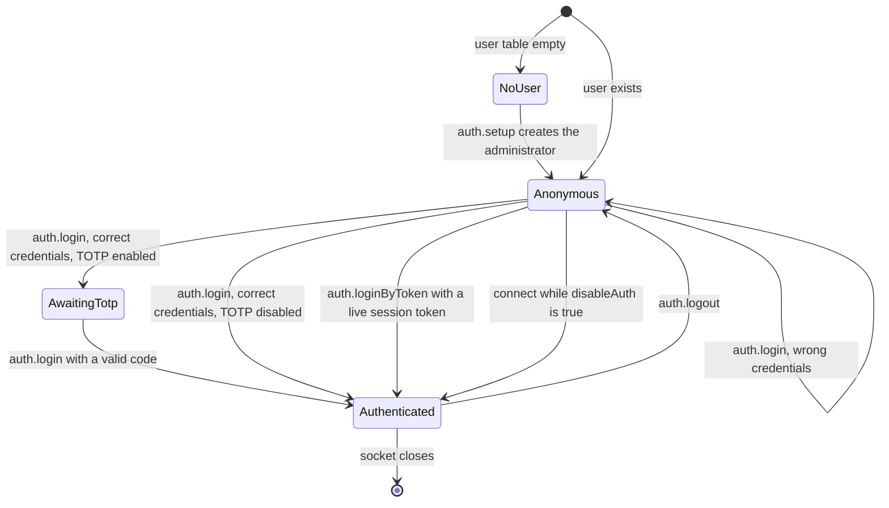

# Authentication, Sessions and Settings - Spec Proposal

| Item       | Detail                           |
|------------|----------------------------------|
| Author     | heavycaffeiner(Dong Hyun Kim)    |
| Created    | 2026-08-09                       |
| Status     | **Draft** / In Review / Approved |
| Reviewers  |                                  |

---

## 1. Summary

Docknight is a single-administrator application. This proposal covers first-run setup, password
login, TOTP second factor, opaque session tokens for the remember-me path, password change, the
option to disable authentication entirely, rate limiting, and the settings store that the rest of the
application reads. It defines when a WebSocket connection transitions from anonymous to
authenticated, which is the gate every other method depends on.

## 2. Background & Motivation

Docknight holds the docker socket. Anyone who reaches its interface can start a privileged container
and own the host. That makes the login screen the only boundary in the product, and it has to hold up
against the deployment reality: a self-hosted service, often exposed to a home network, sometimes
exposed to the internet behind nothing but a reverse proxy, operated by one person who will not
rotate credentials.

Four requirements follow.

- One account. There is no organisation, no delegation, and no audit requirement, so a user table
  with roles would be structure without a purpose. A single administrator keeps the authorisation
  model to a boolean: authenticated or not.
- A second factor that actually works. A single password protecting root-equivalent access on an
  internet-reachable service is thin. TOTP is the factor that needs no infrastructure, so it is
  implemented end to end rather than left as a schema column.
- Sessions that can be revoked. The remember-me path keeps a credential in browser storage for weeks.
  Whatever that credential is, changing the password must invalidate it immediately, and signing out
  one device must be possible. A self-contained signed token cannot do either without carrying server
  state anyway, so the token is opaque and the state is a row.
- A documented escape hatch. An administrator who loses their TOTP device or their password has no
  second channel, so an offline reset run on the host is part of the design and not an afterthought.

The settings mechanism is deliberately small: typed key and value rows with a short-lived cache,
because the settings are a handful of scalars read on nearly every request.

## 3. Goals & Non-Goals

### 3.1 Goals

- [ ] First-run setup that creates exactly one administrator, with password strength enforcement.
- [ ] Password login with scrypt verification and constant-time comparison.
- [ ] A working TOTP second factor: enrolment with QR provisioning, verification, replay protection,
      recovery through the reset script.
- [ ] Opaque session tokens with expiry, per-session revocation, and revoke-all on password change.
- [ ] Password change requiring the current password.
- [ ] Disable and re-enable authentication, with the current password required to disable it.
- [ ] Rate limiting on login and on TOTP verification.
- [ ] Force other browser sessions of the same user to reconnect.
- [ ] The settings store: read, write, cache, and the `general` group used by the UI.
- [ ] An offline password reset entry point for a locked-out administrator.

### 3.2 Non-Goals

- [ ] Multiple user accounts, roles, or per-stack permissions.
- [ ] External identity: OIDC, LDAP, SAML, reverse-proxy header trust.
- [ ] WebAuthn or passkeys.
- [ ] Password reset by email. There is no mail configuration and no second channel.
- [ ] Per-host credentials distinct from that host's own administrator account. Proposal 5 stores one
      username and password per managed host.

## 4. Technical Design

### 4.1 Architecture Overview



`AwaitingTotp` is not connection state. It is a response shape: `auth.login` without a `totp` field
returns `{ totpRequired: true }` and changes nothing on the server. The client then re-sends
`auth.login` with username, password and code together. This keeps the connection stateless with
respect to a partially completed login, so a dropped socket cannot leave a half-authenticated
connection behind.

Modules:

- `backend/auth/password.ts`: scrypt hashing and verification, strength check.
- `backend/auth/totp.ts`: RFC 6238 generation and verification, base32, provisioning URI.
- `backend/auth/session.ts`: token mint, lookup, touch, revoke, sweep.
- `backend/auth/methods.ts`: the protocol methods.
- `backend/settings.ts`: the settings store.
- `backend/rate-limit.ts`: token bucket.
- `scripts/reset-password.ts`: offline recovery.

### 4.2 Data Model Changes

The `user`, `session` and `setting` tables are created in proposal 0 migration `001-initial`. No
further schema change. Column semantics fixed here:

| Column                | Semantics                                                                                        |
|-----------------------|--------------------------------------------------------------------------------------------------|
| `user.password_hash`  | `scrypt$N$r$p$<base64 salt>$<base64 derived key>`, self-describing so parameters can change later  |
| `user.totp_secret`    | Base32 without padding, 20 random bytes. Present but unused while `totp_enabled` is 0             |
| `user.totp_enabled`   | 0 or 1. Set to 1 only after one code has been verified during enrolment                           |
| `user.totp_last_step` | The RFC 6238 counter value of the last accepted code. A code whose step is less than or equal to this is rejected |
| `session.token_hash`  | `sha256(token)` hex. The token itself is never stored                                             |
| `session.expires_at`  | `created_at + 30 days`, refreshed on each successful `auth.loginByToken`                          |

Settings keys in the `general` group:

| Key               | Type    | Default | Used by                                            |
|-------------------|---------|---------|-----------------------------------------------------|
| `disableAuth`     | boolean | `false` | This proposal                                       |
| `primaryHostname` | string  | `""`    | Proposal 7, for building container URLs              |
| `checkUpdate`     | boolean | `true`  | The version check in proposal 0, section 4.3.10      |
| `checkBeta`       | boolean | `false` | The version check in proposal 0, section 4.3.10      |
| `autoUpgrade`     | boolean | `false` | The self upgrade in proposal 0, section 4.3.11        |
| `trustProxy`      | boolean | `false` | Client IP resolution for rate limiting and logging    |

`globalENV` is presented in the same settings screen but is not a settings row; it is the file
`${stacksDir}/global.env` and is owned by proposal 3.

### 4.3 Core Logic

#### 4.3.1 Password hashing

`node:crypto`'s scrypt, no third-party hashing dependency.

```
hashPassword(plain):
    salt := randomBytes(16)
    key  := scryptSync(plain.normalize("NFKC"), salt, 64, { N: 2**15, r: 8, p: 1, maxmem: 64 MiB })
    return "scrypt$32768$8$1$" + base64(salt) + "$" + base64(key)

verifyPassword(plain, stored):
    parse N, r, p, salt, expected from stored     # unknown prefix returns false
    actual := scryptSync(plain.normalize("NFKC"), salt, expected.length, { N, r, p })
    return timingSafeEqual(actual, expected)      # lengths compared first, non-throwing
```

`N = 2^15` costs roughly 100 ms on a Raspberry Pi 4 class device, which is acceptable for an
interactive login that is additionally rate limited. Unicode normalisation means a password typed on
a different keyboard layout still matches.

Storing the parameters inside the hash is what makes a future cost increase possible: a login that
verifies against an older parameter set can be transparently rehashed at the new cost.

Strength policy, checked at setup and at password change: at least 8 characters, and at least two of
the three classes letters, digits, symbols.

#### 4.3.2 TOTP

RFC 6238 with the parameters every authenticator app defaults to: HMAC-SHA1, 6 digits, a 30 second
step, and a validation window of the previous, current and next step.

```
generate(secretBytes, step):
    counter := 8-byte big-endian step
    mac     := hmacSha1(secretBytes, counter)
    offset  := mac[19] & 0x0f
    binary  := ((mac[offset]   & 0x7f) << 24)
             | ((mac[offset+1] & 0xff) << 16)
             | ((mac[offset+2] & 0xff) <<  8)
             |  (mac[offset+3] & 0xff)
    return zeroPad(binary % 1_000_000, 6)

verify(user, code):
    if code does not match /^[0-9]{6}$/: return false
    now  := floor(unixSeconds() / 30)
    for step in [now - 1, now, now + 1]:
        if step <= user.totp_last_step: continue          # replay guard
        if timingSafeEqual(generate(secret, step), code):
            UPDATE user SET totp_last_step = step
            return true
    return false
```

Recording the accepted counter, rather than the accepted digits, is what makes the replay guard hold:
a code cannot be reused inside its own window, and the guard stays meaningful across a secret change.

Enrolment is two calls so that a user cannot lock themselves out by saving a secret their
authenticator never received:

1. `auth.totp.begin` requires the current password, generates 20 random bytes, stores the base32 form
   in `totp_secret`, leaves `totp_enabled` at 0, and returns the secret plus the provisioning URI
   `otpauth://totp/Docknight:<username>?secret=<base32>&issuer=Docknight&algorithm=SHA1&digits=6&period=30`.
2. `auth.totp.enable` takes one code. On success it sets `totp_enabled = 1`. On failure nothing
   changes and the secret remains unusable.

`auth.totp.disable` requires the current password and a currently valid code, then clears all three
columns.

#### 4.3.3 Sessions

```
mintSession(userId):
    token := base64url(randomBytes(32))          # 256 bits
    INSERT INTO session(user_id, token_hash, created_at, last_used_at, expires_at)
        VALUES (userId, sha256Hex(token), now, now, now + 30 days)
    return { token, sessionId: the inserted row id }   # the token is returned once, never logged

resolveSession(token):
    row := SELECT * FROM session WHERE token_hash = sha256Hex(token)
    if row is null or row.expires_at <= now:
        DELETE the row if present
        return null
    UPDATE session SET last_used_at = now, expires_at = now + 30 days WHERE id = row.id
    return { userId: row.user_id, sessionId: row.id }
```

The lookup is by hash and therefore an exact index match, so no timing comparison is needed. A sweep
deletes expired rows at startup and every six hours.

A successful `auth.login` or `auth.loginByToken` records both `conn.userId` and `conn.sessionId`, the
identifier of the row it minted or resolved. Without that second field a connection has no way to name
the session it is holding, and logout would have to ask the client to send its own token back.

Revocation:

- `auth.logout` deletes the row identified by `conn.sessionId` and sets both fields to null.
- A password change deletes every session row for the user, then mints one new session and updates
  `conn.sessionId` on the acting connection, so the browser that made the change is not logged out
  while every other device is.
- `auth.disconnectOthers` closes every other authenticated connection with close code 1000 after
  sending a `refresh` event, without touching stored sessions.

Whether the browser keeps the token in `localStorage` or `sessionStorage` is the client's choice,
driven by the remember-me checkbox.

#### 4.3.4 Login

```
handle auth.login({ username, password, totp? }):
    ip := clientIp(conn)                           # X-Forwarded-For honoured only if trustProxy
    if not loginBucket.take(ip): throw rateLimited

    user := SELECT * FROM user WHERE username = ? AND active = 1
    ok   := user is not null and verifyPassword(password, user.password_hash)
    if not ok:
        log warn "login failed for <username> from <ip>"
        throw unauthorized with i18n "authIncorrectCreds"
        # the same error and the same latency whether the user exists or not

    if user.totp_enabled == 1:
        if totp is absent: return { totpRequired: true }
        if not totpBucket.take(ip): throw rateLimited
        if not verifyTotp(user, totp): throw unauthorized with i18n "authInvalidToken"

    conn.userId := user.id
    { token, sessionId } := mintSession(user.id)
    conn.sessionId := sessionId
    afterLogin(conn)
    return { token, username: user.username }
```

`afterLogin(conn)` sends `info`, then the current `stackList` for the local host, then one `stackList`
per configured remote host from the pool's cache, then `agentList`, then one `agentStatus` per host so
the browser knows which links are live. It is the single place where a connection begins receiving
data, so nothing leaks to an anonymous connection. It does not open any link: the pool connects at
startup and maintains its own links, as specified in proposal 5.

When a user record does not exist, the handler still runs one scrypt derivation against a fixed dummy
hash before returning, so response time does not reveal whether the username is right.

#### 4.3.5 Disabled authentication

When `disableAuth` is true, every connection is authenticated as the single administrator at connect
time and an `autoLogin` event is emitted. This exists for the case where Docknight sits behind
another authenticating proxy on a trusted network.

Turning it off and on is asymmetric on purpose:

- Enabling `disableAuth` requires the current password in the same request. Without that, anyone who
  reaches an already-open session can permanently remove the password gate.
- Disabling `disableAuth`, meaning turning authentication back on, requires no password, because the
  operation only ever increases restriction.

The setting is read from the database on every connect rather than cached across the process, so the
change takes effect for the next connection without a restart.

#### 4.3.6 Rate limiting

A token bucket per key, in memory:

| Bucket  | Key       | Capacity | Refill        | Applies to                        |
|---------|-----------|----------|---------------|-----------------------------------|
| `login` | client IP | 20       | 20 per minute | `auth.login`, `auth.loginByToken` |
| `totp`  | client IP | 30       | 30 per minute | TOTP verification within a login  |

Exceeding a bucket throws `rateLimited`. Buckets are keyed by IP, resolved from the socket's remote
address, or from the first entry of `X-Forwarded-For` when `trustProxy` is true. Entries idle for ten
minutes are evicted so the map cannot grow without bound.

#### 4.3.7 Settings store

```
Settings.get(key):        cache hit within 60 s, else SELECT value FROM setting WHERE key = ?, JSON.parse
Settings.set(key, value, type): UPSERT with JSON.stringify, then invalidate the cache entry
Settings.getGroup(type):  SELECT key, value FROM setting WHERE type = ?
Settings.setGroup(type, obj): one transaction, one UPSERT per key, cache invalidated for all keys
```

`setGroup` writes only keys already carrying that type or absent from the table, so a request cannot
move an internal row into a user-editable group. Values are JSON encoded, so a boolean stays a
boolean across a round trip.

The cache is a plain `Map` with a timestamp per entry and a sweeper on a 60 second interval, cleared
at shutdown.

#### 4.3.8 Offline recovery

`pnpm reset-password` runs `scripts/reset-password.ts` against the same data directory. It prompts for
a new password on the terminal, applies the strength policy, writes the new hash, clears
`totp_secret`, `totp_enabled` and `totp_last_step`, deletes every session row, and exits. It refuses
to run while a Docknight process holds the database, detected by attempting an `IMMEDIATE`
transaction and reporting the busy error plainly.

## 5. API Design

### 5-1. New / Modified

All methods run on the receiving host and carry `endpoint: ""`. None is routable.

```ts
/** Create the single administrator. Fails once any user exists. */
"auth.setup": {
    params: { username: string; password: string };
    result: { ok: true };
}

/**
 * Password login. Omitting `totp` when the account has TOTP enabled is not an error;
 * it returns { totpRequired: true } and the client re-sends with the code.
 */
"auth.login": {
    params: { username: string; password: string; totp?: string };
    result: { token: string; username: string } | { totpRequired: true };
}

/** Resume a session. Extends the session's expiry on success. */
"auth.loginByToken": {
    params: { token: string };
    result: { username: string };
}

/** Revoke the presenting session and drop this connection to anonymous. */
"auth.logout": { params: undefined; result: { ok: true } }

/** Change the password. Revokes every session and returns a fresh token for this connection. */
"auth.changePassword": {
    params: { currentPassword: string; newPassword: string };
    result: { token: string };
}

/** Close every other authenticated connection of this user. */
"auth.disconnectOthers": { params: undefined; result: { ok: true } }

/** Begin TOTP enrolment. Does not enable TOTP. */
"auth.totp.begin": {
    params: { currentPassword: string };
    result: { secret: string; uri: string };
}

/** Complete enrolment by proving one code. */
"auth.totp.enable": { params: { totp: string }; result: { ok: true } }

/** Remove TOTP. Requires both the password and a live code. */
"auth.totp.disable": { params: { currentPassword: string; totp: string }; result: { ok: true } }

/** Read the general settings group plus the global env file contents. */
"settings.get": {
    params: undefined;
    result: {
        disableAuth: boolean; primaryHostname: string;
        checkUpdate: boolean; checkBeta: boolean; autoUpgrade: boolean;
        trustProxy: boolean; globalENV: string;
    };
}

/**
 * Write the general settings group and the global env file.
 * `currentPassword` is required only when the request turns `disableAuth` from false to true.
 */
"settings.set": {
    params: { settings: Partial<GeneralSettings>; globalENV?: string; currentPassword?: string };
    result: { ok: true };
}
```

Internal signatures:

```ts
/** Derive a self-describing scrypt hash. Input is NFKC normalised before derivation. */
export function hashPassword(plain: string): string;

/** Constant-time verification. Returns false for an unparseable stored value. */
export function verifyPassword(plain: string, stored: string): boolean;

/** Reject weak passwords. Returns null when acceptable, otherwise an i18n key. */
export function checkPasswordStrength(plain: string): string | null;

/**
 * Verify a 6-digit code against the user's secret across steps [now-1, now, now+1],
 * rejecting any step already recorded in totp_last_step and recording the accepted step.
 */
export function verifyTotp(user: UserRow, code: string): boolean;

/**
 * Mint an opaque 256-bit session token. Only the SHA-256 of the token is persisted.
 * Returns the token, which is shown to the client exactly once, and the row id, which
 * the connection keeps so that logout can revoke precisely this session.
 */
export function mintSession(userId: number): { token: string; sessionId: number };

/** Resolve and refresh a session token. Returns null when unknown or expired. */
export function resolveSession(token: string): { userId: number; sessionId: number } | null;
```

### 5-2. Error Handling

| Code           | i18n key                | Condition                                                       |
|----------------|-------------------------|------------------------------------------------------------------|
| `conflict`     | `setupAlreadyDone`      | `auth.setup` when a user already exists                          |
| `validation`   | `passwordTooWeak`       | Password fails the strength policy                               |
| `unauthorized` | `authIncorrectCreds`    | Unknown username, wrong password, or inactive account            |
| `unauthorized` | `authInvalidToken`      | Wrong, expired, or replayed TOTP code                            |
| `unauthorized` | `authSessionExpired`    | `auth.loginByToken` with an unknown or expired token             |
| `unauthorized` | `authIncorrectPassword` | `currentPassword` did not verify on a password-confirmed action  |
| `rateLimited`  | `tooManyAttempts`       | Login or TOTP bucket exhausted for this IP                       |
| `conflict`     | `totpAlreadyEnabled`    | `auth.totp.begin` while `totp_enabled` is 1                      |
| `validation`   | `totpNotStarted`        | `auth.totp.enable` with no pending secret                        |
| `internal`     |                         | Anything unexpected; logged with a stack trace, not returned     |

Rules that hold across every case:

- No error distinguishes an unknown username from a wrong password, in wording or in latency.
- Passwords, tokens, and TOTP secrets never reach the log, which the redaction filter in proposal 0
  enforces independently of caller discipline.
- A failed login logs the username and client IP at `warn`, which is what makes brute-force attempts
  visible without recording the attempted password.
- The repeat-password field is checked in the browser only. The server never receives it.

## 6. Implementation Plan

### 6-1. Milestones

| Phase   | Task                                                                                        | Estimated Duration | Owner          |
|---------|---------------------------------------------------------------------------------------------|--------------------|----------------|
| Phase 1 | `auth/password.ts`: scrypt hash, verify, strength policy, with test vectors                  | TBD                | heavycaffeiner |
| Phase 2 | `auth/session.ts`: mint, resolve, revoke, sweep                                              | TBD                | heavycaffeiner |
| Phase 3 | `rate-limit.ts`: token bucket, IP resolution, eviction                                       | TBD                | heavycaffeiner |
| Phase 4 | `settings.ts`: get, set, group operations, cache and sweeper                                 | TBD                | heavycaffeiner |
| Phase 5 | `auth/methods.ts`: setup, login, loginByToken, logout, changePassword, disconnectOthers      | TBD                | heavycaffeiner |
| Phase 6 | `auth/totp.ts`: base32, RFC 6238 generate and verify, provisioning URI, with RFC test vectors | TBD               | heavycaffeiner |
| Phase 7 | TOTP methods: begin, enable, disable, wired into the login flow                              | TBD                | heavycaffeiner |
| Phase 8 | `settings.get` and `settings.set` including the `disableAuth` confirmation rule              | TBD                | heavycaffeiner |
| Phase 9 | `scripts/reset-password.ts` with the busy-database check                                     | TBD                | heavycaffeiner |

Phases 1 to 4 are independent. Phase 5 depends on 1, 2, 3 and on proposal 1 Phase 3. Phase 7 depends
on 5 and 6. The frontend screens are proposal 7.

### 6-2. Dependencies

| Package | Purpose | Why not the standard library                                                                                                                              |
|---------|---------|------------------------------------------------------------------------------------------------------------------------------------------------------------|
| none    |         | `node:crypto` covers scrypt, HMAC-SHA1, `randomBytes`, SHA-256, and `timingSafeEqual`. Base32 and the RFC 6238 truncation are about forty lines and are covered by published test vectors |

QR rendering for the provisioning URI happens in the browser and its dependency is declared in
proposal 7.

Internal dependencies: proposal 0 for the database, configuration, and logging. Proposal 1 for the
method registration and the `Conn.userId` field this proposal sets.

## 7. References

- RFC 6238, TOTP: https://www.rfc-editor.org/rfc/rfc6238
- RFC 4226, HOTP, source of the dynamic truncation: https://www.rfc-editor.org/rfc/rfc4226
- RFC 4648, base32: https://www.rfc-editor.org/rfc/rfc4648
- Key URI format for authenticator apps: https://github.com/google/google-authenticator/wiki/Key-Uri-Format
- Node crypto scrypt: https://nodejs.org/api/crypto.html#cryptoscryptpassword-salt-keylen-options-callback
- OWASP password storage guidance: https://cheatsheetseries.owasp.org/cheatsheets/Password_Storage_Cheat_Sheet.html
- OWASP session management guidance: https://cheatsheetseries.owasp.org/cheatsheets/Session_Management_Cheat_Sheet.html
- Companion proposals: `docknight-0-foundation`, `docknight-1-transport`,
  `docknight-7-frontend-features`
