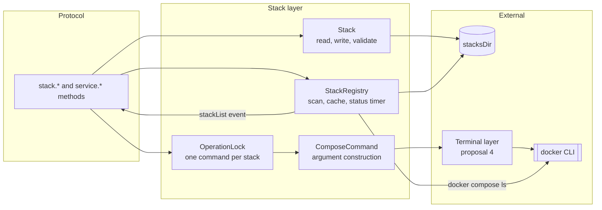

# Stack and Service Management - Spec Proposal

| Item       | Detail                           |
|------------|----------------------------------|
| Author     | heavycaffeiner(Dong Hyun Kim)    |
| Created    | 2026-08-09                       |
| Status     | **Draft** / In Review / Approved |
| Reviewers  |                                  |

---

## 1. Summary

This proposal covers the core of Docknight: discovering compose stacks on disk, reading and writing
their `compose.yaml` and `.env` files, running `docker compose` against them, tracking their status,
and controlling individual services. It also covers the global environment file, docker network
enumeration, and container resource statistics. Everything here runs on the host that owns the stacks
directory; the routing that lets one UI reach several such hosts is proposal 5.

## 2. Background & Motivation

A stack is a directory containing a compose file. Docknight edits that file in place and runs
`docker compose` against it. Nothing is imported, nothing is generated into a private format, and the
directory keeps working from a shell with Docknight stopped. That constraint is the product, and it
determines the whole design of this layer.

Two consequences shape everything below.

**The filesystem is authoritative, so writes must be safe.** Docknight overwrites files the user
depends on and removes directories on request. A compose file truncated by a crash during a write is
a real outage, and there is no database backup to restore it from because the file is the record. So
every write is atomic through a same-directory temporary file and a rename, every destructive path
re-verifies that the resolved target is inside the stacks directory rather than trusting the name
that produced it, and `.env` is written whenever the user edited it rather than only when some other
condition happens to hold.

**The CLI is authoritative for compose semantics, so Docknight does not reimplement them.** Profiles,
`depends_on` ordering, build contexts, extension merging, variable interpolation at deploy time: all
of it belongs to `docker compose`, and every operation is an argument vector handed to that binary
with the stack directory as the working directory. This is also what makes Podman support free, since
`podman-docker` provides the same command surface. The cost is that Docknight must be careful about
two things the CLI does not manage for it: which `--env-file` flags are passed, so that a single
service starts with the same environment the whole stack does, and how many commands may run against
one stack at a time, so that an `up` and a `down` issued from two browser tabs cannot interleave.

Beyond correctness, the layer has one performance requirement: status must be near-live for every
connected viewer without turning into a process storm. `docker compose ls` is a subprocess, so it
runs once per interval for the whole process and the result fans out, rather than once per viewer or
once per handler.

## 3. Goals & Non-Goals

### 3.1 Goals

- [ ] Discover stacks by scanning the stacks directory and merge them with what `docker compose ls`
      reports, including stacks not created by Docknight.
- [ ] Read and write `compose.yaml` and `.env` atomically, preserving user comments.
- [ ] Validate stack names and enforce that every resolved path stays inside the stacks directory.
- [ ] Run deploy, start, stop, restart, down, update and delete through `docker compose`, streaming
      output to the requesting client.
- [ ] Serialise operations per stack with an explicit lock and a clear conflict error.
- [ ] Track stack status on a single shared timer and push changes to every authenticated client.
- [ ] Report per-service status and health, and start, stop or restart a single service.
- [ ] Report container CPU and memory statistics.
- [ ] Enumerate docker networks for the compose editor.
- [ ] Support `${stacksDir}/global.env` as an additional env file for every stack.
- [ ] Apply `PUID` and `PGID` ownership to everything written into the stacks directory.

### 3.2 Non-Goals

- [ ] Talking to the Docker Engine API directly.
- [ ] Implementing compose semantics: profiles, `depends_on` ordering, build, extends.
- [ ] Editing files inside a stack directory other than the compose file and `.env`.
- [ ] Stack templates, a registry browser, or image search.
- [ ] Backup, snapshots, or rollback of compose files.
- [ ] Image pruning, volume management, or any host-level docker maintenance.

## 4. Technical Design

### 4.1 Architecture Overview



Long-running commands go through the terminal layer rather than a plain `spawn`, because their output
is the progress display the user watches. Short read-only commands, meaning `compose ls`,
`compose ps`, `stats` and `network ls`, are plain `spawn` calls with captured stdout and never touch
a pty.

Modules:

- `backend/stack/registry.ts`: discovery, the status cache, the refresh timer, `stackList` emission.
- `backend/stack/stack.ts`: one stack, its paths, its file IO, its validation.
- `backend/stack/compose.ts`: argument construction and the short-command runner.
- `backend/stack/lock.ts`: the per-stack operation lock.
- `backend/stack/methods.ts`: protocol methods.
- `common/stack.ts`: status constants and the shared `StackSummary` type.

### 4.2 Data Model Changes

No database change. Stacks live entirely on the filesystem; the database holds no row per stack. This
is what lets a user edit a compose file over SSH and have Docknight show the result on the next
refresh.

Filesystem layout Docknight expects:

```
${stacksDir}/
  global.env               optional, applies to every stack
  <stack-name>/
    compose.yaml           or docker-compose.yaml, docker-compose.yml, compose.yml
    .env                   optional
    ...                    any other file, left untouched
```

The accepted compose file names, in the order they are probed, are `compose.yaml`,
`docker-compose.yaml`, `docker-compose.yml`, `compose.yml`. The first that exists wins and is
preserved on save, so a stack created with `docker-compose.yml` is not silently renamed.

In-memory types shared with the frontend:

```ts
export const UNKNOWN = 0;         // not reported by docker compose ls
export const DRAFT = 1;           // files on disk, never deployed
export const CREATED = 2;         // containers created, none running
export const RUNNING = 3;         // all reported services running
export const EXITED = 4;          // at least one service exited

export interface StackSummary {
    name: string;
    status: number;
    managed: boolean;             // the directory exists under stacksDir
    composeFileName: string;
}
// No endpoint field: which host a summary describes is carried by the event envelope,
// per proposal 1. A relayed payload is never rewritten to add it.

export interface StackDetail extends StackSummary {
    composeYAML: string;
    composeENV: string;
    primaryHostname: string;      // for building service URLs in the UI
}

export interface ServiceInstance { name: string; status: string; }   // container name, health or state
```

### 4.3 Core Logic

#### 4.3.1 Name validation and path containment

Two checks, both applied on every operation that resolves a name to a path, not only on create:

```
assertValidName(name):
    if not /^[a-z0-9][a-z0-9_-]{0,62}$/.test(name): throw validation "invalidStackName"
    # leading character constrained so a name cannot begin with - and be read as a flag

resolveStackPath(name):
    assertValidName(name)
    full := path.resolve(stacksDir, name)
    if full != path.join(stacksDir, name): throw validation "invalidStackName"
    if not full.startsWith(stacksDir + path.sep): throw validation "invalidStackName"
    return full
```

The redundancy is intentional. The regex is the policy; the containment check is the guarantee, and
it is what a destructive operation actually relies on, so it must not be conditional on the policy
staying as strict as it is today. `delete` additionally verifies with `lstat` that the target is a
directory and not a symbolic link before removing it, so a symlink planted inside the stacks
directory cannot redirect the removal.

#### 4.3.2 Discovery

```
scan():
    entries := readdir(stacksDir, { withFileTypes: true })
    result  := empty map
    for entry in entries where entry.isDirectory() and name passes assertValidName:
        fileName := first accepted compose file name that exists in the directory
        if fileName is null: continue                  # a directory without a compose file is not a stack
        result[entry.name] := Stack(name, fileName, status = DRAFT)
    return result

refreshStatus(stacks):
    out := run docker compose ls --all --format json         # 10 s timeout
    for entry in parse(out):
        stack := stacks[entry.Name]
        if stack is null:
            if entry.Name == "docknight": continue           # do not manage ourselves
            stack := Stack(entry.Name, managed = false)       # deployed but not under stacksDir
            stacks[entry.Name] := stack
        stack.status         := convertStatus(entry.Status)
        stack.configFilePath := entry.ConfigFiles

convertStatus(text):                                  # e.g. "exited(1), running(2)"
    starts with "created"  -> CREATED
    contains "exited"      -> EXITED
    starts with "running"  -> RUNNING
    otherwise              -> UNKNOWN
```

`scan()` touches the filesystem and is therefore run when a mutation happens and at most once every
60 seconds otherwise. `refreshStatus()` runs on the 10 second timer against the cached scan result.
Exactly one `compose ls` runs per tick regardless of how many clients are connected.

`stackList` is emitted after every refresh tick and after every mutation, to every authenticated
connection. The payload is the whole map rather than a delta, because it is small, a few hundred
bytes per stack, and because a full snapshot makes reconnection resynchronisation trivial.

#### 4.3.3 Reading a stack

```
read(name):
    dir := resolveStackPath(name)
    if dir does not exist: throw notFound
    fileName    := first accepted compose file name present, defaulting to "compose.yaml"
    composeYAML := readFile(dir/fileName, "utf8")  or ""  when absent
    composeENV  := readFile(dir/".env",   "utf8")  or ""  when absent
    return StackDetail
```

Both files are size-capped at 1 MiB on read. A larger file returns `validation` with
`composeFileTooLarge` rather than being loaded into an editor that cannot handle it.

#### 4.3.4 Writing a stack

Validation before any write:

```
validate(name, composeYAML, composeENV):
    assertValidName(name)
    doc := YAML.parseDocument(composeYAML)
    if doc.errors is non-empty: throw validation "invalidYAML" with the first error's message
    root := doc.toJS()
    if root is not a plain object: throw validation "invalidCompose"
    if root.services is present and is not a plain object: throw validation "servicesMustBeObject"
    for each line of composeENV:
        skip blank lines and lines whose first non-space character is #
        if the line has no "=": throw validation "invalidEnvFormat" naming the line number
```

The env check exists because `docker compose` fails with an opaque platform error on a malformed env
file, and a line-numbered message is the difference between a five second fix and a support thread.

The write itself:

```
write(name, composeYAML, composeENV, isCreate):
    dir := resolveStackPath(name)
    if isCreate:
        if dir exists: throw conflict "stackAlreadyExists"
        mkdir dir, mode 0755
    else:
        if dir does not exist: throw notFound

    writeAtomic(dir/fileName, composeYAML)
    if composeENV is non-empty or dir/.env exists:
        writeAtomic(dir/".env", composeENV)
    applyOwnership(dir)                      # PUID and PGID, when both are set

writeAtomic(target, content):
    tmp := target + ".tmp-" + random 6 chars       # same directory, so rename stays atomic
    fd  := open(tmp, "wx", 0644)
    write(fd, content); fsync(fd); close(fd)
    rename(tmp, target)
    fsync(directory containing target)             # makes the rename itself durable
    # any failure unlinks tmp and rethrows; the original file is untouched
```

The current file is never in a partially written state, and a failure leaves the previous version
intact. `.env` is written whenever the user supplied content or a `.env` already exists, so an edit
in the environment editor is never silently discarded.

#### 4.3.5 Compose argument construction

```
composeArgs(stack, command, ...extra):
    args := ["compose"]
    if exists(stacksDir/global.env):
        args.push("--env-file", "../global.env")
        if exists(stack.dir/.env): args.push("--env-file", "./.env")
    args.push(command, ...extra)
    return args
```

The order matters: compose applies later `--env-file` values over earlier ones, so the stack's own
`.env` must come after `global.env`. When no `global.env` exists the flags are omitted entirely and
compose picks up `.env` by its own default rule, which is what makes a stack directory behave
identically outside Docknight.

Every command goes through this function, including the per-service ones, so a single service starts
with exactly the environment the whole stack would start with. The working directory is always the
stack directory.

| Operation       | Command                                                          |
|-----------------|------------------------------------------------------------------|
| deploy          | `up -d --remove-orphans`                                         |
| start           | `up -d --remove-orphans`                                         |
| stop            | `stop`                                                           |
| restart         | `restart`                                                        |
| down            | `down`                                                           |
| delete          | `down --remove-orphans`, then remove the directory               |
| update          | `pull`, then `up -d --remove-orphans` when the stack was running |
| service start   | `up -d <service>`                                                |
| service stop    | `stop <service>`                                                 |
| service restart | `restart <service>`                                              |

`update` re-reads the status after `pull` and skips the `up` when the stack is not `RUNNING`, so
pulling images for a stopped stack does not start it.

Three of these methods also touch the stack's follow-log terminal, which is proposal 4's object:
`deploy` and `start` join it for the requesting connection, and `stop` leaves it, since a stopped
stack produces no further output. `stack.get` joins it as well, which is what fills the log pane when
a user opens a stack page.

#### 4.3.6 Operation lock

```
withStackLock(name, fn):
    if locks.has(name): throw conflict "operationInProgress"
    promise := fn()
    locks.set(name, promise)
    try: return await promise
    finally: locks.delete(name)
```

One in-flight mutating command per stack, process-wide, so two browser tabs cannot run `up` and
`down` against the same stack at once. Read-only calls, meaning `stack.get`, `stack.serviceStatus`
and `docker.stats`, do not take the lock.

The lock lives in the stack layer rather than falling out of some lower-level uniqueness constraint,
so the error the user sees names the real condition.

#### 4.3.7 Running a long command

```
runComposeCommand(conn, stack, command, args):
    terminalName := "compose-" + conn.endpoint + "-" + stack.name
    exitCode     := await Terminal.run(terminalName, "docker", composeArgs(stack, command, ...args),
                                       stack.dir, joinFor = conn)          # proposal 4
    if exitCode != 0: throw commandFailed with the exit code and the terminal name
    registry.markDirty(stack.name)                # forces a scan plus status refresh on the next tick
    emit stackList to every authenticated connection
    return exitCode
```

The terminal name is derived from the endpoint and the stack name, so a client that reconnects
mid-deploy re-joins the same terminal and sees the scrollback rather than a blank pane.

The `docker` process environment is the parent environment unchanged, which is what makes
`DOCKER_HOST`, `DOCKER_CONFIG` and registry credentials mounted into the container work. No shell is
involved at any point; arguments are passed as an array, so a stack name or service name can never be
interpreted as shell syntax.

#### 4.3.8 Service status

```
serviceStatus(stack):
    out := run docker compose ps --format json in stack.dir          # 10 s timeout
    # compose emits either one JSON array or one JSON object per line depending on version
    for each parsed record:
        group by record.Service
        append { name: record.Name, status: record.Health or record.State }
    return the grouping
```

Both output shapes are handled because the format differs between compose releases and both are in
the field. A line that fails to parse is skipped, not fatal.

`Health` takes precedence over `State` so a container reports `healthy`, `unhealthy` or `starting`
when it defines a healthcheck, which is the distinction the UI colours on.

#### 4.3.9 Container statistics

```
dockerStats():
    out := run docker stats --format json --no-stream               # 15 s timeout
    return one record per line, keyed by record.Name
```

Host-wide, not per stack, because one invocation covers every stack page a user might have open. The
frontend matches records to services by container name. A non-zero exit returns an empty map and logs
a warning rather than failing the request, so a statistics hiccup never blocks the stack page from
rendering.

#### 4.3.10 Networks

```
dockerNetworks():
    out := run docker network ls --format {{.Name}}                 # 10 s timeout
    return the non-empty lines, sorted with localeCompare
```

Used only to populate the external-network picker in the compose editor.

#### 4.3.11 Global environment file

`${stacksDir}/global.env` is read and written through `settings.get` and `settings.set` in proposal 2,
because that is where the settings screen lives, but the file itself belongs to this proposal:

- Reading an absent file returns the placeholder `# VARIABLE=value #comment`.
- Writing content equal to that placeholder deletes the file, which is how the user removes it.
- Writes use the same `writeAtomic` helper and the same ownership rule as stack files.
- The content is validated with the same per-line env check as `.env`.

#### 4.3.12 Short command runner

```
runCapture(argv, cwd, timeoutMs):
    child := spawn("docker", argv, { cwd, env: process.env })
    collect stdout and stderr, each capped at 4 MiB
    on timeout: SIGKILL and throw commandFailed with "timeout"
    on exit != 0: throw commandFailed with the code and the first 500 characters of stderr
    return stdout
```

No shell, an explicit timeout on every call, and a bounded buffer, so a hung daemon produces an error
rather than a promise that never settles.

## 5. API Design

### 5-1. New / Modified

Every method below is routable, meaning it accepts a non-empty `endpoint` that proposal 5 forwards.

```ts
/** Snapshot of every stack this host knows about. Also delivered unsolicited as the stackList event. */
"stack.list": { params: undefined; result: { stacks: Record<string, StackSummary> } }

/**
 * Full detail including file contents. Joins the stack's combined log terminal as a side
 * effect when the stack directory exists, so the client's terminal pane fills immediately.
 */
"stack.get": { params: { name: string }; result: { stack: StackDetail } }

/** Validate and write the files without running any docker command. */
"stack.save": {
    params: { name: string; composeYAML: string; composeENV: string; isCreate: boolean };
    result: { ok: true };
}

/** Write the files, then up -d --remove-orphans. */
"stack.deploy": {
    params: { name: string; composeYAML: string; composeENV: string; isCreate: boolean };
    result: { exitCode: number };
}

"stack.start":   { params: { name: string }; result: { exitCode: number } }
"stack.stop":    { params: { name: string }; result: { exitCode: number } }
"stack.restart": { params: { name: string }; result: { exitCode: number } }
"stack.down":    { params: { name: string }; result: { exitCode: number } }

/** compose pull, then up -d only when the stack was running before the pull. */
"stack.update":  { params: { name: string }; result: { exitCode: number } }

/** compose down --remove-orphans, then remove the stack directory recursively. */
"stack.delete":  { params: { name: string }; result: { exitCode: number } }

"stack.serviceStatus": {
    params: { name: string };
    result: { services: Record<string, ServiceInstance[]> };
}

"service.start":   { params: { stack: string; service: string }; result: { exitCode: number } }
"service.stop":    { params: { stack: string; service: string }; result: { exitCode: number } }
"service.restart": { params: { stack: string; service: string }; result: { exitCode: number } }

/** Host-wide container statistics, keyed by container name. */
"docker.stats":    { params: undefined; result: { stats: Record<string, DockerStat> } }

/** Docker network names, sorted. */
"docker.networks": { params: undefined; result: { networks: string[] } }
```

Internal signatures:

```ts
/**
 * Resolve a stack name to an absolute path inside the stacks directory.
 * Applies the name policy and then verifies containment, so the returned path is
 * always safe to pass to a destructive filesystem call.
 *
 * @throws ValidationError("invalidStackName") for any name that fails either check.
 */
export function resolveStackPath(stacksDir: string, name: string): string;

/**
 * Write `content` to `target` atomically: same-directory temp file, fsync, rename,
 * directory fsync. On any failure the temp file is removed and the original is untouched.
 */
export async function writeAtomic(target: string, content: string, mode?: number): Promise<void>;

/**
 * Build the docker argument vector for one compose command, inserting --env-file for
 * global.env and the stack's own .env when they exist, in that precedence order.
 */
export function composeArgs(stack: Stack, command: string, ...extra: string[]): string[];

/**
 * Run `fn` while holding this stack's exclusive operation lock.
 * @throws ProtocolError("conflict", "operationInProgress") when another command is running.
 */
export function withStackLock<T>(name: string, fn: () => Promise<T>): Promise<T>;
```

### 5-2. Error Handling

| Code            | i18n key               | Condition                                                               |
|-----------------|------------------------|--------------------------------------------------------------------------|
| `validation`    | `invalidStackName`     | Name fails the policy or resolves outside the stacks directory           |
| `validation`    | `invalidYAML`          | The compose file does not parse; `message` carries the parser message    |
| `validation`    | `servicesMustBeObject` | `services` is present and is not a mapping                               |
| `validation`    | `invalidEnvFormat`     | An env line is neither blank, a comment, nor `KEY=value`                 |
| `validation`    | `composeFileTooLarge`  | A file on disk exceeds 1 MiB                                             |
| `notFound`      | `stackNotFound`        | The named stack directory does not exist and compose does not report it  |
| `conflict`      | `stackAlreadyExists`   | Create against an existing directory                                     |
| `conflict`      | `operationInProgress`  | Another mutating command holds this stack's lock                         |
| `commandFailed` | `composeCommandFailed` | `docker compose` exited non-zero; `message` carries the code             |
| `commandFailed` | `dockerUnavailable`    | The `docker` binary is missing or the daemon refused the connection      |
| `internal`      |                        | Unexpected filesystem or parsing error, logged with a stack trace        |

Behavioural rules:

- A failed `stack.delete` still emits `stackList`, because `compose down` may have partly succeeded
  and the UI must show the real state rather than the state it hoped for.
- `docker.stats` and `docker.networks` degrade to an empty result with a logged warning instead of
  raising, since neither is required for the page to function.
- A command failure never removes files. `delete` removes the directory only after `down` returns
  zero.
- Error messages carry the exit code and the terminal name, never the full stderr, because the full
  output is already streaming to the user's terminal pane.

## 6. Implementation Plan

### 6-1. Milestones

| Phase   | Task                                                                                               | Estimated Duration | Owner          |
|---------|----------------------------------------------------------------------------------------------------|--------------------|----------------|
| Phase 1 | `common/stack.ts`: status constants, `StackSummary`, `StackDetail`, status conversion with tests    | TBD                | heavycaffeiner |
| Phase 2 | `stack/stack.ts`: path resolution, containment, compose file name probing, read, validate          | TBD                | heavycaffeiner |
| Phase 3 | `writeAtomic` and `applyOwnership`, plus the create and update write paths including `.env`         | TBD                | heavycaffeiner |
| Phase 4 | `stack/compose.ts`: `composeArgs`, `runCapture` with timeouts and bounded buffers                   | TBD                | heavycaffeiner |
| Phase 5 | `stack/registry.ts`: scan, status refresh, dirty marking, the 10 second timer, `stackList` emission | TBD                | heavycaffeiner |
| Phase 6 | `stack/lock.ts` and the long-command runner on top of proposal 4's terminal layer                   | TBD                | heavycaffeiner |
| Phase 7 | Lifecycle methods: save, deploy, start, stop, restart, down, update, delete                         | TBD                | heavycaffeiner |
| Phase 8 | Service status parsing for both compose output shapes, and the three per-service methods            | TBD                | heavycaffeiner |
| Phase 9 | `docker.stats`, `docker.networks`, and the `global.env` read and write path                         | TBD                | heavycaffeiner |

Phases 1 to 4 depend only on proposal 0. Phase 6 depends on proposal 4 Phase 5, which is where `run()`
lands. Phases 7 to 9 depend on proposal 1 Phase 3 for method registration.

### 6-2. Dependencies

| Package | Purpose                                               | Why not the standard library                                                                                            |
|---------|-------------------------------------------------------|--------------------------------------------------------------------------------------------------------------------------|
| `yaml`  | Parse and serialise compose files preserving comments | A round trip that keeps comments and formatting is subtle work with an existing correct implementation; a plain parser discards both |

`node:child_process`, `node:fs/promises` and `node:path` cover everything else.

External requirements: the `docker` binary on `PATH` with the Compose v2 plugin, and a reachable
daemon socket. Under Podman this is satisfied by `podman-docker`.

Internal dependencies: proposal 0 for configuration, logging and ownership settings. Proposal 1 for
method registration and event emission. Proposal 2 for the authentication gate and the settings store
that carries `global.env`. Proposal 4 for the terminal that streams command output.

## 7. References

- Compose file specification: https://github.com/compose-spec/compose-spec
- `docker compose ls`: https://docs.docker.com/reference/cli/docker/compose/ls/
- `docker compose ps` JSON output: https://docs.docker.com/reference/cli/docker/compose/ps/
- `docker compose up`: https://docs.docker.com/reference/cli/docker/compose/up/
- Compose environment file precedence: https://docs.docker.com/compose/how-tos/environment-variables/envvars-precedence/
- `docker stats` formatting: https://docs.docker.com/reference/cli/docker/container/stats/
- `docker network ls`: https://docs.docker.com/reference/cli/docker/network/ls/
- Podman docker compatibility: https://podman.io/docs
- `yaml` package document API: https://eemeli.org/yaml/#documents
- Companion proposals: `docknight-0-foundation`, `docknight-1-transport`, `docknight-2-auth`,
  `docknight-4-terminal`, `docknight-5-agent`, `docknight-7-frontend-features`
