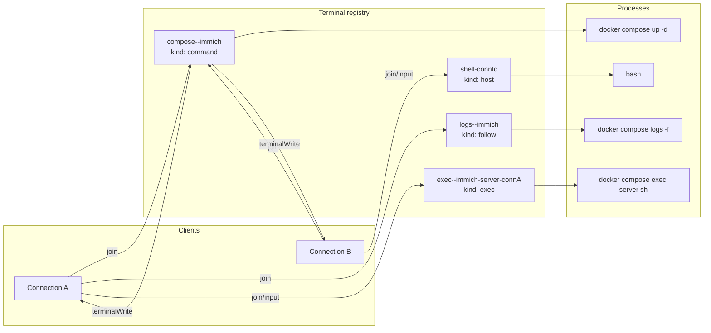

# Terminal Subsystem - Spec Proposal

| Item       | Detail                           |
|------------|----------------------------------|
| Author     | heavycaffeiner(Dong Hyun Kim)    |
| Created    | 2026-08-09                       |
| Status     | **Draft** / In Review / Approved |
| Reviewers  |                                  |

---

## 1. Summary

Docknight streams four kinds of terminal to the browser: the progress output of a running compose
command, the combined follow-log of a stack, an interactive shell inside a container, and an optional
host shell. This proposal specifies the pseudo-terminal registry that backs all four, their naming,
their lifetime rules, scrollback replay on join, resize handling, and the protocol methods that drive
them.

## 2. Background & Motivation

Compose commands are not silent. `pull` draws layer progress bars, `up` reports per-service state
transitions, and a failure explains itself in its output and nowhere else. If Docknight ran these
commands and reported only an exit code, every failure would end with the user opening a shell to find
out what happened, which defeats the point of the tool. So command output is a first-class part of the
interface and it must be live.

That forces a pseudo-terminal rather than plain pipes. Compose detects whether its output is a tty and
degrades to plain line-per-event logging when it is not, so pipes produce a different and worse
display. A container shell needs a tty by definition. Once there is a pty, everything else follows:
the process has a size, so resize must be forwarded; the output is a byte stream with escape
sequences, so it must reach the renderer unmodified; and the process outlives any single HTTP request,
so it needs a name and a registry rather than a request scope.

Three requirements come from operating this rather than from building it.

- **A viewer arriving late must see what happened.** A deploy takes minutes; a user switches tabs and
  comes back, or their laptop sleeps and the socket reconnects. Each terminal therefore keeps a
  bounded scrollback that is replayed on join, and the size of that buffer is capped so that a
  chatty container cannot consume the process's memory.
- **Every child must be reclaimed.** A `docker compose logs -f` process is a long-lived child holding
  a daemon connection. If terminals are not closed when their last viewer leaves, and again when the
  process shuts down, orphans accumulate until something else reaps them. Termination escalates
  rather than hoping a single interrupt is honoured.
- **A terminal is an authority boundary.** A container shell is arbitrary command execution inside
  that container, and the host shell is arbitrary command execution as the user Docknight runs as.
  Names are derived from public values such as stack and service names, so membership in a terminal's
  subscriber set is checked on every write rather than inferred from knowing the name.

## 3. Goals & Non-Goals

### 3.1 Goals

- [ ] One registry of named pseudo-terminals with a documented naming scheme.
- [ ] Four terminal kinds with distinct lifetime rules: command, follow-log, container exec, host shell.
- [ ] Scrollback replay when a client joins or rejoins, bounded in memory.
- [ ] Output streamed only to joined clients, coalesced and backpressure-aware per proposal 1.
- [ ] Input and resize for interactive terminals, with a membership check on both.
- [ ] Deterministic teardown: on last leave, on client disconnect, and on process exit.
- [ ] Host shell gated behind an explicit configuration flag and isolated per connection.
- [ ] Container exec restricted to a known shell list and to services of a known stack.

### 3.2 Non-Goals

- [ ] Persisting terminal output across a Docknight restart. Scrollback is memory only.
- [ ] Session recording, export, or search of terminal output.
- [ ] `docker attach` semantics or access to a container's stdin outside `compose exec`.
- [ ] Terminal multiplexing, split panes, or tabs on the server side. The UI decides its layout.
- [ ] Running arbitrary host commands through the protocol. The host shell is a pty, not a command
      execution API, and it is off by default.

## 4. Technical Design

### 4.1 Architecture Overview



`backend/terminal/registry.ts` owns the map and the lifecycle. `backend/terminal/terminal.ts` is one
pty plus its subscriber set and ring buffer. `backend/terminal/methods.ts` exposes the protocol
methods. `common/terminal.ts` holds the name builders, shared with the frontend so both sides
construct identical names.

### 4.2 Data Model Changes

No database change. All terminal state is in memory and dies with the process.

```ts
type TerminalKind = "command" | "follow" | "exec" | "host";

interface TerminalState {
    name: string;
    kind: TerminalKind;
    pty: IPty;
    cols: number;
    rows: number;
    buffer: RingBuffer<string>;      // 200 chunks, 256 KiB total cap
    subscribers: Set<Conn>;
    exited: boolean;
    exitCode: number | null;
    idleSince: number | null;        // set when subscribers becomes empty
}
```

Name builders, in `common/terminal.ts`:

| Kind    | Name                                            | Scope                                                      |
|---------|-------------------------------------------------|-------------------------------------------------------------|
| command | `compose-${endpoint}-${stack}`                  | One per stack; the operation lock guarantees one at a time  |
| follow  | `logs-${endpoint}-${stack}`                     | One per stack, shared by every viewer                       |
| exec    | `exec-${endpoint}-${stack}-${service}-${connectionId}` | One per connection, so two tabs get two shells       |
| host    | `shell-${connectionId}`                         | One per connection                                          |
| command | `upgrade`                                       | One per process; proposal 0's self upgrade, unscoped because it replaces the process itself |

`endpoint` is `""` on the host that owns the stack, so on that host the name reads `compose--immich`.
The field exists so that a manager relaying another host's events can key its local terminal views
without collision, and it is filled in by proposal 5.

Default geometry:

| Kind    | Columns | Rows | Rationale                                             |
|---------|---------|------|--------------------------------------------------------|
| command | 105     | 8    | A fixed progress pane; compose draws pull bars to width |
| follow  | 105     | 20   | A taller log pane                                       |
| exec    | 105     | 24   | Resized by the client on mount                          |
| host    | 105     | 40   | Resized by the client on mount                          |

Row counts are chosen so that each pane's rendered height lands on the 4 pixel grid defined in
proposal 6. The monospace line height there is 20 pixels, so the four kinds occupy 160, 400, 480 and
800 pixels, every one a multiple of 4.

### 4.3 Core Logic

#### 4.3.1 Creation and start

```
getOrCreate(name, kind, file, args, cwd, geometry):
    existing := registry.get(name)
    if existing is not null and not existing.exited: return existing

    pty := spawn(file, args, {
        name: "xterm-256color",
        cwd, env: process.env,
        cols: geometry.cols, rows: geometry.rows,       # both taken from geometry
    })
    state := TerminalState(name, kind, pty, geometry, buffer = new RingBuffer(200, 256 KiB))
    registry.set(name, state)

    pty.onData(chunk => {
        state.buffer.push(chunk)
        for conn in state.subscribers: enqueueWrite(conn, name, chunk)   # coalesced, proposal 1
    })

    pty.onExit(({ exitCode }) => finish(state, exitCode))
    return state
```

`TERM` is set to `xterm-256color` because that is what the frontend renderer implements, and because
compose's progress output and most container shells choose their escape sequences from it.

The environment is inherited unchanged so that `DOCKER_HOST` and registry configuration reach the
child, matching proposal 3.

#### 4.3.2 Join, leave, and replay

```
join(conn, name):
    state := registry.get(name)
    if state is null: return { buffer: "" }        # not an error; the command may not have started
    state.subscribers.add(conn)
    conn.joinedTerminals.add(name)
    state.idleSince := null
    return { buffer: state.buffer.join(), exited: state.exited, exitCode: state.exitCode }

leave(conn, name):
    state := registry.get(name)
    if state is null: return
    state.subscribers.delete(conn)
    conn.joinedTerminals.delete(name)
    if state.subscribers is empty:
        state.idleSince := now
        if state.kind is "exec" or "host": closeTerminal(state)   # a private shell dies with its viewer
        # "follow" is reaped by the idle sweeper; "command" runs to completion regardless

detachConnection(conn):
    for name in conn.joinedTerminals:
        conn.joinedTerminals.delete(name)
        state := registry.get(name)
        if state is null: continue
        state.subscribers.delete(conn)
        if state.subscribers is empty: state.idleSince := now
        # nothing is closed here; the sweeper reaps what nobody comes back to
```

Joining a terminal that does not exist returns an empty buffer rather than an error, because the
client mounts its progress pane before it issues the command that creates the terminal. Treating this
as a normal case removes a race the UI would otherwise have to handle.

Connection close runs `detachConnection` synchronously in the socket's close handler, so subscriber
sets never hold dead connections and no polling is needed to detect them. It is deliberately not
`leave`: a socket that died under its viewer is not a viewer who left. A mobile browser drops the
socket whenever the user switches apps, and closing an interactive shell there loses the work they are
coming back to. The terminal name embeds the connection id, so the client reconnects and rejoins the
same pty by name.

An explicit `terminal.leave` still closes a private shell at once, because that is a user navigating
away rather than a network fault.

#### 4.3.3 Lifetime by kind

| Kind    | Ends when                                                                                             |
|---------|--------------------------------------------------------------------------------------------------------|
| command | The process exits. Subscribers may all leave; the command still runs to completion and the exit code is still recorded, so a reconnecting client learns the outcome |
| follow  | Idle, meaning no subscribers, for 60 seconds. Checked by one sweeper on a 30 second interval           |
| exec    | The last subscriber leaves explicitly, or the shell exits, or it sits idle for 120 seconds              |
| host    | The last subscriber leaves explicitly, or the shell exits, or it sits idle for 120 seconds              |

The 120 second grace on `exec` and `host` is what a dropped socket buys: long enough to cover an app
switch or a tunnel walk, short enough that a shell nobody returns to does not sit holding a pty. The
same sweeper enforces both limits.

```
finish(state, exitCode):
    state.exited   := true
    state.exitCode := exitCode
    for conn in state.subscribers: send evt terminalExit { terminal: state.name, exitCode }
    registry.delete(state.name)              # the name is immediately reusable
    resolve any pending run() promise with exitCode
```

Deleting on exit is what makes `compose-<endpoint>-<stack>` a usable single-flight key. The client
keeps its own rendered scrollback until the user navigates away, so discarding the server-side buffer
loses nothing visible.

#### 4.3.4 Closing a terminal

```
closeTerminal(state):
    if state.exited: return
    state.pty.write("\x03")                       # let a foreground program clean up
    after 2 s, if still alive: state.pty.kill("SIGTERM")
    after 5 s, if still alive: state.pty.kill("SIGKILL")
```

Escalation guarantees the child goes away even when it ignores an interrupt. The same routine runs for
every registry entry during shutdown, before the database closes.

#### 4.3.5 Running a command and awaiting it

```
run(name, file, args, cwd, joinFor):
    if registry.has(name): throw conflict "terminalBusy"
    state := getOrCreate(name, "command", file, args, cwd, COMMAND_GEOMETRY)
    if joinFor is not null: join(joinFor, name)
    return a promise resolved by finish() with the exit code
```

This is the entry point proposal 3 calls. It rejects with a proper `ProtocolError`, and the caller
holds the stack lock, so `terminalBusy` is a second line of defence rather than the primary one.

#### 4.3.6 Input and resize

```
input(conn, name, data):
    state := registry.get(name)
    if state is null: throw notFound
    if state.kind is "command" or "follow": throw validation "terminalNotInteractive"
    if conn not in state.subscribers: throw unauthorized
    state.pty.write(data)

resize(conn, name, cols, rows):
    state := registry.get(name)
    if state is null: return                       # a resize for a finished terminal is not an error
    if conn not in state.subscribers: throw unauthorized
    clamp cols to [20, 500] and rows to [5, 200]
    state.cols := cols; state.rows := rows
    state.pty.resize(cols, rows)
```

Membership is checked on both, because exec terminal names are derived from public stack and service
names and would otherwise be guessable. Dimensions are integer-checked and clamped before reaching
`resize`, which rejects nonsense input at the binding layer.

A shared terminal has one geometry. When several clients view one `follow` terminal, the last resize
wins; the frontend renders with reflow enabled so a mismatch degrades to rewrapping rather than
corruption.

#### 4.3.7 Container exec

```
exec(conn, stackName, serviceName, shell):
    stack := resolveStack(stackName)                          # proposal 3, validates and locates
    if serviceName not in the parsed compose services: throw notFound "serviceNotFound"
    if shell not in ["sh", "bash", "ash", "zsh"]: throw validation "unsupportedShell"

    name := "exec-" + conn.endpoint + "-" + stackName + "-" + serviceName + "-" + conn.id
    state := getOrCreate(name, "exec", "docker",
                         composeArgs(stack, "exec", serviceName, shell), stack.dir, EXEC_GEOMETRY)
    join(conn, name)
```

The service name is checked against the stack's own compose file rather than passed through, so a
request cannot reach a container outside the addressed stack. The shell allowlist turns an arbitrary
string into one of four known values; a container without that shell fails cleanly with a non-zero
exit that the user sees in the pane.

Keying the name on the connection, exactly as the host shell does, is what gives two browser tabs on
the same service two independent shells instead of one they both type into. It also means a
reconnecting client gets a fresh shell, which is correct: the previous one was closed when its last
subscriber left.

#### 4.3.8 Host shell

Off unless `enableConsole` is true. When enabled:

```
hostShell(conn):
    if not config.enableConsole: throw validation "consoleDisabled"
    shell := "bash" when present on PATH, else "sh"
    name  := "shell-" + conn.id
    state := getOrCreate(name, "host", shell, [], config.stacksDir, HOST_GEOMETRY)
    join(conn, name)
```

Keying on the connection id gives each browser tab its own shell, so two tabs do not type into one
process. The shell starts in the stacks directory, which is where a user opening it wants to be.

The setting is documented as what it is: a full shell as the user Docknight runs as, usually root
inside the container, with the docker socket mounted. It is not sandboxed and is not meant to be.

#### 4.3.9 Memory bounds

The ring buffer holds at most 200 chunks and at most 256 KiB in total; pushing past either drops from
the front. A pty emitting a megabyte per second therefore costs a fixed 256 KiB per terminal, and the
per-connection send queue is bounded separately by proposal 1's backpressure rule.

The registry itself is bounded by construction: `command` and `follow` are one per stack, and `host`
and `exec` are keyed by connection, so their count is bounded by the number of open connections and
every one of them is released when its socket closes.

## 5. API Design

### 5-1. New / Modified

All methods are routable.

```ts
/**
 * Subscribe to a terminal and receive its scrollback. Joining a terminal that does not
 * exist is not an error; it returns an empty buffer so the client can mount its pane
 * before the command that creates the terminal is issued.
 */
"terminal.join": {
    params: { terminal: string };
    result: { buffer: string; exited: boolean; exitCode: number | null };
}

/** Unsubscribe. Closes exec and host terminals whose last viewer just left. */
"terminal.leave": { params: { terminal: string }; result: { ok: true } }

/** Write to an interactive terminal. Rejected for command and follow terminals. */
"terminal.input": { params: { terminal: string; data: string }; result: { ok: true } }

/** Resize. Values are clamped to cols [20,500] and rows [5,200]. */
"terminal.resize": { params: { terminal: string; cols: number; rows: number }; result: { ok: true } }

/**
 * Open or re-open this connection's interactive shell in one service of one stack,
 * and join it. `shell` must be one of sh, bash, ash, zsh.
 */
"terminal.exec": {
    params: { stack: string; service: string; shell: string };
    result: { terminal: string };
}

/** Open or re-open this connection's host shell and join it. Requires enableConsole. */
"terminal.main": { params: undefined; result: { terminal: string } }

/** Report whether the host shell is available, so the UI can hide the entry point. */
"terminal.mainEnabled": { params: undefined; result: { enabled: boolean } }
```

The `follow` terminal is not opened by a terminal method. Proposal 3's `stack.get`, `stack.start` and
`stack.deploy` create and join it as a side effect, and `stack.stop` leaves it, which is what makes
the log pane fill without an extra round trip.

Internal signatures:

```ts
/**
 * Start a one-shot command in a named terminal and resolve with its exit code.
 * The command runs to completion even if every subscriber leaves.
 *
 * @throws ProtocolError("conflict", "terminalBusy") when the name is already live.
 */
export function run(
    name: string, file: string, args: string[], cwd: string, joinFor: Conn | null,
    geometry: Geometry,
): Promise<number>;

/** True only while a terminal of that name is live, which makes the name a single-flight key. */
export function has(name: string): boolean;

/** Create the terminal if absent, otherwise return the live one. Never restarts a running pty. */
export function getOrCreate(
    name: string, kind: TerminalKind, file: string, args: string[], cwd: string, geometry: Geometry,
): TerminalState;

/** Ctrl-C, then SIGTERM after 2 s, then SIGKILL after 5 s. Safe to call on an exited terminal. */
export function closeTerminal(state: TerminalState): void;

/** Remove `conn` from every terminal it joined, closing none of them. From the socket close handler. */
export function detachConnection(conn: Conn): void;

/** Close every live terminal. Called during shutdown before the database is closed. */
export async function closeAll(): Promise<void>;
```

### 5-2. Error Handling

| Code            | i18n key                 | Condition                                                              |
|-----------------|--------------------------|-------------------------------------------------------------------------|
| `notFound`      | `terminalNotFound`       | `terminal.input` against an unknown terminal                            |
| `notFound`      | `serviceNotFound`        | `terminal.exec` naming a service absent from the stack's compose file   |
| `validation`    | `terminalNotInteractive` | Input sent to a command or follow terminal                              |
| `validation`    | `unsupportedShell`       | A shell outside the allowlist                                           |
| `validation`    | `consoleDisabled`        | `terminal.main` while `enableConsole` is false                          |
| `unauthorized`  | `terminalNotJoined`      | Input or resize from a connection that is not a subscriber              |
| `conflict`      | `terminalBusy`           | `run` against a live terminal name                                      |
| `commandFailed` | `terminalSpawnFailed`    | `pty.spawn` threw, for example a missing binary                         |

Failure behaviour:

- A spawn failure is reported as a `terminalExit` event with exit code 127 in addition to the method
  error, so a client that already mounted its pane sees the outcome in place.
- A pty that exits with a non-zero code is not an error at this layer. The exit code is delivered and
  the caller, usually proposal 3, decides whether it means failure.
- Terminal output is never inspected or parsed for errors. It is bytes destined for a renderer.

## 6. Implementation Plan

### 6-1. Milestones

| Phase   | Task                                                                                              | Estimated Duration | Owner          |
|---------|---------------------------------------------------------------------------------------------------|--------------------|----------------|
| Phase 1 | `common/terminal.ts`: kinds, name builders, geometry constants                                    | TBD                | heavycaffeiner |
| Phase 2 | `RingBuffer` with both a chunk cap and a byte cap, with tests                                      | TBD                | heavycaffeiner |
| Phase 3 | `terminal/terminal.ts`: spawn, data fan-out, exit handling, escalating close                       | TBD                | heavycaffeiner |
| Phase 4 | `terminal/registry.ts`: map, join, leave, idle sweeper, `detachConnection`, `closeAll`             | TBD                | heavycaffeiner |
| Phase 5 | `run()` and its integration with proposal 3's command execution                                    | TBD                | heavycaffeiner |
| Phase 6 | `terminal.join`, `terminal.leave`, `terminal.resize` methods                                       | TBD                | heavycaffeiner |
| Phase 7 | `terminal.input` with the membership check, and `terminal.exec` with the service and shell checks  | TBD                | heavycaffeiner |
| Phase 8 | `terminal.main` and `terminal.mainEnabled`, per-connection host shell                              | TBD                | heavycaffeiner |
| Phase 9 | Shutdown integration: `closeAll` wired ahead of the database close in proposal 0's sequence        | TBD                | heavycaffeiner |

Phases 1 to 4 depend on proposal 0 only. Phase 5 unblocks proposal 3 Phase 6. Phases 6 to 8 depend on
proposal 1 Phase 3.

### 6-2. Dependencies

| Package                                   | Purpose               | Why not the standard library                                                                                                                                                                 |
|-------------------------------------------|-----------------------|-----------------------------------------------------------------------------------------------------------------------------------------------------------------------------------------------|
| `@homebridge/node-pty-prebuilt-multiarch` | Pseudo-terminal spawn | Node has no pty API. `child_process` pipes are not a tty, so compose prints no progress bars and no interactive shell works. This fork ships prebuilt binaries for amd64, arm64 and armv7, which keeps a compiler out of the image |

The browser-side renderer dependency is declared in proposal 7.

Internal dependencies: proposal 0 for configuration, logging and the shutdown hook. Proposal 1 for
method registration, the coalesced write queue, and `Conn`. Proposal 3 for stack resolution and
compose argument construction.

## 7. References

- node-pty: https://github.com/microsoft/node-pty
- Prebuilt multiarch fork: https://github.com/homebridge/node-pty-prebuilt-multiarch
- `docker compose exec`: https://docs.docker.com/reference/cli/docker/compose/exec/
- `docker compose logs`: https://docs.docker.com/reference/cli/docker/compose/logs/
- xterm control sequences, for the `TERM` choice: https://invisible-island.net/xterm/ctlseqs/ctlseqs.html
- Companion proposals: `docknight-0-foundation`, `docknight-1-transport`, `docknight-3-stack`,
  `docknight-7-frontend-features`
