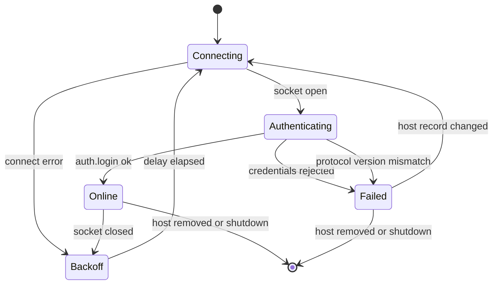

# Multi-Host Federation - Spec Proposal

| Item       | Detail                           |
|------------|----------------------------------|
| Author     | heavycaffeiner(Dong Hyun Kim)    |
| Created    | 2026-08-09                       |
| Status     | **Draft** / In Review / Approved |
| Reviewers  |                                  |

---

## 1. Summary

One Docknight instance can manage stacks on other Docknight hosts. The instance the browser talks to
acts as a manager: it holds outbound WebSocket links to the configured hosts, forwards routable
requests to them, relays their events back with the originating endpoint stamped, and presents every
host's stacks in one list. This proposal specifies the host record, credential storage, the connection
pool, forwarding, status reporting, and version compatibility. A managed host is called an agent in
the protocol and the UI.

## 2. Background & Motivation

Self-hosting rarely stays on one machine. A NAS runs the storage stacks, a small server runs the media
stacks, a spare board runs something at the edge. Each of them needs the same manager, and opening
three browser tabs to three installations means three logins, three stack lists, and no single view of
what is running where.

Federation is the answer, and its shape is decided by three constraints.

- **One build, both roles.** There is no separate agent package to install, version, and keep in step.
  Every Docknight is capable of managing and of being managed, and which role it plays is decided
  entirely by whether another instance has been configured to connect to it. The agent side of the
  protocol is the same server the browser already talks to, distinguished only by a header on the
  upgrade request.
- **The link belongs to the process, not to a browser tab.** A user with three tabs open must not
  produce three logins against every remote host. The pool is a process-wide singleton created at
  startup, so the number of outbound connections equals the number of configured hosts regardless of
  how many browsers are attached, and the manager's view is already warm when the first browser
  arrives.
- **Remote credentials have to be replayable, so they cannot be hashed.** A stored password that must
  be presented to another service can only be encrypted, and the key has to live on the same machine.
  That is not a defence against someone who already holds the data directory, and the design does not
  pretend otherwise. It is a defence against the ordinary case: a database file copied into a backup,
  a support ticket, or a screenshot, where a plaintext password would be readable at a glance.

Forwarding itself must be transparent. A stack page addressed at a remote host has to behave exactly
like a local one, including its terminal stream and including its errors, so the endpoint is a field
in the protocol envelope rather than something each handler re-derives.

## 3. Goals & Non-Goals

### 3.1 Goals

- [ ] Store host records with encrypted credentials.
- [ ] One process-wide connection pool, independent of how many browsers are connected.
- [ ] Automatic connection at startup and after a configuration change, with reconnect backoff.
- [ ] Forward routable requests to a named host and map responses back.
- [ ] Broadcast fire-and-forget requests to every host.
- [ ] Relay events to subscribed browser connections with the endpoint stamped.
- [ ] Report per-host status: connecting, online, offline, with a reason.
- [ ] Add, remove, and rename hosts, with a credential test before a host is stored.
- [ ] Refuse hosts whose protocol version does not match, with a clear status message.
- [ ] Merge every host's stack list into the manager's view without name collisions.

### 3.2 Non-Goals

- [ ] A separate lightweight agent binary or a non-Docknight agent protocol.
- [ ] Host-to-host communication. The topology is a star with the manager at the centre.
- [ ] Nested federation. A managed host does not forward to its own managed hosts; forwarding is one
      hop.
- [ ] Certificate pinning or mutual TLS. Transport security is whatever the host's URL provides,
      meaning TLS when `https`, none when `http`.
- [ ] Cross-host operations such as moving a stack from one host to another.
- [ ] Per-host access control. The manager's administrator has full control of every configured host,
      which is what holding its credentials means.

## 4. Technical Design

### 4.1 Architecture Overview

```mermaid
flowchart TB
    subgraph Browsers
        B1[Tab 1]
        B2[Tab 2]
    end

    subgraph "Manager process"
        WS[WebSocket endpoint]
        POOL["AgentPool (one per process)"]
        L1["Link nas:5001"]
        L2["Link pi:5001"]
        LOCAL[Local handlers]
    end

    subgraph "Host nas:5001"
        A1[WebSocket endpoint]
        AH1[Local handlers]
    end

    subgraph "Host pi:5001"
        A2[WebSocket endpoint]
        AH2[Local handlers]
    end

    B1 --- WS
    B2 --- WS
    WS -->|endpoint ""| LOCAL
    WS -->|endpoint "nas:5001"| POOL
    WS -->|endpoint "pi:5001"| POOL
    POOL --- L1
    POOL --- L2
    L1 <-->|"WebSocket, protocol v1"| A1
    L2 <-->|"WebSocket, protocol v1"| A2
    A1 --> AH1
    A2 --> AH2
```

Both browser tabs share `L1` and `L2`.

Modules:

- `backend/agent/pool.ts`: the pool, the links, reconnection, request forwarding, event relay.
- `backend/agent/link.ts`: one outbound connection and its state machine.
- `backend/agent/store.ts`: the `agent` table, encryption, and the endpoint derivation.
- `backend/agent/methods.ts`: the four management methods.

### 4.2 Data Model Changes

The `agent` table is created in proposal 0 migration `001-initial`. Semantics fixed here:

| Column     | Semantics                                                                                                                        |
|------------|-----------------------------------------------------------------------------------------------------------------------------------|
| `url`      | Absolute `http` or `https` URL of the host, normalised at insert: scheme lowercased, default port removed, trailing slash removed. Unique |
| `username` | The administrator username on that host                                                                                            |
| `secret`   | `v1$<base64 iv>$<base64 ciphertext>$<base64 tag>`, AES-256-GCM over the password                                                   |
| `name`     | Optional display name. Empty means the UI shows the endpoint                                                                       |
| `active`   | Reserved for temporarily disabling a host without deleting it. Always 1 in this scope                                              |

Derived, never stored: `endpoint = new URL(url).host`, computed once at insert and validated there, so
a malformed URL fails at `agent.add` and not later inside a list operation.

Key material: `${dataDir}/agent-key`, 32 random bytes, created on first use with mode 0600 and
`O_EXCL`. Losing the file means the stored passwords cannot be decrypted; the recovery is to re-add
the hosts. This is stated in the About screen and in the README, because a user who restores only the
database from a backup needs to know why their hosts went offline.

The reserved endpoint `""` always denotes the local host and can never be stored as a row.
`agent.add` rejects a URL whose host equals the manager's own listening host and port, which prevents
the self-referential loop.

### 4.3 Core Logic

#### 4.3.1 Link state machine



`Failed` is distinct from `Backoff` on purpose. A wrong password or a protocol mismatch will not fix
itself, so the link stops retrying and reports why rather than hammering a host that will keep saying
no. Anything else, meaning a refused connection, a DNS failure, or a dropped socket, backs off and
retries: 1 s, 2 s, 4 s, up to 60 s, with up to 1 s of jitter, reset on a successful login.

```
connect(agent):
    setStatus(agent.endpoint, "connecting")
    socket := new WebSocket(agent.url + "/ws", {
        headers: {
            "X-Docknight-Endpoint": agent.endpoint,
            "X-Docknight-Protocol": PROTOCOL_VERSION,
        },
    })

    on open:
        res := await request("auth.login", { username, password: decrypt(agent.secret) })
        if res is an error:
            setStatus(endpoint, "offline", res.message)
            state := Failed; close the socket; return
        setStatus(endpoint, "online")
        state := Online
        request("stack.list") and relay the result as a stackList event   # prime the manager's view

    on message evt:  relayEvent(agent.endpoint, message)
    on message res:  resolve the pending forward keyed by the local id
    on close/error:  setStatus(endpoint, "offline"); schedule the backoff retry
```

The `X-Docknight-Endpoint` header tells the receiving host that this inbound connection is a manager
link, which makes it stamp that label on its events and treat forwarded requests as local. Sending the
label the manager knows the host by, rather than something the host computes for itself, keeps
addressing consistent: the host may be reachable under a different name from its own point of view,
and every message must come back labelled the way the manager addressed it.

#### 4.3.2 Forwarding

```
pool.request(endpoint, method, params, signal):
    link := links.get(endpoint)
    if link is null: throw agentUnreachable
    if link.state != Online:
        # a request issued during a page load can arrive before the link finishes authenticating
        wait up to 10 s for state Online, resolved by the state-change signal
        if still not Online: throw agentUnreachable

    localId := link.nextId++
    send { t: "req", id: localId, endpoint: "", method, params }
    await the response, the abort signal, or the deadline
    on abort:  send { t: "cancel", id: localId }; throw AbortError
    on deadline: throw agentTimeout                       # 60 s, or none for long-running methods
    on error response: rethrow it verbatim so the browser sees the host's own error code
```

The forwarded request carries `endpoint: ""` because from the receiving host's point of view the work
is local. Ids are per link and independent of the browser's ids; the pool keeps the mapping.

```
pool.broadcast(method, params):
    for link in links where state is Online:
        send a request and ignore the response; log a warning on error
```

Used for the `"*"` endpoint, which the UI uses only for periodic refreshes where a per-host result is
not needed.

#### 4.3.3 Event relay

```
relayEvent(endpoint, message):
    for conn in authenticatedBrowserConnections:
        if message.event is terminalWrite or terminalExit:
            deliver only when conn joined the terminal name under this endpoint
        send { t: "evt", endpoint, event: message.event, data: message.data }
```

The endpoint is added at relay time, in the envelope. Payloads are never mutated to carry it, so an
event whose payload is a string or an array is labelled exactly as reliably as one whose payload is an
object.

`stackList` events are stored per endpoint in the manager's memory and re-emitted to browsers, so a
browser that connects later immediately receives the last known list for every host rather than
waiting for the next tick on each one.

#### 4.3.4 Terminal names across hosts

The receiving host builds terminal names using the endpoint label the manager sent it, so a name is
unique across the whole federation and the manager needs no rewriting. On that host, connections
opened directly by a browser use `endpoint = ""`; connections opened by a manager use the manager's
label. The two therefore produce different names for the same stack, meaning `logs--immich` locally
and `logs-nas:5001-immich` through the manager, and each has its own pty.

This is accepted rather than deduplicated. Sharing one `docker compose logs -f` process between a
host's own browser session and a manager would save one child process and cost a routing rule in every
terminal path.

#### 4.3.5 Managing hosts

```
agent.add({ url, username, password, name }):
    normalised := normaliseUrl(url)                      # scheme check, default port removed
    endpoint   := new URL(normalised).host
    if endpoint equals this host's own listening address: throw validation "cannotAddSelf"
    if a row with this url exists: throw conflict "agentAlreadyExists"

    testConnection(normalised, username, password)       # a real connect and login, then disconnect
    INSERT the row with the encrypted secret
    pool.connect(the new record)
    emit agentList to every authenticated connection

agent.remove({ url }):
    row := SELECT by url; if null throw notFound
    pool.disconnect(row.endpoint)                        # closes the link and cancels retries
    DELETE the row
    drop the cached stack list for that endpoint
    emit agentList to every authenticated connection

agent.rename({ url, name }):
    UPDATE the row's name; emit agentList
```

Every mutation emits `agentList`. Removal emits nothing else: a `stackList` event carries one host's
snapshot in its envelope and there is no snapshot for a host that no longer exists, so the client
drops the entries for any endpoint absent from the new `agentList`. That rule lives in the stack store
in proposal 6 and is the only way an endpoint's rows leave the merged list. Other browser sessions
therefore converge through events rather than through a forced page reload.

`testConnection` opens a real link, performs a real login, and closes it. It is what turns a typo in
the URL or the password into an error on the add form rather than a host row that is permanently
offline.

#### 4.3.6 Merging stack lists

The manager holds `Map<endpoint, Record<stackName, StackSummary>>`, with `""` for the local host.
Browsers receive one `stackList` event per endpoint and merge on the client under the composite key
`${stackName} ${endpoint}`, so two hosts may both have a stack called `immich` without collision. The
frontend renders them grouped by host, which proposal 7 covers.

#### 4.3.7 Startup and shutdown

The pool is built during startup, after migrations and before the HTTP listener, and immediately
begins connecting to every `active` host. Connections are attempted regardless of whether a browser is
connected.

Shutdown closes every link with WebSocket code 1001 and cancels every retry timer, before the database
closes, as part of proposal 0's ordered sequence.

## 5. API Design

### 5-1. New / Modified

These four methods are not routable; they always execute on the receiving host.

```ts
/** Every configured host plus the synthetic local entry keyed by the empty string. */
"agent.list": {
    params: undefined;
    result: { agents: Record<string, AgentSummary> };
}

/**
 * Verify the credentials by connecting and logging in, then store the host and
 * begin maintaining a link to it.
 */
"agent.add": {
    params: { url: string; username: string; password: string; name?: string };
    result: { endpoint: string };
}

/** Close the link, delete the record, and drop the endpoint's cached stack list. */
"agent.remove": { params: { url: string }; result: { ok: true } }

/** Change only the display name. An empty string restores showing the endpoint. */
"agent.rename": { params: { url: string; name: string }; result: { ok: true } }
```

```ts
export interface AgentSummary {
    url: string;        // "" for the local entry
    endpoint: string;   // "" for the local entry
    username: string;   // never the password
    name: string;
}
```

Events used by this proposal, defined in proposal 1:

```ts
"agentList":   { agents: Record<string, AgentSummary> }
"agentStatus": { endpoint: string; status: "connecting" | "online" | "offline"; message?: string }
```

Internal signatures:

```ts
/**
 * Forward one request to a named host and resolve with its result.
 * Waits up to 10 s for a link that is still authenticating, then fails fast.
 *
 * @throws ProtocolError("agentUnreachable") when no link exists or it never came online.
 * @throws ProtocolError("agentTimeout") when the host accepted the request and did not answer.
 * @throws the host's own ProtocolError verbatim when it returned an error.
 */
export function request(
    endpoint: string, method: string, params: unknown, signal: AbortSignal,
): Promise<unknown>;

/** Send to every online link and ignore the results. Used for the "*" endpoint. */
export function broadcast(method: string, params: unknown): void;

/** Open a link, log in, and verify credentials, then close it. Used by agent.add. */
export function testConnection(
    url: string, username: string, password: string,
): Promise<void>;

/**
 * Encrypt a stored password with AES-256-GCM under the key file in the data directory.
 * The key file is created with mode 0600 on first use.
 */
export function encryptSecret(plain: string): string;
export function decryptSecret(stored: string): string;
```

### 5-2. Error Handling

| Code               | i18n key             | Condition                                                                     |
|--------------------|----------------------|--------------------------------------------------------------------------------|
| `validation`       | `invalidAgentUrl`    | The URL does not parse, or its scheme is not `http` or `https`                 |
| `validation`       | `cannotAddSelf`      | The URL resolves to this instance's own listening address                      |
| `conflict`         | `agentAlreadyExists` | A record with the same normalised URL exists                                   |
| `notFound`         | `agentNotFound`      | Remove or rename against an unknown URL                                        |
| `unauthorized`     | `agentAuthFailed`    | The host rejected the credentials during `agent.add` or during a link login    |
| `agentUnreachable` | `agentUnreachable`   | No link, the link is offline, or it did not come online within 10 s            |
| `agentTimeout`     | `agentTimeout`       | The host accepted the request and did not answer within the deadline           |
| `internal`         | `agentKeyUnreadable` | The key file is missing or unreadable, so stored secrets cannot be decrypted   |

Status messages surfaced through `agentStatus` rather than as request errors, since they describe a
link rather than a request:

| `message`                      | Cause                                                            |
|--------------------------------|------------------------------------------------------------------|
| `unsupported protocol version` | The host rejected the handshake on `X-Docknight-Protocol`        |
| `authentication failed`        | Credentials rejected; the link enters `Failed` and stops retrying |
| `connection refused`           | The host is down or unreachable; the link backs off and retries   |

Rules:

- Errors returned by a managed host are forwarded verbatim, code and i18n key included, so the browser
  cannot tell whether a stack lives locally or remotely from the error alone.
- Stored passwords never appear in an error message, a status message, or a log line.
- A failing host never blocks a request to another host or to the local one. Each link is independent
  and the UI shows a per-host status badge.

## 6. Implementation Plan

### 6-1. Milestones

| Phase   | Task                                                                                             | Estimated Duration | Owner          |
|---------|--------------------------------------------------------------------------------------------------|--------------------|----------------|
| Phase 1 | `agent/store.ts`: URL normalisation, endpoint derivation, CRUD over the `agent` table            | TBD                | heavycaffeiner |
| Phase 2 | Key file handling and AES-256-GCM encrypt and decrypt, with round-trip tests                      | TBD                | heavycaffeiner |
| Phase 3 | `agent/link.ts`: outbound socket, headers, login, state machine, backoff, `Failed` handling       | TBD                | heavycaffeiner |
| Phase 4 | `agent/pool.ts`: registry of links, startup connect, shutdown close, status emission              | TBD                | heavycaffeiner |
| Phase 5 | Request forwarding with id mapping, cancellation, and deadlines; wired into proposal 1 dispatch   | TBD                | heavycaffeiner |
| Phase 6 | Event relay with endpoint stamping and terminal join filtering                                    | TBD                | heavycaffeiner |
| Phase 7 | Per-endpoint stack list cache and merged emission to browsers                                     | TBD                | heavycaffeiner |
| Phase 8 | `agent.list`, `agent.add` with `testConnection`, `agent.remove`, `agent.rename`                   | TBD                | heavycaffeiner |
| Phase 9 | Inbound link handling on the managed side: header parsing, protocol check, endpoint labelling     | TBD                | heavycaffeiner |

Phases 1 and 2 depend on proposal 0. Phases 3 to 6 depend on proposal 1 Phases 1 to 3 and complete
proposal 1 Phase 7. Phase 9 is the mirror image on the managed side and depends on proposal 1 Phase 2.

### 6-2. Dependencies

| Package | Purpose                   | Why not the standard library                                                                                                                                     |
|---------|---------------------------|-------------------------------------------------------------------------------------------------------------------------------------------------------------------|
| `ws`    | Outbound WebSocket client | Already a dependency from proposal 1. Node's built-in `WebSocket` global cannot set request headers, and the endpoint and protocol headers are required for the handshake |

`node:crypto` covers AES-256-GCM and the key material.

Internal dependencies: proposal 0 for the data directory and shutdown sequence, proposal 1 for the
envelope types and dispatch, proposal 2 for `auth.login` on the managed side, proposal 3 for the stack
list payloads being relayed.

## 7. References

- WebSocket protocol, RFC 6455: https://www.rfc-editor.org/rfc/rfc6455
- AES-GCM parameter guidance, NIST SP 800-38D: https://csrc.nist.gov/pubs/sp/800/38/d/final
- Node crypto AES-GCM: https://nodejs.org/api/crypto.html#class-cipheriv
- `ws` client options, including custom headers: https://github.com/websockets/ws/blob/master/doc/ws.md
- Companion proposals: `docknight-0-foundation`, `docknight-1-transport`, `docknight-2-auth`,
  `docknight-3-stack`, `docknight-4-terminal`, `docknight-7-frontend-features`
