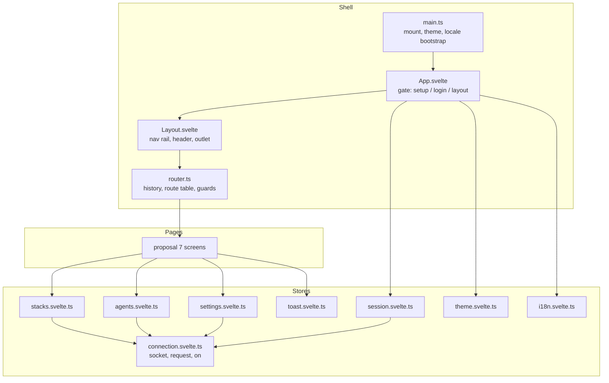

# Frontend Shell and Design System - Spec Proposal

| Item       | Detail                           |
|------------|----------------------------------|
| Author     | heavycaffeiner(Dong Hyun Kim)    |
| Created    | 2026-08-09                       |
| Status     | **Draft** / In Review / Approved |
| Reviewers  |                                  |

---

## 1. Summary

This proposal defines the frontend substrate: the Svelte 5 application shell, the m3-svelte design
system integration, the 4 pixel spacing grid and the alignment rules that every screen must satisfy,
routing, the reactive state stores that wrap the WebSocket connection, theming with light and dark
modes, internationalisation, toast notifications, and accessibility requirements. It contains no
screen. The screens are proposal 7.

## 2. Background & Motivation

Docknight's interface is a dense operations console: a persistent list of stacks, a code editor, a
form built from that same code, several live terminals, and status that changes without the user
acting. Dense and live is the hard combination. Every element competes for the same vertical space,
half of them resize on their own, and a layout that is only approximately aligned reads as broken
rather than as merely untidy.

Three decisions follow from that, and this proposal fixes all three before any screen is built.

**A hard spacing grid, not a style guide.** When a page contains a monospaced terminal, a code editor,
a card list, and a form, the only thing that makes them look like one product is that every edge lands
on the same rhythm. A 4 pixel base unit, applied without exception, gives that for free and removes an
entire category of review comment. It is enforced by tooling rather than by discipline, because
discipline does not survive the twentieth component.

**State that declares itself.** The live parts of this UI, meaning the stack list, the status of every
service, and the terminal streams, are pushed by the server and read by several screens at once.
Implicit global state injected into every component makes it impossible to tell what a component
depends on and impossible to reason about what re-renders. Stores are modules; a component that needs
one imports it.

**One place per concern.** Theme resolution, locale negotiation, connection lifecycle, and toast
presentation each live in exactly one module with a stated contract, so a screen never re-implements
them and never reaches through its parents to find them.

## 3. Goals & Non-Goals

### 3.1 Goals

- [ ] Application shell: layout, navigation, connection state indicator, authentication gate.
- [ ] The 4 pixel spacing grid, the token set, the alignment rules, and their enforcement.
- [ ] Client-side routing with the route table, guards, and code splitting.
- [ ] Reactive stores over the proposal 1 connection: session, stacks, hosts, settings.
- [ ] m3-svelte integration: theme generation, typography, component usage rules.
- [ ] Light, dark, and system theme with persistence.
- [ ] Internationalisation with lazy locale loading, plural handling, and right-to-left support.
- [ ] Toast notifications bound to protocol error codes and i18n keys.
- [ ] Accessibility rules that apply to every screen.
- [ ] The Vite build configuration, dev proxy, and asset strategy.

### 3.2 Non-Goals

- [ ] Any page or feature component. Proposal 7 owns all of them.
- [ ] Server-side rendering or prerendering. Docknight is behind a login and has no crawlable content.
- [ ] A component library of its own. m3-svelte supplies the components; the shell adds only what is
      genuinely missing.
- [ ] Offline support or a service worker.
- [ ] A design token system beyond what Material 3 defines, other than the spacing scale below.

## 4. Technical Design

### 4.1 Architecture Overview



Directory layout under `frontend/src/`:

```
main.ts                  entry: read persisted theme and locale, mount App
App.svelte               top-level gate
router.ts                route table and history integration
lib/
  connection.svelte.ts   proposal 1 client
  stores/                session, stacks, agents, settings, theme, i18n, toast
  format.ts              bytes, durations, relative time via Intl
  a11y.ts                focus trap, live-region announcer
components/              shell-level only: Layout, NavRail, ConnectionBanner, ToastHost, Confirm
pages/                   proposal 7
locales/                 en.json plus one file per language
styles/
  tokens.css             spacing, radius, size and elevation tokens
  theme.css              Material 3 colour roles for both schemes
  global.css             resets, focus ring, scrollbar, typography base
```

### 4.2 Data Model Changes

No server-side change. Client-side persistence uses `localStorage` and `sessionStorage`:

| Key             | Store          | Values                          | Notes                                                             |
|-----------------|----------------|---------------------------------|--------------------------------------------------------------------|
| `token`         | either         | opaque session token             | `localStorage` when remember-me is on, otherwise `sessionStorage`  |
| `remember`      | `localStorage` | `"1"` or `"0"`                  | Decides which storage the token uses                               |
| `theme`         | `localStorage` | `"light"`, `"dark"`, `"system"` | Defaults to `"system"`                                             |
| `locale`        | `localStorage` | BCP 47 tag                      | Absent means negotiate from `navigator.languages`                  |

Nothing else is persisted client-side. Stack contents, host lists, and settings are always fetched,
never cached across a reload, so a stale render can never be mistaken for live state.

### 4.3 Core Logic

#### 4.3.1 The 4 pixel grid

**Rule: every spatial value in the application is a multiple of 4 pixels.** Margins, padding, gaps,
component heights, icon sizes, border radii, and the resolved line height of every text style. There
are exactly three exceptions, listed at the end of this section.

Spacing scale, defined once in `styles/tokens.css` and used through `var()`. Arbitrary lengths are not
permitted in application styles:

| Token        | Value | Typical use                                                        |
|--------------|-------|---------------------------------------------------------------------|
| `--space-1`  | 4px   | Icon to label inside a chip, hairline separation                    |
| `--space-2`  | 8px   | Related controls in a row, chip gaps, dense list padding            |
| `--space-3`  | 12px  | Label to field, inner padding of compact controls                   |
| `--space-4`  | 16px  | Default gap between siblings, card inner padding, page gutter compact |
| `--space-5`  | 20px  | Rarely used; only where 16 crowds and 24 breaks the rhythm          |
| `--space-6`  | 24px  | Card to card, section inner padding, page gutter medium             |
| `--space-8`  | 32px  | Section to section, page gutter expanded                            |
| `--space-10` | 40px  | Major block separation                                              |
| `--space-12` | 48px  | Page header to first section                                        |
| `--space-16` | 64px  | Empty-state vertical padding                                        |

Sizes, all multiples of 4:

| Token                | Value                | Applies to                                   |
|----------------------|----------------------|-----------------------------------------------|
| `--size-control-sm`  | 32px                 | Dense buttons, chips, icon buttons in toolbars |
| `--size-control-md`  | 40px                 | Default button and input height                |
| `--size-control-lg`  | 48px                 | Primary actions, list row minimum height       |
| `--size-control-xl`  | 56px                 | Header bar, nav rail item                      |
| `--size-icon-sm`     | 16px                 | Inline with body text                          |
| `--size-icon-md`     | 20px                 | Buttons, list leading icons                    |
| `--size-icon-lg`     | 24px                 | Navigation, page-level actions                 |
| `--radius-xs` to `--radius-xl` | 4, 8, 12, 16, 28px | Chips, cards, sheets, and pill shapes |

Layout measures. Fixed panel and column widths are tokens too, because the enforcement rule covers
`width` and `max-width` and an inline pixel value there would fail lint just as it does on padding:

| Token                | Value | Applies to                                    |
|----------------------|-------|------------------------------------------------|
| `--size-nav-rail`    | 80px  | Navigation rail width, bottom bar height       |
| `--measure-form`     | 400px | Centred single-purpose forms: login, setup     |
| `--measure-settings` | 720px | Settings column, and any single reading column |

Typography. Font sizes come from the Material 3 type scale and are not constrained to multiples of 4,
but **every line height is rounded to the nearest multiple of 4**, so a block of text occupies a whole
number of grid rows and text next to an icon or a control sits on the same baseline rhythm:

| Style        | Size | Line height | Rows |
|--------------|------|-------------|------|
| Display      | 32px | 40px        | 10   |
| Headline     | 24px | 32px        | 8    |
| Title        | 20px | 28px        | 7    |
| Body large   | 16px | 24px        | 6    |
| Body medium  | 14px | 20px        | 5    |
| Label        | 12px | 16px        | 4    |
| Code / mono  | 13px | 20px        | 5    |

Layout:

| Breakpoint | Width          | Page gutter | Column gap | Nav                 |
|------------|----------------|-------------|------------|---------------------|
| Compact    | under 600px    | 16px        | 16px       | Bottom bar, 80px    |
| Medium     | 600 to 839px   | 24px        | 24px       | Nav rail, 80px      |
| Expanded   | 840px and up   | 32px        | 24px       | Nav rail, 80px      |

Page gutters, column gaps and the navigation width in this table are the tokens `--space-4`,
`--space-6`, `--space-8` and `--size-nav-rail`; the pixel values are shown for readability only.

Content columns are defined in `fr` units within a CSS grid whose gaps are tokens, so the columns
themselves may resolve to fractional pixels while every gap and every edge does not. Any fixed panel
width is a token, which is what keeps it a multiple of 4 and keeps it out of the lint exception list.

Alignment rules, which are as binding as the spacing scale:

- **One start edge per column.** Every heading, label, control, and card in a column shares one
  inline-start edge. Optical indentation is not used; a nested item indents by a token, never by an
  arbitrary amount.
- **One alignment axis per row.** Items in a row align on their centre when their heights differ by
  less than a control size, and on their first text baseline when a label sits beside a multi-line
  value.
- **Icons align to text, not to boxes.** An icon beside a label uses the icon size matching that
  text style from the table above and is centred on the label's line box.
- **Numeric columns are end-aligned** and use tabular figures, so digits do not shift as values
  change. This applies to every statistic, port, and count.
- **Gaps come from the parent.** Layout uses `gap` on a flex or grid container rather than margins on
  children, so a child never carries spacing that depends on where it happens to be placed.
- **No negative margins and no manual nudges.** If something is one pixel off, the container is wrong.

Enforcement. The rules below are stated here and specified in full, together with the runtime layout
auditor that checks them against the rendered DOM, in `docknight-8-design-verification`:

- A stylelint rule restricts the values permitted on `margin*`, `padding*`, `gap`, `row-gap`,
  `column-gap`, `inset*`, `width`, `height`, `min-*` and `max-*` to the token set, `0`, `100%`,
  `auto`, `fr` units, `min-content`, `max-content`, and `calc()` over tokens. A raw `px` length in an
  application stylesheet fails lint.
- A development-only grid overlay, toggled from the console, draws a 4 pixel rule over the viewport
  so a misalignment is visible rather than argued about.
- The review checklist for any screen includes: gutters are tokens, one start edge per column,
  numbers end-aligned, and every control height from the size table.

Exceptions, and only these:

1. Hairlines. Borders, dividers and outlines of 1 or 2 pixels, including the focus ring, which must
   not be scaled to the grid.
2. Character-cell metrics. The terminal renderer sizes itself from the font's advance width and line
   height; its container padding is a token, its internal geometry is not.
3. Values produced by the browser, such as scrollbar width, which are consumed rather than authored.

m3-svelte's own component metrics are already based on a 4 pixel unit, so the tokens above line up
with its defaults rather than fighting them. Where a component exposes no way to reach a token value,
the wrapper sets it; where it exposes nothing at all, the component is not used.

#### 4.3.2 State model

Svelte 5 runes in module scope. Each store is a module exporting a `$state` object and the functions
that mutate it. Components import what they use, so a component's dependencies are visible in its
import list.

```ts
// lib/stores/stacks.svelte.ts

/** Stacks keyed by `${name} ${endpoint}` so two hosts may share a stack name. */
export const stacks = $state<{
    byKey: Record<string, StackSummary>;
    loaded: boolean;
}>({ byKey: {}, loaded: false });

/** Replace the snapshot for one endpoint. Entries for other endpoints are untouched. */
export function applyStackList(endpoint: string, list: Record<string, StackSummary>): void;

/**
 * Drop every entry belonging to an endpoint. Called when an endpoint disappears from
 * agentList, which is the only signal that a host was removed; there is no stackList
 * event for a host that no longer exists.
 */
export function dropEndpoint(endpoint: string): void;

/** Ask a host to rescan and re-emit. Fire and forget; the event carries the result. */
export function refresh(endpoint: string): void;
```

Rules that hold for every store:

- Server events are the only source of truth for list data. A mutating request never optimistically
  edits a store; it waits for the `stackList` or `agentList` event. An optimistic update that
  disagrees with a compose command's real outcome is worse than a half-second delay.
- Stores are cleared on logout and on socket close, so a reconnect cannot render stale rows as live.
- No store imports a component. Dependencies point one way.

#### 4.3.3 Routing

`router.ts` is roughly one hundred lines over the History API: a route table of pattern, loader and
guard, a `navigate(path)` function, a `popstate` listener, and a `$state` holding the matched route
and its parameters.

| Path                                        | Screen             | Guard         |
|---------------------------------------------|--------------------|---------------|
| `/`                                         | Dashboard home     | authenticated |
| `/compose`                                  | New stack          | authenticated |
| `/compose/:name`                            | Stack, local       | authenticated |
| `/compose/:name/:endpoint`                  | Stack, remote host | authenticated |
| `/terminal/:stack/:service/:type`           | Container terminal | authenticated |
| `/terminal/:stack/:service/:type/:endpoint` | Container terminal | authenticated |
| `/console`                                  | Host shell         | authenticated |
| `/console/:endpoint`                        | Host shell         | authenticated |
| `/settings/:section`                        | Settings           | authenticated |
| `/setup`                                    | First-run setup    | needs setup   |

Screens are loaded with dynamic `import()`, which is what makes Vite split them into separate chunks;
the shell, the connection, and the stack list are in the initial bundle because they are needed on
every route.

Guards run before the loader:

- `authenticated` renders the login view in place when `session.state` is `anonymous`, rather than
  redirecting, so the intended path survives the login and the user lands where they were going.
- `needs setup` redirects to `/` once a user exists.

A navigation away from a screen with unsaved edits calls that screen's `beforeLeave` hook.

#### 4.3.4 Application gate

```
App.svelte renders, in priority order:
    connection.state == "connecting" and never yet connected  -> full-page progress
    server sent the setup event                               -> Setup screen
    session.state == "anonymous"                              -> Login screen
    otherwise                                                 -> Layout with the routed screen
```

The session store moves to `authenticated` on three signals, not one: a successful `login`, a
successful `resume` from a stored token, and the `autoLogin` event, which the server emits on connect
when authentication is disabled. Without the third the gate would show a login form for a deployment
that has deliberately turned login off.

A `ConnectionBanner` is layered above the content whenever the socket is not open after a first
successful connection. It states the condition and the retry countdown, and it does not block
interaction with what is already on screen, because a compose file being edited must not be lost to a
five second network blip.

#### 4.3.5 Theme

m3-svelte is driven by Material 3 colour roles exposed as CSS custom properties. The shell generates
both schemes once from a single source colour and ships them as static CSS in `styles/theme.css`,
rather than computing them at runtime, since the source colour is fixed and users do not pick their
own.

```
theme.svelte.ts:
    preference := localStorage.theme or "system"
    system     := matchMedia("(prefers-color-scheme: dark)")
    resolved   := preference == "system" ? (system.matches ? "dark" : "light") : preference

    effect: document.documentElement.dataset.theme = resolved
            <meta name="theme-color"> content updated to the resolved surface colour
    the media query listener re-resolves while the preference is "system"
```

`styles/theme.css` defines every Material 3 colour role under `:root[data-theme="light"]` and
`:root[data-theme="dark"]`. A component never reads the resolved mode to pick a colour; it uses the
role token, which keeps the two schemes in step.

Two consumers need the resolved mode as a value rather than as a token, and they read it explicitly:
the terminal renderer, which takes a colour palette object, and the code editor, which takes a theme
extension. Both are proposal 7.

Non-negotiable: every foreground and background pair in use satisfies WCAG 2.1 AA contrast, meaning
4.5:1 for body text and 3:1 for large text and for interface components. Material 3's role pairings
satisfy this by construction, so the rule is to use the paired `on-` role, checked in review.

#### 4.3.6 Internationalisation

```
i18n.svelte.ts:
    locale := $state(persisted locale, else negotiate(navigator.languages, available), else "en")
    messages := $state({ en })                       # English is bundled, never lazy

    setLocale(tag):
        if messages[tag] is absent:
            messages[tag] := await import(`../locales/${tag}.json`)
        locale := tag
        localStorage.locale := tag
        document.documentElement.lang := tag
        document.documentElement.dir  := RTL.has(baseLanguage(tag)) ? "rtl" : "ltr"

    t(key, values?):
        template := messages[locale]?.[key] ?? messages.en[key] ?? key
        return interpolate(template, values)

    tc(key, count, values?):
        category := new Intl.PluralRules(locale).select(count)      # one, other, few, many, ...
        template := messages[locale]?.[`${key}.${category}`]
                 ?? messages[locale]?.[`${key}.other`]
                 ?? messages.en[`${key}.other`] ?? key
        return interpolate(template, { ...values, count })
```

Details that follow from this:

- The available locale list is derived from `import.meta.glob("../locales/*.json")`, so adding a file
  adds a language and there is no second list to keep in step. Each file declares its own
  `languageName` for the selector, in its own language.
- English is the authored catalogue and the only one guaranteed complete. Any other locale may be
  partial; a missing key falls back to English and then to the key itself, and logs once per key in
  development. Nothing renders blank.
- Plural forms come from `Intl.PluralRules`, not from a hand-written rule per language.
- Right-to-left languages set `dir` on the document element. The layout uses logical CSS properties
  throughout, meaning `margin-inline-start` rather than `margin-left` and `padding-inline` rather than
  `padding-left` and `padding-right`, so mirroring is automatic and the spacing tokens apply
  unchanged.
- Dates and numbers use `Intl.DateTimeFormat`, `Intl.NumberFormat`, and `Intl.RelativeTimeFormat` with
  the active locale. There is no date formatting library.
- Translated strings must tolerate roughly 40 percent expansion from English. No layout may depend on
  a label's length, which is why control widths are content-driven or full-width rather than fixed.

#### 4.3.7 Notifications

`toast.svelte.ts` holds a queue rendered by `ToastHost` in the bottom-inline-end corner, offset from
the viewport by `--space-4`.

```
toastResult(res)         success variant, 6 s
toastError(err)          error variant, sticky until dismissed
```

Error toasts resolve their text from the protocol error: `err.i18n` through `t()` when present,
otherwise `err.message`. This makes proposals 2 to 5's i18n keys the single place a message is worded.

The host is an `aria-live="polite"` region with `role="status"`, so a screen reader announces the
outcome of an action that produces no visible focus change. Error toasts use `aria-live="assertive"`.
At most five toasts are visible; older ones are dropped from the top.

#### 4.3.8 Layout and navigation

`Layout.svelte` is a Material 3 navigation rail on screens 600 CSS pixels and wider, and a bottom
navigation bar below that. Destinations: Home, Console when enabled, Settings. A header strip of
`--size-control-xl` carries the product name, the connection indicator, and the account menu.

The stack list is a persistent panel beside the routed content at medium and expanded widths. On
compact widths there is no room for both, so the panel becomes the whole of the home route and
selecting a stack navigates away from it. There is no separate list route in either case. The list is
the primary navigation for this application, not a secondary index, so it keeps its position rather
than collapsing into a menu.

#### 4.3.9 Accessibility

Rules applied to every screen and checked in review:

- Every interactive element is reachable and operable by keyboard, in a tab order that follows the
  visual order. Custom controls carry the matching `role` and keyboard contract.
- Focus is never invisible. One focus ring style is defined in `global.css` using `:focus-visible`,
  and it is never removed.
- Dialogs trap focus, restore it to the invoking element on close, respond to `Escape`, and carry
  `aria-modal="true"` with an `aria-labelledby` pointing at their title.
- Every input has a programmatically associated label. Icon-only buttons carry `aria-label`.
- Status is never conveyed by colour alone. A stack's state is a coloured chip carrying text, and a
  service's health is text beside its indicator.
- Interactive targets are at least 48 by 48 pixels, or 32 by 32 with at least 8 pixels of clear space
  on every side, which the size and spacing tokens already produce.
- Route changes move focus to the new view's heading and announce the title through the live region,
  because a client-side navigation is silent otherwise.
- `prefers-reduced-motion` disables transitions and the terminal's smooth scrolling.
- The terminal and the code editor cannot be made fully accessible; both carry an accessible name, a
  described purpose, and a documented keyboard escape, meaning `Escape` then `Tab` leaves the editor
  rather than inserting a tab character.

#### 4.3.10 Build

Vite with `@sveltejs/vite-plugin-svelte`.

- Development: `vite dev` on port 5000 with `/ws` proxied to the backend on 5001, so the browser sees
  one origin. This means the origin check in proposal 1 is exercised in development exactly as in
  production, and the client needs no environment branch to find its socket.
- Production: `vite build` to `dist/frontend/`, hashed asset names, brotli and gzip variants emitted
  alongside for the static handler in proposal 0.
- `FRONTEND_VERSION` is injected by `define` from `package.json`, and the shell compares it against
  the `version` in the `info` event, reloading when they differ, so a stale tab cannot talk to an
  upgraded server.
- Target is the browser baseline that supports `Intl.PluralRules`, `:focus-visible`, container
  queries, and top-level `await`, meaning the last two major versions of Chrome, Firefox, Safari and
  Edge. No polyfills, no legacy build.

## 5. API Design

### 5-1. New / Modified

No protocol change. This proposal consumes proposal 1's client and exports the shell surface that
proposal 7 builds on.

```ts
// lib/stores/session.svelte.ts

/** anonymous until a login succeeds; authenticating while a request is in flight. */
export const session: { state: "anonymous" | "authenticating" | "authenticated"; username: string | null };

/**
 * Log in and persist the returned token. Returns "totp" when the account requires a
 * second factor, in which case the caller re-invokes with `totp` supplied.
 */
export function login(username: string, password: string, totp?: string): Promise<"ok" | "totp">;

/** Revoke the session, clear every store, and return to the login gate. */
export function logout(): Promise<void>;

/** Resume from a persisted token on connect. Clears the token when it is rejected. */
export function resume(): Promise<boolean>;
```

```ts
// router.ts

/** Push a new history entry and render the matching route. Runs beforeLeave hooks first. */
export function navigate(path: string, opts?: { replace?: boolean }): Promise<void>;

/** The active route. Reading it in a component makes that component reactive to navigation. */
export const route: { path: string; params: Record<string, string>; component: Component | null };

/** Register a guard that may block or redirect navigation away from the current screen. */
export function onBeforeLeave(hook: () => boolean | Promise<boolean>): void;
```

```ts
// lib/stores/i18n.svelte.ts

/** Translate a key, interpolating {name} placeholders from `values`. */
export function t(key: string, values?: Record<string, string | number>): string;

/** Translate with plural selection driven by Intl.PluralRules for the active locale. */
export function tc(key: string, count: number, values?: Record<string, string | number>): string;

/** Switch locale, lazily importing its catalogue and updating document lang and dir. */
export function setLocale(tag: string): Promise<void>;
```

```ts
// lib/stores/theme.svelte.ts

/** User preference. Assigning persists it and re-resolves the applied scheme. */
export const theme: { preference: "light" | "dark" | "system"; resolved: "light" | "dark" };
```

Design token contract, consumed by every component in proposal 7:

```css
/* styles/tokens.css */
:root {
    --space-1: 4px;  --space-2: 8px;  --space-3: 12px; --space-4: 16px;
    --space-5: 20px; --space-6: 24px; --space-8: 32px; --space-10: 40px;
    --space-12: 48px; --space-16: 64px;

    --size-control-sm: 32px; --size-control-md: 40px;
    --size-control-lg: 48px; --size-control-xl: 56px;
    --size-icon-sm: 16px; --size-icon-md: 20px; --size-icon-lg: 24px;

    --radius-xs: 4px; --radius-sm: 8px; --radius-md: 12px;
    --radius-lg: 16px; --radius-xl: 28px;

    --size-nav-rail: 80px;
    --measure-form: 400px; --measure-settings: 720px;
}
```

### 5-2. Error Handling

The frontend surfaces protocol errors; it does not invent its own taxonomy.

| Situation                           | Behaviour                                                                                                    |
|-------------------------------------|---------------------------------------------------------------------------------------------------------------|
| `unauthorized` on any request        | Clear the stored token, clear every store, show the login gate                                                |
| `rateLimited`                        | Error toast with the wait, login form disabled for the remaining interval                                     |
| `disconnected` or `timeout`          | Error toast, connection banner appears, no automatic retry of the request                                     |
| `validation` or `conflict`           | Error toast keyed on `err.i18n`; the form keeps its contents                                                  |
| `commandFailed`                      | Error toast, and the terminal pane holding the real output is scrolled into view                              |
| `internal`                           | Generic error toast; the server has logged the detail                                                         |
| Unhandled exception in a component   | Caught by the top-level `svelte:boundary`, rendered as an error card with a reload action, logged to the console |
| Locale catalogue fails to load       | Stay on the current locale, error toast, the preference is not persisted                                      |

## 6. Implementation Plan

### 6-1. Milestones

| Phase    | Task                                                                                                | Estimated Duration | Owner          |
|----------|-----------------------------------------------------------------------------------------------------|--------------------|----------------|
| Phase 1  | Vite and Svelte 5 setup, dev proxy, build output, `FRONTEND_VERSION` injection                      | TBD                | heavycaffeiner |
| Phase 2  | `tokens.css`, the stylelint rule enforcing the token set, and the development grid overlay          | TBD                | heavycaffeiner |
| Phase 3  | m3-svelte integration, `theme.css` for both schemes, `global.css` with the focus ring and type scale | TBD               | heavycaffeiner |
| Phase 4  | `theme.svelte.ts`: preference, system listener, meta colour                                          | TBD                | heavycaffeiner |
| Phase 5  | `i18n.svelte.ts`: negotiation, lazy loading, `t`, `tc`, direction, plus the English catalogue        | TBD                | heavycaffeiner |
| Phase 6  | `router.ts`: table, matching, guards, `beforeLeave`, code splitting                                  | TBD                | heavycaffeiner |
| Phase 7  | `session.svelte.ts` and `App.svelte`: the gate, login and setup switching, token persistence         | TBD                | heavycaffeiner |
| Phase 8  | `stacks`, `agents`, `settings` stores bound to proposal 1 events                                     | TBD                | heavycaffeiner |
| Phase 9  | `Layout.svelte`, nav rail and bottom bar, connection banner, account menu                            | TBD                | heavycaffeiner |
| Phase 10 | `toast.svelte.ts` and `ToastHost` with live regions; `a11y.ts` focus trap and announcer              | TBD                | heavycaffeiner |

Phase 1 depends on nothing. Phase 2 gates every later phase, because retrofitting the grid is more
expensive than starting on it. Phases 7 and 8 depend on proposal 1 Phase 6. Proposal 7 begins once
Phase 9 lands.

### 6-2. Dependencies

| Package                        | Purpose                              | Why not the standard library                                                                  |
|--------------------------------|--------------------------------------|-------------------------------------------------------------------------------------------------|
| `svelte` 5.x                   | Component model and reactivity        | Chosen framework                                                                                |
| `m3-svelte`                    | Material 3 component set and theming  | Chosen design system. Building Material 3 components by hand is a project of its own            |
| `@sveltejs/vite-plugin-svelte` | Compilation                           | Build tooling                                                                                   |
| `vite` 7.x                     | Bundling and dev server               | Build tooling                                                                                   |
| `stylelint`                    | Spacing token enforcement             | The grid rule needs to fail a build, not a review comment                                       |

Deliberately absent, with the standard library replacement named:

| Not used         | Replaced by                                                          |
|------------------|-----------------------------------------------------------------------|
| A router package | About one hundred lines over the History API                          |
| An i18n package  | `Intl.PluralRules`, `Intl.DateTimeFormat`, a dictionary, and `t`/`tc` |
| A date library   | `Intl.DateTimeFormat` and `Intl.RelativeTimeFormat`                   |
| A toast package  | A `$state` queue and one component                                    |
| An icon font     | Inline SVG per icon, tree-shaken, no network fetch for glyphs         |

Internal dependencies: proposal 1 for the connection client, proposal 2 for the authentication methods
the session store calls.

## 7. References

- Svelte 5 runes: https://svelte.dev/docs/svelte/what-are-runes
- m3-svelte: https://github.com/KTibow/m3-svelte
- Material Design 3 colour system: https://m3.material.io/styles/color/system/overview
- Material Design 3 layout and the 4dp grid: https://m3.material.io/foundations/layout/understanding-layout/spacing
- Material Design 3 type scale: https://m3.material.io/styles/typography/type-scale-tokens
- Material Design 3 navigation rail: https://m3.material.io/components/navigation-rail/overview
- WCAG 2.1 AA contrast, 1.4.3 and 1.4.11: https://www.w3.org/WAI/WCAG21/quickref/
- WCAG 2.1 target size, 2.5.5: https://www.w3.org/WAI/WCAG21/Understanding/target-size.html
- WAI-ARIA Authoring Practices: https://www.w3.org/WAI/ARIA/apg/
- CSS logical properties: https://developer.mozilla.org/en-US/docs/Web/CSS/CSS_logical_properties_and_values
- `Intl.PluralRules`: https://developer.mozilla.org/en-US/docs/Web/JavaScript/Reference/Global_Objects/Intl/PluralRules
- Vite configuration: https://vite.dev/config/
- Companion proposals: `docknight-1-transport`, `docknight-2-auth`, `docknight-7-frontend-features`,
  `docknight-8-design-verification`
