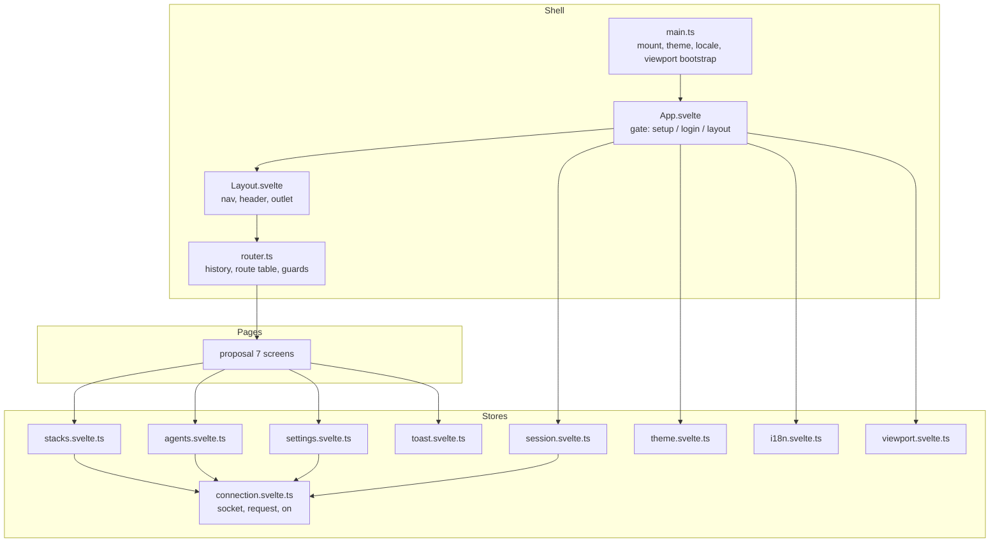

# Frontend Shell and Design System - Spec Proposal (v2)

| Item       | Detail                                  |
|------------|-----------------------------------------|
| Author     | heavycaffeiner(Dong Hyun Kim)           |
| Created    | 2026-08-20                              |
| Status     | **Draft** / In Review / Approved        |
| Reviewers  |                                         |
| Supersedes | docknight-6-frontend-shell (2026-08-09), and absorbs the shell portions of docknight-9-mobile-accessibility (2026-08-11) |

---

## 1. Summary

The frontend substrate: the Svelte 5 application shell, the m3-svelte integration, the 4 pixel
spacing grid and the alignment rules every screen must satisfy, the window size class and pointer
model, the viewport and virtual keyboard handling, routing, the reactive stores over the WebSocket
connection, theming, internationalisation, toasts, and the accessibility requirements. It contains
no screen; screens are proposal 7.

This is a full rewrite. The first implementation treated the compact layout as a smaller copy of
the expanded one: same controls, same disclosure, one density step down. Measurement (documented in
the retired proposal 9) showed that to be the root of nearly every UX complaint: 79 percent of
controls under 44 pixels on the working screen at phone width, the Dashboard unreachable below 840
pixels, the bottom bar covered by the virtual keyboard, and three text column starts in the first
150 pixels of a page. This revision bakes the corrections into the design system itself, so no
screen can be built the old way.

## 2. Background & Motivation

Docknight's interface is a dense operations console: a persistent list of stacks, a code editor, a
form built from that same code, several live terminals, and status that changes without the user
acting. Dense and live is the hard combination, and the first implementation proved a second one:
**the console is operated from a phone as often as from a desktop.**

Four decisions follow, fixed here before any screen is built.

**A hard spacing grid, not a style guide.** When a page contains a monospaced terminal, a code
editor, a card list, and a form, the only thing that makes them look like one product is that every
edge lands on the same rhythm. A 4 pixel base unit, enforced by tooling rather than discipline.

**Density follows the pointer, disclosure follows the width.** A thumb needs a larger target than a
cursor, so control height goes up under a coarse pointer, never down on a narrow screen. What pays
for the height is disclosure: a compact screen shows fewer controls, not smaller ones. The first
implementation had this exactly backwards (`--m3-util-density: -1` under 600 pixels) and the
measured result was 38 of 48 controls under 44 pixels on the stack edit screen at 390 pixels.

**Alignment is optical, not geometric.** A reader aligns on ink, not on boxes. Box edges sharing a
column while glyph edges scatter across three offsets reads as broken. The rules in 4.3.2 are
stated on glyph edges and verified that way by proposal 8's `glyph-edge` rule.

**State that declares itself.** The live parts of the UI are pushed by the server and read by
several screens at once. Stores are modules; a component that needs one imports it, so its
dependencies are visible in its import list.

## 3. Goals & Non-Goals

### 3.1 Goals

- [ ] Application shell: layout, navigation, connection indicator, authentication gate.
- [ ] The 4 pixel grid, the token set, the alignment rules including optical alignment, and their
      enforcement.
- [ ] The window size class model (compact, medium, expanded) and the pointer model (fine, coarse),
      and which decisions each one drives.
- [ ] Viewport and virtual keyboard handling: the `interactive-widget` key, the `visualViewport`
      fallback, keyboard-aware chrome.
- [ ] The Dashboard and every other route reachable at every width.
- [ ] Client-side routing with the route table, guards, and code splitting.
- [ ] Reactive stores over the proposal 1 connection: session, stacks, hosts, settings.
- [ ] m3-svelte integration: theme generation, typography, component usage rules.
- [ ] Light, dark, and system theme with persistence.
- [ ] Internationalisation with lazy locale loading, plural handling, RTL support.
- [ ] Toast notifications bound to protocol error codes and i18n keys.
- [ ] Accessibility rules applying to every screen, including touch target rules.
- [ ] Vite build configuration, dev proxy, asset strategy.

### 3.2 Non-Goals

- [ ] Any page or feature component. Proposal 7 owns all of them.
- [ ] Server-side rendering or prerendering.
- [ ] A component library of its own; m3-svelte supplies the components.
- [ ] Offline support or a service worker.
- [ ] A separate mobile interface, mobile route table, or mobile-only component set. If a change
      cannot be expressed as the same component under a different window size class or pointer, it
      is out of scope.
- [ ] Touch gestures as a primary means of operation. Swipe-to-delete and drag-to-reorder require
      single-pointer alternatives under WCAG 2.5.1 and 2.5.7, meaning the control is built twice.
      Build the control once, as a control.

## 4. Technical Design

### 4.1 Architecture Overview



Directory layout under `frontend/src/`:

```
main.ts                  entry: read persisted theme and locale, start viewport tracking, mount App
App.svelte               top-level gate
router.ts                route table and history integration
lib/
  connection.svelte.ts   proposal 1 client
  viewport.svelte.ts     visualViewport tracking, keyboard state
  stores/                session, stacks, agents, settings, theme, i18n, toast
  format.ts              bytes, durations, relative time via Intl
  a11y.ts                focus trap, live-region announcer
components/              shell-level only: Layout, Nav, BottomBar, ConnectionBanner, ToastHost,
                         Confirm, MenuButton (popup / bottom sheet)
pages/                   proposal 7
locales/                 en.json plus one file per language
styles/
  tokens.css             spacing, radius, size and elevation tokens, pointer query
  theme.css              Material 3 colour roles for both schemes
  global.css             resets, focus ring, scrollbar, typography base, --optical-inset utility
```

### 4.2 Data Model Changes

No server-side change. Client-side persistence:

| Key        | Store          | Values                          | Notes                                                            |
|------------|----------------|---------------------------------|-------------------------------------------------------------------|
| `token`    | either         | opaque session token            | `localStorage` when remember-me is on, otherwise `sessionStorage` |
| `remember` | `localStorage` | `"1"` or `"0"`                  | Decides which storage the token uses                              |
| `theme`    | `localStorage` | `"light"`, `"dark"`, `"system"` | Defaults to `"system"`                                            |
| `locale`   | `localStorage` | BCP 47 tag                      | Absent means negotiate from `navigator.languages`                 |

Nothing else is persisted client-side. Stack contents, host lists, and settings are always fetched,
never cached across a reload.

### 4.3 Core Logic

#### 4.3.1 Size classes and the pointer

Two orthogonal inputs, each driving a different set of decisions. Conflating them was the first
implementation's central mistake.

**Window size classes**, Material 3's definitions, matching the breakpoints already in use:

| Class    | Width          | Navigation      | Drives                                             |
|----------|----------------|-----------------|-----------------------------------------------------|
| Compact  | under 600px    | Bottom bar      | Disclosure policy, panel placement, gutters, sheets |
| Medium   | 600 to 839px   | Nav rail        | Gutters, column count                               |
| Expanded | 840px and up   | Nav rail        | Persistent stack list panel beside the outlet       |

**Pointer**, from `@media (pointer: coarse)`:

| Pointer | Drives                                                                 |
|---------|-------------------------------------------------------------------------|
| Fine    | `--size-control-md` = 40px; 32px targets allowed with 8px clear space   |
| Coarse  | `--size-control-md` = 48px; the 32-with-clear-space branch is closed    |

Width selects the layout; the pointer selects the density. A touchscreen laptop at 1400 pixels gets
48 pixel targets in the expanded layout, and a desktop window dragged to 390 pixels gets the compact
layout with 40 pixel controls. There is no density step downwards anywhere: no
`--m3-util-density` declaration exists in the stylesheet at any width.

The disclosure policy the compact class triggers is specified per screen in proposal 7, but the
principle is fixed here: **a compact screen reduces the number of simultaneously visible controls,
never their size.** Concretely, at compact width: action bars collapse to one primary action plus an
overflow, repeated per-item action sets collapse to one overflow per item, and paired panels become
tabs. Every collapsed control remains reachable in at most two interactions.

#### 4.3.2 The 4 pixel grid and alignment

**Rule: every spatial value in the application is a multiple of 4 pixels.** Margins, padding, gaps,
component heights, icon sizes, border radii, and the resolved line height of every text style. Three
exceptions, listed at the end of this section.

Spacing scale, defined once in `styles/tokens.css` and used through `var()`. Arbitrary lengths are
not permitted in application styles:

| Token        | Value | Typical use                                                          |
|--------------|-------|------------------------------------------------------------------------|
| `--space-1`  | 4px   | Icon to label inside a chip, hairline separation                       |
| `--space-2`  | 8px   | Related controls in a row, chip gaps, dense list padding               |
| `--space-3`  | 12px  | Label to field, inner padding of compact controls                      |
| `--space-4`  | 16px  | Default gap between siblings, card inner padding, page gutter compact  |
| `--space-5`  | 20px  | Rarely used; only where 16 crowds and 24 breaks the rhythm             |
| `--space-6`  | 24px  | Card to card, section inner padding, page gutter medium                |
| `--space-8`  | 32px  | Section to section, page gutter expanded                               |
| `--space-10` | 40px  | Major block separation                                                 |
| `--space-12` | 48px  | Page header to first section                                           |
| `--space-16` | 64px  | Empty-state vertical padding                                           |

Sizes, all multiples of 4:

| Token               | Fine pointer | Coarse pointer | Applies to                                     |
|---------------------|--------------|----------------|--------------------------------------------------|
| `--size-control-sm` | 32px         | 32px           | Non-target chrome: badge, rail indicator. Never an interactive target under a coarse pointer |
| `--size-control-md` | 40px         | 48px           | Default button and input height                  |
| `--size-control-lg` | 48px         | 48px           | Primary actions, list row minimum height         |
| `--size-control-xl` | 56px         | 56px           | Header bar, nav rail item                        |
| `--size-icon-sm`    | 16px         | 16px           | Inline with body text                            |
| `--size-icon-md`    | 20px         | 20px           | Buttons, list leading icons                      |
| `--size-icon-lg`    | 24px         | 24px           | Navigation, page-level actions                   |
| `--radius-xs` to `--radius-xl` | 4, 8, 12, 16, 28px | same | Chips, cards, sheets, pill shapes      |

The coarse-pointer value is set by one media query in `tokens.css`, so every control built from the
token grows together and no per-component override exists:

```css
@media (pointer: coarse) {
    :root {
        --size-control-md: var(--size-control-lg);
    }
}
```

Layout measures, tokens because the enforcement rule covers `width` and `max-width`:

| Token                | Value | Applies to                                    |
|----------------------|-------|------------------------------------------------|
| `--size-nav-rail`    | 80px  | Navigation rail width                          |
| `--size-bottom-bar`  | 64px  | Bottom navigation bar and bottom app bar height |
| `--measure-form`     | 400px | Centred single-purpose forms: login, setup     |
| `--measure-settings` | 720px | Settings column, any single reading column     |

New in this revision:

| Token              | Value                       | Purpose                                                     |
|--------------------|-----------------------------|---------------------------------------------------------------|
| `--viewport-block` | set by `viewport.svelte.ts` | Block size the shell may occupy, keyboard already subtracted |
| `--keyboard-inset` | set by `viewport.svelte.ts` | Height the virtual keyboard occupies, 0 when closed          |
| `--optical-inset`  | `var(--space-3)`            | A leading control's own inset, subtracted so ink lands on the column |

Typography. Font sizes come from the Material 3 type scale; **every line height is rounded to the
nearest multiple of 4**, so text occupies whole grid rows:

| Style       | Size | Line height | Rows |
|-------------|------|-------------|------|
| Display     | 32px | 40px        | 10   |
| Headline    | 24px | 32px        | 8    |
| Title       | 20px | 28px        | 7    |
| Body large  | 16px | 24px        | 6    |
| Body medium | 14px | 20px        | 5    |
| Label       | 12px | 16px        | 4    |
| Code / mono | 13px | 20px        | 5    |

Layout:

| Breakpoint | Width        | Page gutter | Column gap | Nav              |
|------------|--------------|-------------|------------|------------------|
| Compact    | under 600px  | 16px        | 16px       | Bottom bar, 64px |
| Medium     | 600 to 839px | 24px        | 24px       | Nav rail, 80px   |
| Expanded   | 840px and up | 32px        | 24px       | Nav rail, 80px   |

Gutters, gaps and nav sizes in this table are the tokens; pixel values are shown for readability.

Alignment rules, as binding as the spacing scale:

- **One start edge per column, measured on ink.** Every heading, label, control, and card in a
  column starts its first glyph on one inline-start edge. A filled or outlined control whose ink
  starts inside its own padding either does not lead a row that text leads above and below it, or
  its container is offset by `--optical-inset` so the ink lands on the column. Verified by proposal
  8's `glyph-edge` rule; the box-edge rule (`column-edge`) also holds, because a box off its column
  is still a defect.
- **One alignment axis per row, and one outline height per row.** Items in a row align on their
  centre when heights differ by less than a control size, and on their first text baseline when a
  label sits beside a multi-line value. Interactive elements sharing a row share one height token:
  a 32 pixel pill beside 40 pixel buttons is a defect even when the centre axis holds.
- **Icons align to text, not to boxes.** An icon beside a label uses the icon size matching that
  text style and is centred on the label's line box.
- **Numeric columns are end-aligned** and use tabular figures.
- **Gaps come from the parent.** Layout uses `gap` on a flex or grid container, never margins on
  children.
- **No negative margins and no manual nudges.** If something is one pixel off, the container is
  wrong.
- **Full-bleed cards on compact.** At compact width the outlet inset goes to 0 and the card keeps
  its own padding, so text inside a card and a heading outside one share the same column, and the
  card gains content width. Medium and expanded keep the outlet gutter.

Enforcement is stylelint (raw px lengths fail lint on the spatial properties) plus the runtime
auditor of proposal 8. Exceptions, and only these:

1. Hairlines: borders, dividers and outlines of 1 or 2 pixels, including the focus ring.
2. Character-cell metrics: the terminal renderer sizes itself from the font's advance width and
   line height; its container padding is a token, its internal geometry is not.
3. Values produced by the browser, such as scrollbar width.

#### 4.3.3 Viewport and virtual keyboard

Three parts, in increasing order of machinery.

**The meta tag.** `frontend/index.html`:

```html
<meta name="viewport" content="width=device-width, initial-scale=1, interactive-widget=resizes-content" />
```

On Chromium and Firefox this alone makes `100dvh` shrink when a keyboard opens, pulling the bottom
bar above the keyboard and reducing the outlet to what is genuinely visible.

**The fallback.** Safari ignores the key, so `lib/viewport.svelte.ts` publishes the real visible
height as custom properties on the document element, and nothing else:

| Property           | Value                                                                            |
|--------------------|----------------------------------------------------------------------------------|
| `--viewport-block` | `visualViewport.height` in pixels, or unset so the `100dvh` fallback applies     |
| `--keyboard-inset` | `layoutHeight - visualViewport.height - visualViewport.offsetTop`, floored at 0  |

`Layout.svelte` reads the first:

```css
.shell { block-size: var(--viewport-block, 100dvh); }
```

A keyboard is treated as open when `--keyboard-inset` exceeds 120 pixels, comfortably above the
largest browser toolbar and below the smallest keyboard. The threshold is a constant in the module,
not a token, because it is not a spatial value on the grid. The state is published as
`data-keyboard="open"` on the shell.

**What happens when it is open.** The bottom navigation bar is hidden and the outlet reclaims its
height; the bar returns on blur. The bar is navigation, not the current task, so removing it while
the user types costs nothing:

```css
.shell[data-keyboard="open"] .rail { display: none; }
```

The selector is scoped to `.rail` deliberately: the compact bottom app bar (4.3.9) carries the
current task's primary action and back affordance and must stay, sitting on the keyboard rather
than behind it, which the corrected shell height already guarantees.

With the shell sized correctly, the browser's own scroll-into-view lands the focused field in the
visible band. One case still needs help: a centred dialog on a viewport that has just halved. The
`Confirm` dialog anchors to the block start with a margin instead of centring while the keyboard is
open, so the headline, the field, and the buttons stay visible.

`visualViewport` is treated as optional even though every supported browser has it: when missing,
`--viewport-block` stays unset and `100dvh` applies. A negative computed inset is clamped to 0.

#### 4.3.4 State model

Svelte 5 runes in module scope. Each store is a module exporting a `$state` object and the functions
that mutate it.

```ts
// lib/stores/stacks.svelte.ts

/** Stacks keyed by `${name} ${endpoint}` so two hosts may share a stack name. */
export const stacks = $state<{
    byKey: Record<string, StackSummary>;
    loaded: boolean;
}>({ byKey: {}, loaded: false });

/** Replace the snapshot for one endpoint. Entries for other endpoints are untouched. */
export function applyStackList(endpoint: string, list: Record<string, StackSummary>): void;

/**
 * Drop every entry belonging to an endpoint. Called when an endpoint disappears from
 * agentList, which is the only signal that a host was removed.
 */
export function dropEndpoint(endpoint: string): void;

/** Ask a host to rescan and re-emit. Fire and forget; the event carries the result. */
export function refresh(endpoint: string): void;
```

Rules for every store:

- Server events are the only source of truth for list data. A mutating request never optimistically
  edits a store; it waits for the `stackList` or `agentList` event.
- Stores are cleared on logout. They are not cleared on socket close, because a phone drops the
  socket on every app switch and blanking the screen for it is worse than a stale row; the server's
  events refill them once the new connection re-authenticates.
- No store imports a component. Dependencies point one way.

#### 4.3.5 Routing

`router.ts` is roughly one hundred lines over the History API: a route table of pattern, loader and
guard, `navigate(path)`, a `popstate` listener, and a `$state` holding the matched route.

| Path                                        | Screen             | Guard         |
|---------------------------------------------|--------------------|---------------|
| `/`                                         | Dashboard home     | authenticated |
| `/compose`                                  | New stack          | authenticated |
| `/compose/:name`                            | Stack, local       | authenticated |
| `/compose/:name/:endpoint`                  | Stack, remote host | authenticated |
| `/terminal/:stack/:service/:type`           | Container terminal | authenticated |
| `/terminal/:stack/:service/:type/:endpoint` | Container terminal | authenticated |
| `/console`                                  | Host shell         | authenticated |
| `/console/:endpoint`                        | Host shell         | authenticated |
| `/settings/:section`                        | Settings           | authenticated |
| `/setup`                                    | First-run setup    | needs setup   |

Every route renders at every width. There is no width below which a route's content becomes
unreachable; the first implementation's `panel-home` special case, which made the Dashboard
non-existent below 840 pixels, is explicitly forbidden by this rule.

Screens are loaded with dynamic `import()` for code splitting; the shell, the connection, and the
stack list are in the initial bundle.

Guards run before the loader:

- `authenticated` renders the login view in place when `session.state` is `anonymous`, so the
  intended path survives the login.
- `needs setup` redirects to `/` once a user exists.

A navigation away from a screen with unsaved edits calls that screen's `beforeLeave` hook.

#### 4.3.6 Application gate

```
App.svelte renders, in priority order:
    connection.state == "connecting" and never yet connected  -> full-page progress
    server sent the setup event                               -> Setup screen
    session.state == "anonymous"                              -> Login screen
    otherwise                                                 -> Layout with the routed screen
```

The session store moves to `authenticated` on three signals: a successful `login`, a successful
`resume` from a stored token, and the `autoLogin` event.

A `ConnectionBanner` is layered above the content once a drop has outlasted a two second grace
period, after a first successful connection. It states the condition and the retry countdown and
does not block interaction, because a compose file being edited must not be lost to a network blip.

#### 4.3.7 Theme

m3-svelte is driven by Material 3 colour roles exposed as CSS custom properties. Both schemes are
generated once from a single source colour and shipped as static CSS in `styles/theme.css`.

```
theme.svelte.ts:
    preference := localStorage.theme or "system"
    system     := matchMedia("(prefers-color-scheme: dark)")
    resolved   := preference == "system" ? (system.matches ? "dark" : "light") : preference

    effect: document.documentElement.dataset.theme = resolved
            <meta name="theme-color"> content updated to the resolved surface colour
    the media query listener re-resolves while the preference is "system"
```

A component never reads the resolved mode to pick a colour; it uses the role token. Two consumers
need the resolved mode as a value and read it explicitly: the terminal renderer and the code editor,
both proposal 7.

Non-negotiable: every foreground and background pair satisfies WCAG 2.1 AA contrast, 4.5:1 for body
text and 3:1 for large text and interface components.

#### 4.3.8 Internationalisation

```
i18n.svelte.ts:
    locale := $state(persisted locale, else negotiate(navigator.languages, available), else "en")
    messages := $state({ en })                       # English is bundled, never lazy

    setLocale(tag):
        if messages[tag] is absent:
            messages[tag] := await import(`../locales/${tag}.json`)
        locale := tag
        localStorage.locale := tag
        document.documentElement.lang := tag
        document.documentElement.dir  := RTL.has(baseLanguage(tag)) ? "rtl" : "ltr"

    t(key, values?):
        template := messages[locale]?.[key] ?? messages.en[key] ?? key
        return interpolate(template, values)

    tc(key, count, values?):
        category := new Intl.PluralRules(locale).select(count)
        template := messages[locale]?.[`${key}.${category}`]
                 ?? messages[locale]?.[`${key}.other`]
                 ?? messages.en[`${key}.other`] ?? key
        return interpolate(template, { ...values, count })
```

- The available locale list is derived from `import.meta.glob("../locales/*.json")`. Each file
  declares its own `languageName` for the selector.
- English is the authored catalogue and the only one guaranteed complete. A missing key falls back
  to English and then to the key itself, logging once per key in development. Nothing renders blank.
- Right-to-left languages set `dir` on the document element. The layout uses logical CSS properties
  throughout, so mirroring is automatic.
- Dates and numbers use `Intl.DateTimeFormat`, `Intl.NumberFormat`, `Intl.RelativeTimeFormat`.
- Translated strings must tolerate roughly 40 percent expansion from English. No layout may depend
  on a label's length; control widths are content-driven or full-width, never fixed.

#### 4.3.9 Layout and navigation

`Layout.svelte`:

- **Expanded (840px and up):** navigation rail, header strip of `--size-control-xl`, and the stack
  list as a persistent panel beside the routed outlet.
- **Medium (600 to 839px):** navigation rail and the outlet; no persistent panel. The stack list is
  the first card of the Dashboard.
- **Compact (under 600px):** bottom navigation bar of `--size-bottom-bar` and the outlet. The stack
  list is the first card of the Dashboard, carrying the search field. On detail screens (a stack
  page in either mode) the bottom navigation bar is replaced by a **bottom app bar** of the same
  height carrying the screen's primary action, its overflow menu, and a back affordance. Material's
  rule: the two bars never stack; net chrome height is constant.

Destinations: Home, Console when enabled, Settings. The header carries the product name, the
connection indicator, and the account menu.

The primary action of a compact detail screen therefore lives in the thumb zone at the bottom of
the screen, not at the top of a multi-screenful scroll.

`MenuButton`, the shared overflow menu component, renders as an anchored popup on medium and
expanded, with flip logic so it is never clipped by a scroll container, and as a **bottom sheet** on
compact. A sheet is not positioned inside the scrolling outlet, so it cannot be clipped, and its
items land in the thumb zone. Same component, same items, one container that adapts.

#### 4.3.10 Notifications

`toast.svelte.ts` holds a queue rendered by `ToastHost` in the bottom-inline-end corner, offset by
`--space-4`, and additionally offset above the bottom bar on compact.

```
toastResult(res)         success variant, 6 s
toastError(err)          error variant, sticky until dismissed
```

Error toasts resolve their text from the protocol error: `err.i18n` through `t()` when present,
otherwise `err.message`.

The host is an `aria-live="polite"` region with `role="status"`; error toasts use
`aria-live="assertive"`. At most five toasts are visible; older ones drop from the top.

#### 4.3.11 Accessibility

Rules applied to every screen and verified by proposal 8:

- Every interactive element is keyboard reachable and operable, in a tab order following the visual
  order. Custom controls carry the matching `role` and keyboard contract.
- Focus is never invisible. One `:focus-visible` ring in `global.css`, never removed.
- Dialogs trap focus, restore it on close, respond to `Escape`, and carry `aria-modal="true"` with
  `aria-labelledby`.
- Every input has a programmatically associated label. Icon-only buttons carry `aria-label`.
- Status is never conveyed by colour alone; every status chip carries its word.
- Target size: under a fine pointer, at least 48 by 48, or 32 by 32 with at least 8 pixels of clear
  space. Under a coarse pointer, at least 48 by 48 with no clear-space branch, and the gap between
  two targets in one scroll container is at least 8 pixels at 48 and above, 12 below it.
- Route changes move focus to the new view's heading and announce the title through the live
  region.
- `prefers-reduced-motion` disables transitions and the terminal's smooth scrolling.
- Both orientations work (WCAG 1.3.4). Landscape on a phone is a short viewport, roughly 390 pixels
  tall, and is a first-class layout case, not an accident.
- The terminal and the code editor carry an accessible name, a described purpose, and a documented
  keyboard escape: `Escape` then `Tab` leaves the editor rather than inserting a tab character.

#### 4.3.12 Build

Vite with `@sveltejs/vite-plugin-svelte`.

- Development: `vite dev` on port 5000 with `/ws` proxied to the backend on 5001, so the browser
  sees one origin and the origin check is exercised in development exactly as in production.
- Production: `vite build` to `dist/frontend/`, hashed asset names, brotli and gzip variants for
  the static handler in proposal 0.
- `FRONTEND_VERSION` is injected by `define` from `package.json`; the shell reloads when the `info`
  event reports a different server version.
- Target: the last two major versions of Chrome, Firefox, Safari and Edge. No polyfills, no legacy
  build.

## 5. API Design

### 5-1. New / Modified

No protocol change. The shell surface proposal 7 builds on:

```ts
// lib/stores/session.svelte.ts

/** anonymous until a login succeeds; authenticating while a request is in flight. */
export const session: { state: "anonymous" | "authenticating" | "authenticated"; username: string | null };

/**
 * Log in and persist the returned token. Returns "totp" when the account requires a
 * second factor, in which case the caller re-invokes with `totp` supplied.
 */
export function login(username: string, password: string, totp?: string): Promise<"ok" | "totp">;

/** Revoke the session, clear every store, and return to the login gate. */
export function logout(): Promise<void>;

/** Resume from a persisted token on connect. Clears the token when it is rejected. */
export function resume(): Promise<boolean>;
```

```ts
// lib/viewport.svelte.ts

/**
 * Track visualViewport and publish --viewport-block, --keyboard-inset, and
 * data-keyboard on the document element. Returns an unsubscribe function.
 * Called once from App.svelte.
 */
export function trackViewport(): () => void;

/** Reactive keyboard state, for the two components that branch on it in markup. */
export const keyboardOpen: { readonly value: boolean };
```

```ts
// router.ts

/** Push a new history entry and render the matching route. Runs beforeLeave hooks first. */
export function navigate(path: string, opts?: { replace?: boolean }): Promise<void>;

/** The active route. Reading it in a component makes that component reactive to navigation. */
export const route: { path: string; params: Record<string, string>; component: Component | null };

/** Register a guard that may block or redirect navigation away from the current screen. */
export function onBeforeLeave(hook: () => boolean | Promise<boolean>): void;
```

```ts
// lib/stores/i18n.svelte.ts

/** Translate a key, interpolating {name} placeholders from `values`. */
export function t(key: string, values?: Record<string, string | number>): string;

/** Translate with plural selection driven by Intl.PluralRules for the active locale. */
export function tc(key: string, count: number, values?: Record<string, string | number>): string;

/** Switch locale, lazily importing its catalogue and updating document lang and dir. */
export function setLocale(tag: string): Promise<void>;
```

```ts
// lib/stores/theme.svelte.ts

/** User preference. Assigning persists it and re-resolves the applied scheme. */
export const theme: { preference: "light" | "dark" | "system"; resolved: "light" | "dark" };
```

Design token contract:

```css
/* styles/tokens.css */
:root {
    --space-1: 4px;  --space-2: 8px;  --space-3: 12px; --space-4: 16px;
    --space-5: 20px; --space-6: 24px; --space-8: 32px; --space-10: 40px;
    --space-12: 48px; --space-16: 64px;

    --size-control-sm: 32px; --size-control-md: 40px;
    --size-control-lg: 48px; --size-control-xl: 56px;
    --size-icon-sm: 16px; --size-icon-md: 20px; --size-icon-lg: 24px;

    --radius-xs: 4px; --radius-sm: 8px; --radius-md: 12px;
    --radius-lg: 16px; --radius-xl: 28px;

    --size-nav-rail: 80px; --size-bottom-bar: 64px;
    --measure-form: 400px; --measure-settings: 720px;

    --optical-inset: var(--space-3);
}

@media (pointer: coarse) {
    :root { --size-control-md: var(--size-control-lg); }
}
```

### 5-2. Error Handling

The frontend surfaces protocol errors; it does not invent its own taxonomy.

| Situation                          | Behaviour                                                                                                       |
|------------------------------------|--------------------------------------------------------------------------------------------------------------------|
| `unauthorized` on any request      | Clear the stored token, clear every store, show the login gate                                                     |
| `rateLimited`                      | Error toast with the wait, login form disabled for the remaining interval                                          |
| `disconnected` or `timeout`        | Error toast, connection banner appears, no automatic retry of the request                                          |
| `validation` or `conflict`         | Error toast keyed on `err.i18n`; the form keeps its contents                                                       |
| `commandFailed`                    | Error toast, and the terminal pane holding the real output is scrolled into view                                   |
| `internal`                         | Generic error toast; the server has logged the detail                                                              |
| Unhandled exception in a component | Caught by the top-level `svelte:boundary`, rendered as an error card with a reload action, logged to the console   |
| Locale catalogue fails to load     | Stay on the current locale, error toast, the preference is not persisted                                           |

## 6. Implementation Plan

### 6-1. Milestones

| Phase    | Task                                                                                                  | Estimated Duration | Owner          |
|----------|---------------------------------------------------------------------------------------------------------|--------------------|----------------|
| Phase 1  | Vite and Svelte 5 setup, dev proxy, build output, `FRONTEND_VERSION` injection                           | TBD                | heavycaffeiner |
| Phase 2  | `tokens.css` including the coarse-pointer query, the stylelint rules, the development grid overlay hook  | TBD                | heavycaffeiner |
| Phase 3  | `viewport.svelte.ts`, the `interactive-widget` meta tag, shell sizing, `data-keyboard`                   | TBD                | heavycaffeiner |
| Phase 4  | m3-svelte integration, `theme.css`, `global.css` with the focus ring, type scale, `--optical-inset`      | TBD                | heavycaffeiner |
| Phase 5  | `theme.svelte.ts`: preference, system listener, meta colour                                              | TBD                | heavycaffeiner |
| Phase 6  | `i18n.svelte.ts`: negotiation, lazy loading, `t`, `tc`, direction, the English catalogue                 | TBD                | heavycaffeiner |
| Phase 7  | `router.ts`: table, matching, guards, `beforeLeave`, code splitting                                      | TBD                | heavycaffeiner |
| Phase 8  | `session.svelte.ts` and `App.svelte`: the gate, login and setup switching, token persistence             | TBD                | heavycaffeiner |
| Phase 9  | `stacks`, `agents`, `settings` stores bound to proposal 1 events                                         | TBD                | heavycaffeiner |
| Phase 10 | `Layout.svelte`: rail, bottom bar, bottom app bar slot, keyboard-aware chrome, connection banner         | TBD                | heavycaffeiner |
| Phase 11 | `MenuButton` (popup with flip / bottom sheet), `toast.svelte.ts`, `ToastHost`, `a11y.ts`                 | TBD                | heavycaffeiner |

Phase 1 depends on nothing. Phases 2 and 3 gate every later phase: retrofitting the grid or the
keyboard handling is more expensive than starting on them. Phases 8 and 9 depend on proposal 1
Phase 6. Proposal 7 begins once Phase 10 lands.

### 6-2. Dependencies

| Package                        | Purpose                              | Why not the standard library                                                    |
|--------------------------------|--------------------------------------|-----------------------------------------------------------------------------------|
| `svelte` 5.x                   | Component model and reactivity       | Chosen framework                                                                  |
| `m3-svelte`                    | Material 3 component set and theming | Building Material 3 components by hand is a project of its own                    |
| `@sveltejs/vite-plugin-svelte` | Compilation                          | Build tooling                                                                     |
| `vite` 7.x                     | Bundling and dev server              | Build tooling                                                                     |
| `stylelint`                    | Spacing token enforcement            | The grid rule needs to fail a build, not a review comment                         |

Deliberately absent, with the replacement named:

| Not used                   | Replaced by                                                                     |
|----------------------------|-----------------------------------------------------------------------------------|
| A router package           | About one hundred lines over the History API                                      |
| An i18n package            | `Intl.PluralRules`, `Intl.DateTimeFormat`, a dictionary, and `t`/`tc`             |
| A date library             | `Intl.DateTimeFormat` and `Intl.RelativeTimeFormat`                               |
| A toast package            | A `$state` queue and one component                                                |
| An icon font               | Inline SVG per icon, tree-shaken                                                  |
| A responsive framework     | Two width queries and a pointer query                                             |
| The VirtualKeyboard API    | `interactive-widget` plus `visualViewport` covers every supported browser         |
| A device detection library | `pointer: coarse` and the window size classes                                     |

Internal dependencies: proposal 1 for the connection client, proposal 2 for the authentication
methods the session store calls.

## 7. References

- Svelte 5 runes: https://svelte.dev/docs/svelte/what-are-runes
- m3-svelte: https://github.com/KTibow/m3-svelte
- Material Design 3 colour system: https://m3.material.io/styles/color/system/overview
- Material Design 3 layout and the 4dp grid: https://m3.material.io/foundations/layout/understanding-layout/spacing
- Material 3 window size classes: https://m3.material.io/foundations/layout/applying-layout/window-size-classes
- Material Design 3 type scale: https://m3.material.io/styles/typography/type-scale-tokens
- WCAG 2.1 AA contrast, 1.4.3 and 1.4.11: https://www.w3.org/WAI/WCAG21/quickref/
- WCAG 2.2 target size minimum, 2.5.8: https://www.w3.org/WAI/WCAG22/Understanding/target-size-minimum.html
- WCAG 2.1 reflow, 1.4.10: https://www.w3.org/WAI/WCAG21/Understanding/reflow.html
- WCAG 2.1 orientation, 1.3.4: https://www.w3.org/WAI/WCAG21/Understanding/orientation.html
- WAI-ARIA Authoring Practices: https://www.w3.org/WAI/ARIA/apg/
- CSS logical properties: https://developer.mozilla.org/en-US/docs/Web/CSS/CSS_logical_properties_and_values
- `interactive-widget` viewport key: https://developer.mozilla.org/en-US/docs/Web/HTML/Guides/Viewport_meta_element
- `VisualViewport`: https://developer.mozilla.org/en-US/docs/Web/API/VisualViewport
- `pointer` media feature: https://developer.mozilla.org/en-US/docs/Web/CSS/@media/pointer
- Nielsen Norman Group on progressive disclosure: https://www.nngroup.com/videos/progressive-disclosure/
- Vite configuration: https://vite.dev/config/
- Companion proposals: `docknight-1-transport`, `docknight-2-auth`, `docknight-7-frontend-features`,
  `docknight-8-design-verification`
