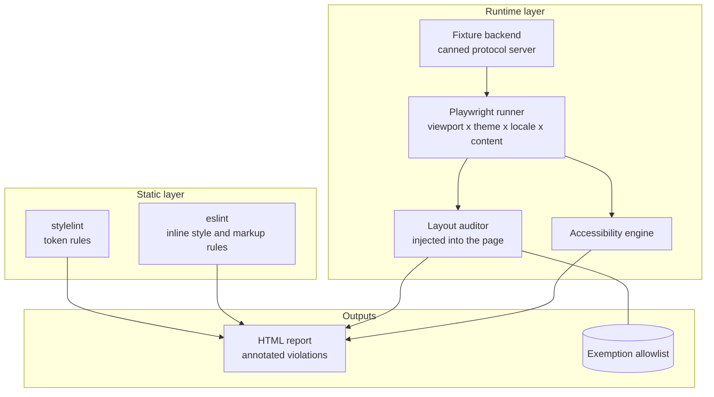
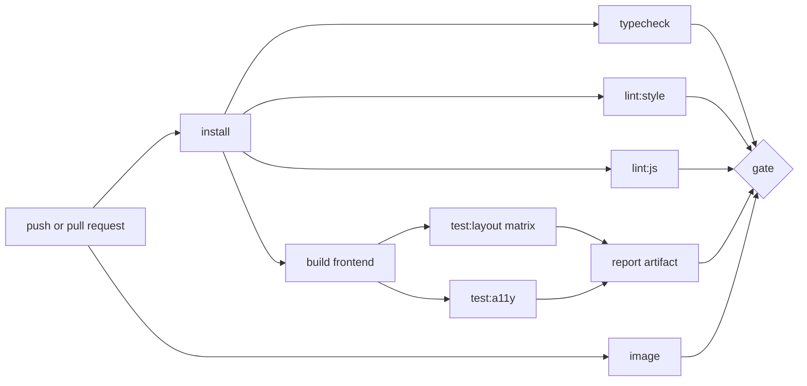

# Design and Layout Verification Toolchain - Spec Proposal

| Item       | Detail                           |
|------------|----------------------------------|
| Author     | heavycaffeiner(Dong Hyun Kim)    |
| Created    | 2026-08-09                       |
| Status     | **Draft** / In Review / Approved |
| Reviewers  |                                  |

---

## 1. Summary

This proposal defines the toolchain that verifies Docknight's interface mechanically: that every
spatial value comes from the 4 pixel token scale, that elements which should share an edge or an axis
actually do at render time, and that no screen overflows, collides, or clips under any supported
viewport, locale, or content length. It covers the static linters, the runtime layout auditor, the
deterministic fixture backend the auditor renders against, the accessibility pass, the development
overlay, and how all of it is wired into CI.

Everything here checks measured geometry, computed colour and the accessibility tree. Nothing
compares rendered images.

## 2. Background & Motivation

Docknight's design rules are only worth writing down if something checks them. The rules themselves
are specified in proposal 6: a 4 pixel base unit applied without exception, one inline-start edge per
column, one alignment axis per row, end-aligned tabular numerals, spacing from the container's `gap`.
Every one of them is easy to state, easy to agree with, and impossible to hold by review alone across
a dozen screens, two colour schemes, and thirty locales.

Three failure modes motivate a toolchain rather than a checklist.

**Drift is invisible one commit at a time.** A single card padded 14 pixels instead of 16 looks fine
in isolation and looks wrong beside the card next to it three weeks later. By then the fix touches
other things. A rule that fails the build the first time catches it while it is one line.

**A component library is not automatically on your grid.** Docknight builds on a third-party Material
3 component set. Its metrics are compatible with a 4 pixel unit, but a component that hard-codes a
value, or a wrapper that adds a margin to reach an alignment, produces geometry that no stylesheet in
this repository declares. Checking source alone misses it, so the audit has to run against the
rendered DOM.

**Layout breaks on content, not on code.** The screens hold stack names of unknown length, image
references that can exceed sixty characters, port lists that can hold twenty entries, and translated
labels that run 40 percent longer than the English they were designed against. The break appears only
when the data is unusual, which means the verification has to supply unusual data on purpose rather
than wait for a user to.

There is a fourth reason the toolchain is worth its cost here specifically: the interface has to be
rendered without a Docker host. Nothing in the UI layer needs a real daemon, and a verification suite
that requires one cannot run in CI. A deterministic fixture backend is therefore part of this proposal
and, once it exists, it is also the fastest way to develop any screen.

## 3. Goals & Non-Goals

### 3.1 Goals

- [ ] Static enforcement of the spacing, size, radius, and logical-property rules at lint time.
- [ ] A deterministic fixture backend that serves the protocol from canned data with no Docker.
- [ ] A runtime layout auditor that runs against the rendered DOM and reports rule violations with
      element paths and measured values.
- [ ] Grid conformance measured as offsets from a declared grid origin, with a stated tolerance.
- [ ] Edge and axis alignment checks for columns, rows, and numeric cells.
- [ ] Overflow, clipping, collision, and off-viewport detection.
- [ ] A content stress matrix: pseudo-locale expansion, long values, high cardinality, empty states.
- [ ] A viewport matrix covering compact through expanded, plus the WCAG reflow width.
- [ ] Colour contrast and target size checks derived from computed styles and geometry.
- [ ] An accessibility scan with an established rule engine.
- [ ] A development overlay that shows the grid and highlights live violations in place.
- [ ] An explicit, counted exemption mechanism that cannot grow silently.
- [ ] CI wiring: what runs when, what gates a merge, and what artifacts a reviewer gets.

### 3.2 Non-Goals

- [ ] Judging aesthetics. The toolchain checks measurable properties. Whether a screen is well
      designed remains a human decision.
- [ ] Image comparison of any kind. No committed screenshot baselines, no pixel diff, no pinned
      rendering environment to produce them in. The rules here assert geometry and colour, which hold
      across a redesign; a baseline image does not, and a suite whose expected output is rewritten on
      every visual change is a suite nobody reads. Screenshots exist only inside the failure report,
      where they show a human where a violation is.
- [ ] Cross-browser rendering compatibility beyond the supported baseline. Layout audits run in one
      engine; the baseline is stated in proposal 6 and the audit does not certify the others.
- [ ] Testing backend behaviour. The fixture backend replaces the server for UI verification; the
      server's own correctness is covered by its own proposals.
- [ ] Performance budgets, bundle size limits, or Core Web Vitals.
- [ ] Automatic repair. Every rule reports; none rewrites source.
- [ ] Verifying the terminal renderer's internal glyph layout, which is character-cell geometry and is
      an explicit exception in proposal 6.

## 4. Technical Design

### 4.1 Architecture Overview



Repository layout:

```
tools/
  stylelint/
    grid-tokens.cjs          custom rule: spacing properties must resolve to tokens
    logical-properties.cjs   custom rule: no physical inset or margin properties
  audit/
    index.ts                 auditor entry, injected into the page
    rules/                   one module per rule, see 4.3.4
    report.ts                violation model and HTML report writer
  fixtures/
    server.ts                deterministic protocol backend
    data/                    canned stacks, services, stats, hosts, settings
  overlay/
    overlay.svelte           development grid and violation overlay
tests/
  layout/                    Playwright specs driving the auditor
  a11y/
design/
  exemptions.json            counted, reasoned exemptions
```

### 4.2 Data Model Changes

No application database change. One file becomes part of the repository's contract.

`design/exemptions.json`, the only way an element escapes a rule:

```json
{
  "version": 1,
  "entries": [
    {
      "id": "terminal-pane-cell-metrics",
      "rule": "grid-offset",
      "selector": "[data-audit-id='terminal-surface']",
      "reason": "Character cell height comes from the monospace font, not the token scale.",
      "maxMatches": 4,
      "approvedBy": "heavycaffeiner",
      "approvedOn": "2026-08-09"
    }
  ]
}
```

Rules for the file, enforced by the runner:

- An exemption matches by `data-audit-id`, never by a CSS class or a structural selector, so a
  refactor cannot silently widen it.
- `reason` must be non-empty and must not repeat the rule name.
- `maxMatches` is the ceiling on how many elements this entry may silence in one matrix cell. A
  repeated component legitimately needs more than one, so the ceiling is declared rather than assumed,
  and exceeding it fails the run. This is what stops one entry from growing to cover a subtree.
- An entry that matches nothing for two consecutive runs is reported as stale and must be removed.
- The total across all entries is printed in every report, passing or failing, so the number is
  visible as it moves.

Markup contract: any element a rule needs to address carries `data-audit-id`. These attributes are
kept in production builds. They are a handful of bytes, they double as stable selectors for anyone
debugging a layout complaint from a user, and stripping them would make the audited build differ from
the shipped one.

### 4.3 Core Logic

#### 4.3.1 Static rules

Two custom stylelint rules plus configuration of the standard set.

`grid-tokens` restricts the values permitted on the spatial properties:

```
for each declaration whose property is in
    margin*, padding*, gap, row-gap, column-gap, inset*, top, right, bottom, left,
    width, height, min-width, min-height, max-width, max-height,
    border-radius*, translate, and the equivalents inside transform()

  accept: 0
          a var() reference to a token in the approved list
          100%, auto, min-content, max-content, fit-content
          an <flex> value such as 1fr
          calc() whose every length operand is one of the above
          a raw px length only when the property is a border or outline width
          the literal values in tools/stylelint/allowed-raw.json, currently empty

  reject: everything else, with a message naming the property, the value,
          and the nearest permitted token
```

`logical-properties` rejects `margin-left`, `padding-right`, `left`, `right`, `text-align: left|right`
and their relatives, requiring the inline and block equivalents, so right-to-left mirroring stays
automatic.

ESLint rules over Svelte markup:

- No `style="..."` attribute containing a length. Dynamic geometry goes through a CSS custom property
  set from a token.
- Any element with `role` requires the attributes that role mandates.
- Any `` requires `alt`; any icon-only button requires `aria-label`.

The static layer is fast enough for a pre-commit hook and runs first in CI, because a token typo
should not consume a browser run to be found.

What static analysis cannot see, and why the runtime layer exists: values coming from third-party
component stylesheets, values produced by `calc()` at runtime, geometry produced by flex or grid
distribution, and anything that depends on the text actually rendered.

#### 4.3.2 Fixture backend

`tools/fixtures/server.ts` implements the proposal 1 protocol over a real WebSocket and answers every
method from canned data. It runs in-process with the Vite dev server during verification runs.

```
fixtureServer(scenario):
    accept /ws, skip the origin check
    auth.login          -> succeeds for the fixture credentials, mints a fixed token
    auth.loginByToken   -> succeeds for that token
    settings.get        -> scenario.settings
    stack.list          -> scenario.stacks
    stack.get           -> scenario.stacks[name] plus canned compose text
    stack.serviceStatus -> scenario.serviceStatus[name]
    docker.stats        -> scenario.stats
    agent.list          -> scenario.agents
    terminal.join       -> scenario.terminalBuffer, then no further writes
    every mutating method -> succeeds after scenario.latency and re-emits the affected list
```

Determinism is the point, so the fixture server holds these properties:

- No clock reads and no random values. Timestamps in fixtures are literals.
- Terminal output is a fixed buffer replayed once at join, with no streaming, so a terminal pane
  measures the same on every run.
- Statistics are fixed strings, not sampled numbers.
- `scenario.latency` is zero by default. A dedicated scenario sets it high to exercise pending states.

Named scenarios, each a data module under `tools/fixtures/data/`:

| Scenario        | Content                                                                                     |
|-----------------|----------------------------------------------------------------------------------------------|
| `typical`       | 6 stacks, mixed status, 1 to 4 services each, one host                                       |
| `empty`         | No stacks, no hosts, first-run state after setup                                             |
| `single-stack`  | One stack, one service, the minimum a screen ever renders                                    |
| `dense`         | 60 stacks across 4 hosts, one stack with 12 services and 20 ports                            |
| `extreme`       | 63-character stack names, 80-character image references, 40-character service names, deep volume paths |
| `degraded`      | Two hosts offline, one stack unmanaged, one stack with invalid YAML on disk                  |
| `slow`          | 3 second latency on every method, for pending and disabled states                            |

#### 4.3.3 The auditor and its execution model

The auditor is a self-contained script evaluated inside the page after the screen has settled. It
walks the DOM once, collects geometry and computed styles, applies the rule modules, and returns a
list of violations. It never mutates the page.

```
audit(options):
    await document.fonts.ready               # metrics are wrong before the webfont loads
    await settle()                           # see below
    nodes := every element under [data-audit-root], excluding
             [hidden], display:none, visibility:hidden, and zero-area elements
    measure := for each node, { rect: getBoundingClientRect(), style: getComputedStyle(node) }
    violations := flatten(rule(nodes, measure, options) for rule in RULES)
    return violations.filter(v => not exempted(v))

settle():
    await two animation frames
    await any pending ResizeObserver callbacks to flush
    assert no CSS transition or animation is running on any measured node
    # transitions are disabled globally during verification through a stylesheet that sets
    # animation-duration and transition-duration to 0s, so this is a guard, not a wait
```

Measuring before `document.fonts.ready` is the single most common source of false results, since text
width and therefore every content-driven column changes when the real face arrives.

The Playwright runner drives it across a matrix:

| Axis     | Values                                                                 |
|----------|-------------------------------------------------------------------------|
| Screen   | Every route in proposal 6's table, plus the compose editor in edit mode  |
| Width    | 320, 360, 600, 840, 1280, 1920 CSS pixels                               |
| Theme    | light, dark                                                             |
| Locale   | `en`, `en-XA` pseudo-locale, one right-to-left locale                    |
| Scenario | `typical` for every cell; `extreme`, `dense`, `empty`, `degraded` at 360 and 1280 |

Full cross product would be wasteful, so the matrix is defined as: every screen at every width in
`en`, light and dark; plus every screen at 360 and 1280 in the pseudo-locale and the right-to-left
locale; plus the four extra scenarios at 360 and 1280. The 320 pixel width exists specifically for the
WCAG reflow requirement and asserts only the overflow rules.

#### 4.3.4 Rules

Each rule is a module exporting `check(nodes, measure, options): Violation[]`. Tolerance is 0.5 CSS
pixels unless stated, which absorbs the sub-pixel rounding that flex and grid distribution produce
without absorbing a real one-pixel mistake.

**`token-usage`.** For every measured node, the computed values of the spatial properties must equal a
token value. This is the runtime counterpart of the stylelint rule and is what catches third-party
component metrics. Reports the property, the computed value, and the nearest token.

**`grid-offset`.** The 4 pixel conformance check, and the one that has to be defined carefully.

The naive assertion, that every edge is at a multiple of 4 from the viewport origin, is wrong: a
centred container in an odd-width viewport starts at a half pixel, and every child inherits that
offset without anything being misaligned. Conformance is therefore measured relative to a declared
origin.

```
check:
    origins := elements carrying [data-grid-origin], plus the layout content box as the default
    for each measured node:
        origin := nearest ancestor origin
        for edge in [inlineStart, blockStart]:
            offset := node.rect[edge] - origin.rect[edge]
            if abs(offset mod 4) > 0.5 and abs(offset mod 4) < 3.5:
                report { node, edge, offset, nearestMultiple }
        for extent in [blockSize]:
            if abs(extent mod 4) > 0.5 and abs(extent mod 4) < 3.5:
                report { node, extent }
```

Inline extents are not checked, because a content-driven width is legitimately fractional and
constraining it would push authors toward fixed widths, which is the opposite of the goal.

Two supporting requirements make the rule stable rather than noisy:

- A container whose width is fixed at a breakpoint must be an even number of pixels, so centring never
  produces a half-pixel origin. Checked by a companion assertion on `[data-grid-origin]` elements.
- Elements inside a terminal or code editor surface are excluded by ancestor, matching proposal 6's
  character-cell exception, and that exclusion is one entry in the exemption file rather than a
  hidden condition in the rule.

**`column-edge`.** For every element carrying `[data-audit-column]`, all direct children that
participate in normal flow must share one inline-start edge within tolerance. Reports the outlier and
its delta, which is the check that catches a stray padding or an optical indent.

**`row-axis`.** For every `[data-audit-row]`, children must align on one axis. The rule accepts either:

- centre alignment, meaning every child's rect centre on the block axis is equal within tolerance, or
- first-baseline alignment, measured by taking the first text node of each child and reading
  `Range.getClientRects()[0].bottom`, which is the only reliable way to obtain a rendered baseline.

The rule picks the intended mode from `data-audit-row="center"` or `"baseline"` and reports when
neither holds.

**`numeric-alignment`.** Every `[data-audit-numeric]` cell must have `font-variant-numeric` including
`tabular-nums`, and cells within one column must share an inline-end edge. Reports both conditions
separately, because the tabular figures failure is the one that only shows up when a value changes.

**`overflow`.** Three distinct conditions:

- Horizontal document overflow: `document.scrollingElement.scrollWidth > innerWidth + 1`. Fatal at
  every width and the only rule asserted at 320 pixels.
- Element overflow: `scrollWidth > clientWidth + 1` on an element whose computed `overflow-x` is
  `visible` or `hidden` and which carries no `[data-audit-clip]` marker.
- Unintended clipping: `scrollHeight > clientHeight + 1` with `overflow-y: hidden` and no
  `-webkit-line-clamp` and no `[data-audit-clip]`, which is text silently cut off.

**`collision`.** For each `[data-audit-column]` and `[data-audit-row]`, no two in-flow children's
rects may intersect by more than 0.5 pixels. Absolutely positioned elements, elements with a
`transform`, and anything under a popover or dialog surface are excluded, since overlap is their
purpose.

**`in-viewport`.** No measured element's rect may start before 0 or end after the viewport width on
the inline axis. Catches the case where content is pushed off-screen rather than causing a scrollbar.

**`contrast`.** For every element containing a text node, resolve the effective background by walking
ancestors until an opaque background colour is found, compute the relative luminance of both colours,
and require 4.5:1, or 3:1 when the computed font size is at least 24 pixels, or at least 18.66 pixels
at weight 700 or above. Non-text interface elements carrying `[data-audit-boundary]`, such as input
outlines and status chip borders, require 3:1.

Stated limitations, because a check that overstates its coverage is worse than one that does not run:
the rule cannot evaluate text over an image or a gradient, and it treats a semi-transparent overlay by
compositing only the colours it can resolve. Elements it cannot evaluate are reported as
`contrast-unknown` and listed in the report rather than passed silently.

**`target-size`.** Every element matching the interactive selector set must have a rect of at least 48
by 48 pixels, or at least 32 by 32 with at least 8 pixels of clear space to the nearest other
interactive rect on every side. Inline links inside a paragraph are excluded, matching the WCAG
exception.

**`focus-visible`.** For each interactive element, focus it, re-measure, and require that the computed
`outline-style` is not `none` and that the outline colour differs from the adjacent background by at
least 3:1. This is the one rule that mutates page state, so it runs in its own pass after every
measuring rule has completed.

#### 4.3.5 Content stress

Two mechanisms, both driven by the runner rather than by the rules.

**Pseudo-locale `en-XA`.** Generated at build time from the English catalogue by a script: each string
is accented, wrapped in brackets, and padded to 140 percent of its original length. Accents make an
untranslated hard-coded string obvious; the padding reproduces the expansion real translations cause.
The catalogue is generated, never committed, and is excluded from the language selector in production
builds.

**Extreme content.** The `extreme` scenario supplies values at the limits the server permits: a
63-character stack name, an image reference at the registry's practical maximum, twenty ports on one
service, a volume path of 120 characters, and a service name that reaches the compose limit. Together
with the pseudo-locale this is what turns "the layout might break on long names" into a test that
fails.

Empty and degraded states are equally load-bearing and are covered by the `empty` and `degraded`
scenarios, because a zero-item list and an error banner are layouts that reviewers rarely see and
users see immediately.

#### 4.3.6 Accessibility scan

An established rule engine runs on every matrix cell, configured to the WCAG 2.1 AA rule set.
Duplicated coverage with the auditor's own contrast and target-size rules is deliberate: the engine is
authoritative for the rules it implements, and the auditor's versions exist because they report
measured values and element paths in the same format as every other rule, which is what makes the
report usable.

Violations at impact `serious` or `critical` fail the run. `moderate` and `minor` are reported and
tracked but do not gate, because the engine's heuristics produce findings on patterns that are correct
here, and a gate that is routinely overridden stops meaning anything.

#### 4.3.7 Development overlay

`tools/overlay/overlay.svelte` is mounted only in development builds, behind a keyboard shortcut.

- A 4 pixel rule drawn over the viewport, with every fourth line emphasised so 16 pixel rhythm is
  readable at a glance.
- A live run of the auditor against the current page, re-triggered on a mutation-observer callback
  debounced to 500 milliseconds.
- Violations drawn as outlines on the offending elements, with a panel listing rule, element, and
  measured delta, and a click that logs the element to the console.
- A toggle that inflates every string to the pseudo-locale in place, so expansion can be checked
  without restarting.

The overlay and the CI auditor import the same rule modules. A rule that behaves differently in the
two places is a rule that will be argued about, so there is exactly one implementation.

#### 4.3.8 Reporting

Every run produces `verification-report.html`, a single self-contained file:

- A summary table by rule and by severity.
- One entry per violation carrying the rule, the matrix cell, the `data-audit-id` path, the measured
  value, the expected value, and a cropped screenshot with the offending rect outlined.
- The exemption ledger with match counts and any stale entries.
- The list of elements the contrast rule could not evaluate.

The cropped screenshot is what makes a geometry violation actionable. A message reading
`grid-offset: inlineStart offset 14px, expected 12 or 16` is precise and still takes ten minutes to
locate without a picture.

### 4.4 CI wiring



| Job           | Runs on                | Gates a merge | Typical duration budget |
|---------------|------------------------|---------------|-------------------------|
| `typecheck`   | every push             | yes           | under 1 minute          |
| `lint:style`  | every push, pre-commit | yes           | seconds                 |
| `lint:js`     | every push, pre-commit | yes           | seconds                 |
| `test:layout` | every pull request     | yes           | under 10 minutes        |
| `test:a11y`   | every pull request     | yes, at serious and above | under 4 minutes |
| `image`       | every push and pull request | yes      | under 15 minutes        |

The `image` job builds both platforms through QEMU and pushes to GHCR only on a push, so a fork's
pull request still proves the image builds without needing a token it cannot have.

Every job runs on the plain runner image. The browser build is pinned by the Playwright version in
the lockfile, and the faces the application styles text with ship in the bundle, so the geometry that
the rules assert does not depend on what the machine has installed. Text that falls through to a
generic family is measured in whatever font the machine holds, which is the one part of a result that
is not portable.

The layout matrix runs in parallel shards. The report artifact is uploaded on both success and
failure, because a passing run's exemption ledger is the thing that shows the escape hatches growing.

A pull request that changes `design/exemptions.json` is labelled automatically, so a reviewer is told
that an exemption is part of the change rather than having to notice it.

## 5. API Design

### 5-1. New / Modified

No protocol change. The toolchain's contracts:

```ts
// tools/audit/rules/types.ts

export interface Measured {
    node: Element;
    /** Path of data-audit-id values from the audit root, for stable reporting. */
    path: string;
    rect: DOMRect;
    style: CSSStyleDeclaration;
}

export interface Violation {
    rule: string;
    severity: "error" | "warning";
    path: string;
    /** Human-readable statement of what was measured, in English. */
    message: string;
    measured: number | string;
    expected: number | string;
    /** Viewport rect to crop for the report screenshot. */
    highlight: { x: number; y: number; width: number; height: number };
}

export interface Rule {
    name: string;
    /** Rules run in declaration order. A rule that focuses or otherwise mutates
     *  the page sets `mutates` and is deferred until every measuring rule is done. */
    mutates?: boolean;
    check(nodes: Measured[], options: AuditOptions): Violation[];
}
```

```ts
// tools/audit/index.ts

/**
 * Walk the audit root, measure every visible element once, run every rule, and
 * return the violations that no exemption matches.
 *
 * Waits for font loading and for layout to settle before measuring, because text
 * metrics before the webfont resolves produce false geometry for every rule.
 */
export async function audit(options: AuditOptions): Promise<Violation[]>;

export interface AuditOptions {
    /** Grid base unit in CSS pixels. 4 for this project. */
    unit: number;
    /** Absolute tolerance in CSS pixels applied to every geometric comparison. */
    tolerance: number;
    /** Parsed design/exemptions.json. */
    exemptions: Exemption[];
    /** Rule names to skip for this cell, for example inline-extent rules at 320px. */
    skip?: string[];
}
```

```ts
// tools/fixtures/server.ts

/**
 * Start a deterministic protocol server backed by a named scenario.
 * Answers every method in the proposal 1 method map from canned data, reads no
 * clock and generates no random values, so two runs produce identical output.
 */
export function startFixtureServer(scenario: ScenarioName, port: number): Promise<FixtureServer>;

export interface FixtureServer {
    /** Push an event to every connected client, for testing live-update paths. */
    emit(event: string, endpoint: string, data: unknown): void;
    close(): Promise<void>;
}
```

Markup attributes, which are part of the component contract in proposal 7:

| Attribute                    | Meaning                                                                |
|------------------------------|-------------------------------------------------------------------------|
| `data-audit-id`              | Stable identifier used in reports and exemptions                        |
| `data-audit-root`            | The subtree the auditor walks                                           |
| `data-grid-origin`           | Declares a grid origin for offset measurement                           |
| `data-audit-column`          | Children must share one inline-start edge                               |
| `data-audit-row="center\|baseline"` | Children must share the named axis                              |
| `data-audit-numeric`         | End-aligned, tabular figures                                            |
| `data-audit-clip`            | Clipping here is intentional                                            |
| `data-audit-volatile`        | Content changes here do not count as the page failing to settle         |
| `data-audit-boundary`        | Non-text element held to the 3:1 contrast requirement                   |

Package scripts:

```
pnpm lint:style      stylelint over every stylesheet and Svelte style block
pnpm lint:js         eslint over TypeScript and Svelte markup
pnpm test:layout     Playwright matrix with the auditor
pnpm test:a11y       accessibility scan
pnpm verify          all of the above, the command CI runs
```

### 5-2. Error Handling

| Condition                                          | Behaviour                                                                                     |
|----------------------------------------------------|------------------------------------------------------------------------------------------------|
| A stylelint rule matches                            | Fail with file, line, property, value, and the nearest permitted token                        |
| An auditor rule reports at `error`                  | Fail the cell, record the violation with a cropped screenshot                                 |
| An auditor rule reports at `warning`                | Record, do not fail; warnings appear in the report summary                                    |
| An exemption matches nothing twice consecutively    | Fail with `stale exemption`, naming the entry                                                 |
| An exemption matches more elements than its `maxMatches` | Fail with `exemption over-matched`, naming the entry, the ceiling and the actual count    |
| `document.fonts.ready` does not resolve in 10 s     | Fail the cell with `fonts did not load`; never measure with fallback metrics                  |
| An animation is still running at measure time       | Fail with `page did not settle`, naming the animated element                                  |
| The fixture server fails to start                   | Fail the whole run immediately; do not fall back to a live backend                            |
| The accessibility engine reports serious or critical | Fail the cell                                                                                 |

Two policies keep the suite trustworthy:

- No rule may be disabled inline in source. The only suppression channel is `design/exemptions.json`,
  which is counted, reasoned, and reviewed.
- A rule that produces a false result is fixed or removed, not tolerated. A verification suite that
  people learn to ignore is worse than none, because it consumes CI time and produces false
  confidence.

## 6. Implementation Plan

### 6-1. Milestones

| Phase    | Task                                                                                              | Estimated Duration | Owner          |
|----------|---------------------------------------------------------------------------------------------------|--------------------|----------------|
| Phase 1  | stylelint configuration plus the `grid-tokens` and `logical-properties` custom rules, with fixtures | TBD               | heavycaffeiner |
| Phase 2  | ESLint markup rules: no inline lengths, role attribute completeness, accessible names             | TBD                | heavycaffeiner |
| Phase 3  | Fixture backend and the `typical`, `empty`, `single-stack` scenarios                              | TBD                | heavycaffeiner |
| Phase 4  | Playwright harness, the settle procedure, the verification stylesheet                             | TBD                | heavycaffeiner |
| Phase 5  | Auditor core: walk, measure, rule interface, exemption matching, violation model                   | TBD                | heavycaffeiner |
| Phase 6  | Geometry rules: `grid-offset`, `column-edge`, `row-axis`, `numeric-alignment`                      | TBD                | heavycaffeiner |
| Phase 7  | Robustness rules: `overflow`, `collision`, `in-viewport`, `token-usage`                            | TBD                | heavycaffeiner |
| Phase 8  | `contrast`, `target-size`, and the deferred `focus-visible` pass                                   | TBD                | heavycaffeiner |
| Phase 9  | Pseudo-locale generator and the `dense`, `extreme`, `degraded`, `slow` scenarios                    | TBD                | heavycaffeiner |
| Phase 10 | Matrix definition, sharding, and the HTML report with cropped violation screenshots                 | TBD                | heavycaffeiner |
| Phase 11 | Accessibility scan integration and its severity gate                                                | TBD                | heavycaffeiner |
| Phase 12 | Development overlay sharing the rule modules, with the pseudo-locale toggle                         | TBD                | heavycaffeiner |
| Phase 13 | CI workflow, artifact upload, automatic labelling for exemption changes                             | TBD                | heavycaffeiner |

Phases 1 and 2 depend on proposal 6 Phase 2 and can land with it. Phase 3 depends on proposal 1
Phase 1 for the method map. Phases 5 to 8 depend on Phase 4. Phases 9 to 11 depend on proposal 7
having screens to render, and are the phases that turn proposal 7's Phase 13 conformance pass from a
manual sweep into a gate.

Sequencing note worth stating: Phases 1 and 2 must land before the first screen is built. Retrofitting
a spacing scale across finished screens costs more than every other phase here combined.

### 6-2. Dependencies

| Package                        | Purpose                                       | Why not the standard library or a hand-rolled version                                               |
|--------------------------------|-----------------------------------------------|-------------------------------------------------------------------------------------------------------|
| `stylelint`                    | CSS rule engine and custom rule host           | Parsing CSS well enough to evaluate declarations in context is a solved problem with a plugin API      |
| `@playwright/test`             | Browser automation and the matrix runner       | Driving a real engine, waiting on fonts, and sharding a matrix across workers is not reimplementable   |
| `axe-core`                     | Accessibility rule engine                      | Encodes hundreds of WCAG mappings maintained against the specification                                  |
| `postcss-value-parser`         | Value parsing inside the custom stylelint rules | Already a stylelint dependency; parsing `calc()` operands by regular expression is where these rules go wrong |

Deliberately absent:

| Not used                       | Replaced by                                                                                  |
|--------------------------------|-----------------------------------------------------------------------------------------------|
| A visual regression service     | Nothing compares images, so there is no record for a service to hold                         |
| A component story catalogue     | The fixture backend renders real screens. A story catalogue would be a second surface to maintain and would not catch composition problems |
| A design token synchronisation tool | Tokens are twelve custom properties in one file                                          |
| An image diff library           | Nothing compares images                                                                      |

Internal dependencies: proposal 1 for the method map the fixture server implements, proposal 6 for the
token scale, the alignment rules, and the breakpoints, proposal 7 for the screens and the
`data-audit-*` attributes they carry.

## 7. References

- Material Design 3 layout and the 4dp grid: https://m3.material.io/foundations/layout/understanding-layout/spacing
- WCAG 2.1 contrast minimum, 1.4.3: https://www.w3.org/WAI/WCAG21/Understanding/contrast-minimum.html
- WCAG 2.1 non-text contrast, 1.4.11: https://www.w3.org/WAI/WCAG21/Understanding/non-text-contrast.html
- WCAG 2.1 reflow at 320 CSS pixels, 1.4.10: https://www.w3.org/WAI/WCAG21/Understanding/reflow.html
- WCAG 2.1 target size, 2.5.5: https://www.w3.org/WAI/WCAG21/Understanding/target-size.html
- WCAG relative luminance and contrast ratio definitions: https://www.w3.org/TR/WCAG21/#dfn-relative-luminance
- stylelint custom rule API: https://stylelint.io/developer-guide/rules/
- Playwright emulation and device scale factor: https://playwright.dev/docs/emulation
- axe-core rule descriptions: https://github.com/dequelabs/axe-core/blob/develop/doc/rule-descriptions.md
- `document.fonts.ready`: https://developer.mozilla.org/en-US/docs/Web/API/FontFaceSet/ready
- `Range.getClientRects`, used for baseline measurement: https://developer.mozilla.org/en-US/docs/Web/API/Range/getClientRects
- `font-variant-numeric` and tabular figures: https://developer.mozilla.org/en-US/docs/Web/CSS/font-variant-numeric
- CSS logical properties: https://developer.mozilla.org/en-US/docs/Web/CSS/CSS_logical_properties_and_values
- Companion proposals: `docknight-1-transport`, `docknight-6-frontend-shell`,
  `docknight-7-frontend-features`
