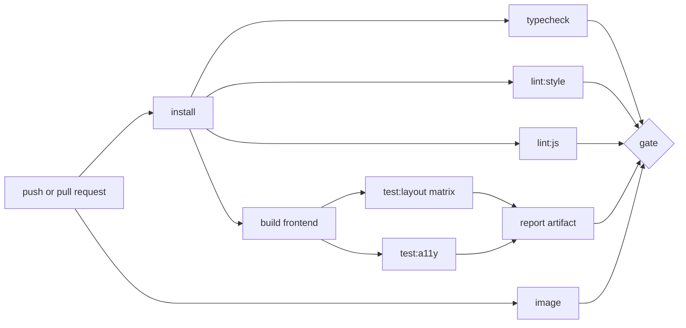

# Design and Layout Verification Toolchain - Spec Proposal (v2)

| Item       | Detail                                        |
|------------|-----------------------------------------------|
| Author     | heavycaffeiner(Dong Hyun Kim)                 |
| Created    | 2026-08-20                                    |
| Status     | **Draft** / In Review / Approved              |
| Reviewers  |                                               |
| Supersedes | docknight-8-design-verification (2026-08-09), and absorbs the verification portions of docknight-9-mobile-accessibility (2026-08-11) |

---

## 1. Summary

The toolchain that verifies Docknight's interface mechanically: that every spatial value comes from
the 4 pixel token scale, that elements which should share an edge or an axis actually do at render
time, on both box edges and glyph edges, that no screen overflows, collides, or clips under any
supported geometry, locale, or content length, and that touch targets meet the coarse-pointer rules.
It covers the static linters, the runtime layout auditor, the deterministic fixture backend, the
accessibility pass, the development overlay, and CI wiring.

Everything here checks measured geometry, computed colour and the accessibility tree. Nothing
compares rendered images.

Changes from v1, all learned from the first implementation's failures:

- The matrix samples **device geometry**, not widths at a pinned 900 pixel height. Viewport height,
  a coarse pointer, a landscape phone, and a keyboard-open short viewport are all cells. The v1
  matrix passed every rule while the phone was unusable, because a 360 pixel wide window 900 pixels
  tall driven by a mouse is not a phone.
- Two rules are added: `glyph-edge`, which measures alignment on ink rather than boxes, and
  `touch-target`, which enforces the coarse-pointer floor with size-scaled gaps.
- The `target-size` fine-pointer rule keeps its 32-with-clear-space branch; under a coarse pointer
  that branch is closed.

## 2. Background & Motivation

Docknight's design rules are only worth writing down if something checks them. The rules are in
proposal 6; every one is easy to state and impossible to hold by review alone across a dozen
screens, two colour schemes, and thirty locales.

Four failure modes motivate a toolchain rather than a checklist.

**Drift is invisible one commit at a time.** A card padded 14 pixels instead of 16 looks fine in
isolation and wrong beside the next card three weeks later. A rule that fails the build catches it
while it is one line.

**A component library is not automatically on your grid.** A third-party component that hard-codes a
value produces geometry no stylesheet in this repository declares. The audit has to run against the
rendered DOM.

**Layout breaks on content, not on code.** Stack names of unknown length, image references over
sixty characters, twenty ports on one service, translations 40 percent longer than English. The
verification supplies unusual data on purpose.

**A suite that samples the wrong space is worse than none, because it is green.** The first
implementation's suite was well built, its rules were correct, and its matrix never rendered a
phone: constant 900 pixel height, no coarse pointer, no keyboard state. Every mobile defect it was
supposed to catch passed. The matrix in 4.3.3 is the correction, and it is the part of this document
that must not regress.

The interface also has to render without a Docker host, so a deterministic fixture backend is part
of this proposal, and once it exists it is also the fastest way to develop any screen.

## 3. Goals & Non-Goals

### 3.1 Goals

- [ ] Static enforcement of the spacing, size, radius, and logical-property rules at lint time.
- [ ] A deterministic fixture backend serving the protocol from canned data with no Docker.
- [ ] A runtime layout auditor running against the rendered DOM, reporting violations with element
      paths and measured values.
- [ ] Grid conformance measured as offsets from a declared grid origin, with a stated tolerance.
- [ ] Edge and axis alignment checks for columns, rows, and numeric cells, on box edges and on
      glyph edges.
- [ ] Overflow, clipping, collision, and off-viewport detection.
- [ ] Touch target verification under an emulated coarse pointer.
- [ ] A content stress matrix: pseudo-locale expansion, long values, high cardinality, empty states.
- [ ] A geometry matrix covering real device shapes: phone portrait, phone landscape, keyboard-open,
      tablet, laptop, desktop, plus the WCAG reflow width.
- [ ] Colour contrast and target size checks derived from computed styles and geometry.
- [ ] An accessibility scan with an established rule engine.
- [ ] A development overlay showing the grid and highlighting live violations in place.
- [ ] An explicit, counted exemption mechanism that cannot grow silently.
- [ ] CI wiring: what runs when, what gates a merge, what artifacts a reviewer gets.

### 3.2 Non-Goals

- [ ] Judging aesthetics. The toolchain checks measurable properties.
- [ ] Image comparison of any kind. No committed screenshot baselines, no pixel diff. The rules
      assert geometry and colour, which hold across a redesign; a baseline image does not.
      Screenshots exist only inside the failure report.
- [ ] Cross-browser rendering compatibility beyond the supported baseline. Audits run in one engine.
- [ ] Testing backend behaviour. The fixture backend replaces the server for UI verification.
- [ ] Performance budgets, bundle size limits, or Core Web Vitals.
- [ ] Automatic repair. Every rule reports; none rewrites source.
- [ ] Verifying the terminal renderer's internal glyph layout, which is character-cell geometry and
      an explicit exception in proposal 6.
- [ ] Driving a real virtual keyboard. Playwright cannot open one; the keyboard-open cell models the
      resized viewport it produces, and the Safari `visualViewport` fallback is covered by a unit
      test against a stubbed `visualViewport`, not by a matrix cell.

## 4. Technical Design

### 4.1 Architecture Overview


Repository layout:

```
tools/
  stylelint/
    grid-tokens.cjs          custom rule: spatial properties must resolve to tokens
    logical-properties.cjs   custom rule: no physical inset or margin properties
  audit/
    index.ts                 auditor entry, injected into the page
    rules/                   one module per rule, see 4.3.4
      shared.ts              activationRect, scrollContainer, nearestNeighbour
    report.ts                violation model and HTML report writer
  fixtures/
    server.ts                deterministic protocol backend
    data/                    canned stacks, services, stats, hosts, settings
  overlay/
    overlay.svelte           development grid and violation overlay
tests/
  support/
    matrix.ts                geometries, cells, sampling
    harness.ts               page setup, settle, audit invocation
  layout/                    Playwright specs driving the auditor
  a11y/
design/
  exemptions.json            counted, reasoned exemptions
```

### 4.2 Data Model Changes

No application database change. One file is part of the repository's contract.

`design/exemptions.json`, the only way an element escapes a rule:

```json
{
  "version": 1,
  "entries": [
    {
      "id": "terminal-pane-cell-metrics",
      "rule": "grid-offset",
      "selector": "[data-audit-id='terminal-surface']",
      "reason": "Character cell height comes from the monospace font, not the token scale.",
      "maxMatches": 4,
      "approvedBy": "heavycaffeiner",
      "approvedOn": "2026-08-20"
    }
  ]
}
```

Rules for the file, enforced by the runner:

- An exemption matches by `data-audit-id`, never by a CSS class or a structural selector, so a
  refactor cannot silently widen it. It also does not name matrix cell ids, so a matrix change does
  not invalidate the ledger.
- `reason` must be non-empty and must not repeat the rule name.
- `maxMatches` is the ceiling on how many elements the entry may silence in one matrix cell.
  Exceeding it fails the run.
- An entry matching nothing for two consecutive runs is reported as stale and must be removed.
- The total across all entries is printed in every report, passing or failing.

Markup contract: any element a rule needs to address carries `data-audit-id`. These attributes are
kept in production builds; they double as stable selectors for debugging a layout complaint, and
stripping them would make the audited build differ from the shipped one.

### 4.3 Core Logic

#### 4.3.1 Static rules

Two custom stylelint rules plus configuration of the standard set.

`grid-tokens` restricts the values permitted on the spatial properties:

```
for each declaration whose property is in
    margin*, padding*, gap, row-gap, column-gap, inset*, top, right, bottom, left,
    width, height, min-width, min-height, max-width, max-height,
    border-radius*, translate, and the equivalents inside transform()

  accept: 0
          a var() reference to a token in the approved list
          100%, auto, min-content, max-content, fit-content
          an <flex> value such as 1fr
          calc() whose every length operand is one of the above
          a raw px length only when the property is a border or outline width
          the literal values in tools/stylelint/allowed-raw.json, currently empty

  reject: everything else, with a message naming the property, the value,
          and the nearest permitted token
```

`logical-properties` rejects `margin-left`, `padding-right`, `left`, `right`,
`text-align: left|right` and relatives, requiring the inline and block equivalents.

ESLint rules over Svelte markup:

- No `style="..."` attribute containing a length. Dynamic geometry goes through a CSS custom
  property set from a token.
- Any element with `role` requires the attributes that role mandates.
- Any `` requires `alt`; any icon-only button requires `aria-label`.
- No `matchMedia` result stored in plain component state. Media-query state must be reactive, so a
  window resized across a breakpoint behaves as if it had started there. (The first implementation
  had a terminal component sample `(width < 600px)` once at init.)

The static layer runs first in CI because a token typo should not consume a browser run to be found.

#### 4.3.2 Fixture backend

`tools/fixtures/server.ts` implements the proposal 1 protocol over a real WebSocket and answers
every method from canned data. It runs in-process with the Vite dev server during verification.

```
fixtureServer(scenario):
    accept /ws, skip the origin check
    auth.login          -> succeeds for the fixture credentials, mints a fixed token
    auth.loginByToken   -> succeeds for that token
    settings.get        -> scenario.settings
    stack.list          -> scenario.stacks
    stack.get           -> scenario.stacks[name] plus canned compose text
    stack.serviceStatus -> scenario.serviceStatus[name]
    docker.stats        -> scenario.stats
    agent.list          -> scenario.agents
    terminal.join       -> scenario.terminalBuffer, then no further writes
    every mutating method -> succeeds after scenario.latency and re-emits the affected list
```

Determinism properties:

- No clock reads and no random values. Timestamps in fixtures are literals.
- Terminal output is a fixed buffer replayed once at join, no streaming.
- Statistics are fixed strings, not sampled numbers.
- `scenario.latency` is zero by default; a dedicated scenario sets it high.

Named scenarios, each a data module under `tools/fixtures/data/`:

| Scenario       | Content                                                                                      |
|----------------|-------------------------------------------------------------------------------------------------|
| `typical`      | 6 stacks, mixed status, 1 to 4 services each, one host                                          |
| `empty`        | No stacks, no hosts, first-run state after setup                                                |
| `single-stack` | One stack, one service, the minimum a screen ever renders                                       |
| `dense`        | 60 stacks across 4 hosts, one stack with 12 services and 20 ports                               |
| `extreme`      | 63-character stack names, 80-character image references, 40-character service names, deep paths |
| `degraded`     | Two hosts offline, one stack unmanaged, one stack with invalid YAML on disk                     |
| `slow`         | 3 second latency on every method, for pending and disabled states                               |

#### 4.3.3 The geometry matrix

The single most important table in this document. Geometry means width, height, and pointer, never
width alone.

```ts
/** Viewport geometry. Height is what a keyboard takes and what landscape has none of. */
export interface Geometry {
    id: string;
    width: number;
    height: number;
    touch: boolean;
}

export const GEOMETRIES: readonly Geometry[] = [
    { id: "reflow",     width: 320,  height: 900,  touch: false },
    { id: "phone",      width: 390,  height: 844,  touch: true  },
    { id: "phone-wide", width: 600,  height: 900,  touch: true  },
    { id: "phone-land", width: 780,  height: 390,  touch: true  },
    { id: "keyboard",   width: 390,  height: 380,  touch: true  },
    { id: "tablet",     width: 840,  height: 1120, touch: true  },
    { id: "laptop",     width: 1280, height: 900,  touch: false },
    { id: "desktop",    width: 1920, height: 1080, touch: false },
];
```

The harness sets both dimensions and `hasTouch` per cell. `hasTouch: true` is what makes
`pointer: coarse` match, so the density tokens and the `touch-target` rule are exercised rather than
assumed.

Three geometries need their numbers justified, because the obvious choice is wrong in each case:

- `phone-land` is 780 wide, not 844: an 844 pixel wide viewport is past the 840 breakpoint and would
  test the expanded layout on a short screen, which is not what WCAG 1.3.4 asks about. 780 is a real
  phone landscape width inside the medium class, exercising that layout at 390 pixels of height.
- `keyboard` models a keyboard-open phone as a short viewport, which is what
  `interactive-widget=resizes-content` produces on the browsers that support it. It does not
  exercise the Safari path: Playwright never opens a keyboard, so `--keyboard-inset` stays 0 and
  `data-keyboard` never becomes `open`. The bar-hiding behaviour is covered by a unit test driving
  `trackViewport` against a stubbed `visualViewport`. Stated so the cell name does not imply
  coverage it lacks.
- `reflow` keeps a 900 pixel height because it runs `REFLOW_RULES` (overflow only) and WCAG 1.4.10
  is a statement about width. A realistic height would add a second failure mode to a cell that
  exists to isolate one.

The full matrix:

| Axis     | Values                                                                                   |
|----------|--------------------------------------------------------------------------------------------|
| Screen   | Every route in proposal 6's table, plus the compose editor in edit mode                    |
| Geometry | The eight above                                                                            |
| Theme    | light, dark                                                                                |
| Locale   | `en`, `en-XA` pseudo-locale, one right-to-left locale                                      |
| Scenario | `typical` for every cell; `extreme`, `dense`, `empty`, `degraded` at `phone` and `laptop` |

Full cross product would be wasteful, so sampling is: every screen at every geometry in `en`, light
and dark; plus every screen at `phone` and `laptop` in the pseudo-locale and the RTL locale; plus
the four extra scenarios at `phone` and `laptop`. `keyboard` and `phone-land` run against the
screens that carry a text field (login, setup, stack, dashboard, settings sections) and skip the
rest. `reflow` asserts only the overflow rules.

Cell ids carry the geometry id, `stack.light.laptop`, so reports and screenshot names are readable.

#### 4.3.4 The auditor and its execution model

A self-contained script evaluated inside the page after the screen has settled. It walks the DOM
once, collects geometry and computed styles, applies the rule modules, and returns violations. It
never mutates the page, with one declared exception (`focus-visible`).

```
audit(options):
    await document.fonts.ready               # metrics are wrong before the webfont loads
    await settle()                           # see below
    nodes := every element under [data-audit-root], excluding
             [hidden], display:none, visibility:hidden, and zero-area elements
    measure := for each node, { rect: getBoundingClientRect(), style: getComputedStyle(node) }
    violations := flatten(rule(nodes, measure, options) for rule in RULES)
    return violations.filter(v => not exempted(v))

settle():
    await two animation frames
    await any pending ResizeObserver callbacks to flush
    assert no CSS transition or animation is running on any measured node
    # transitions are disabled globally during verification through a stylesheet that sets
    # animation-duration and transition-duration to 0s, so this is a guard, not a wait
```

Measuring before `document.fonts.ready` is the single most common source of false results.

#### 4.3.5 Rules

Each rule is a module exporting `check(nodes, measure, options): Violation[]`. Tolerance is 0.5 CSS
pixels unless stated. Helpers shared between rules (`activationRect`, `scrollContainer`,
`nearestNeighbour`) live in `rules/shared.ts`, implemented once.

**`token-usage`.** For every measured node, the computed values of the spatial properties must equal
a token value. The runtime counterpart of the stylelint rule; catches third-party component metrics.

**`grid-offset`.** The 4 pixel conformance check, measured relative to a declared origin, because a
centred container in an odd-width viewport starts at a half pixel without anything being misaligned:

```
check:
    origins := elements carrying [data-grid-origin], plus the layout content box as the default
    for each measured node:
        origin := nearest ancestor origin
        for edge in [inlineStart, blockStart]:
            offset := node.rect[edge] - origin.rect[edge]
            if abs(offset mod 4) > 0.5 and abs(offset mod 4) < 3.5:
                report { node, edge, offset, nearestMultiple }
        for extent in [blockSize]:
            if abs(extent mod 4) > 0.5 and abs(extent mod 4) < 3.5:
                report { node, extent }
```

Inline extents are not checked: a content-driven width is legitimately fractional. A container whose
width is fixed at a breakpoint must be an even number of pixels, checked by a companion assertion on
`[data-grid-origin]` elements. Terminal and code editor surfaces are excluded by ancestor, and that
exclusion is an entry in the exemption file rather than a hidden condition.

**`column-edge`.** For every `[data-audit-column]`, all direct in-flow children share one
inline-start box edge within tolerance. A box off its column is a defect.

**`glyph-edge`.** For every `[data-audit-column]`, the left edge of the first glyph of each child
block, measured with a `Range` over the first non-empty text node, must match the column's modal
glyph edge within tolerance. This is the rule that catches ink scattering across three offsets while
every box shares an edge: a filled control's ink starts inside its own padding, and `column-edge`
alone cannot see it. Children without a text node are skipped.

**`row-axis`.** For every `[data-audit-row]`, children align on one axis: centre (block-axis rect
centres equal within tolerance) or first baseline (first text node's
`Range.getClientRects()[0].bottom`). The intended mode comes from `data-audit-row="center|baseline"`.
Additionally, interactive children of one row must share one height: a 32 pixel pill beside 40 pixel
buttons fails even when the centre axis holds, because the eye reads the outline.

**`numeric-alignment`.** Every `[data-audit-numeric]` cell has `font-variant-numeric` including
`tabular-nums`, and cells within one column share an inline-end edge.

**`overflow`.** Three conditions:

- Horizontal document overflow: `scrollWidth > innerWidth + 1` on the scrolling element. Fatal at
  every geometry and the only rule asserted at `reflow`.
- Element overflow: `scrollWidth > clientWidth + 1` on an element whose computed `overflow-x` is
  `visible` or `hidden` and which carries no `[data-audit-clip]`.
- Unintended clipping: `scrollHeight > clientHeight + 1` with `overflow-y: hidden`, no
  `-webkit-line-clamp`, no `[data-audit-clip]`.

**`collision`.** For each `[data-audit-column]` and `[data-audit-row]`, no two in-flow children's
rects intersect by more than 0.5 pixels. Absolutely positioned elements, transformed elements, and
anything under a popover or dialog surface are excluded.

**`in-viewport`.** No measured element's rect starts before 0 or ends after the viewport width on
the inline axis.

**`contrast`.** For every element containing a text node, resolve the effective background by
walking ancestors to an opaque background colour, compute relative luminance, and require 4.5:1, or
3:1 at large sizes (24 pixels, or 18.66 at weight 700). Non-text elements carrying
`[data-audit-boundary]` require 3:1. Elements the rule cannot evaluate (text over an image or
gradient) are reported as `contrast-unknown` and listed, never passed silently.

**`target-size`.** Runs under a fine pointer (`touch: false` cells). Every interactive element has a
rect of at least 48 by 48, or at least 32 by 32 with at least 8 pixels of clear space to the nearest
other interactive rect on every side. Inline links inside a paragraph are excluded, matching the
WCAG exception.

**`touch-target`.** Runs under a coarse pointer (`touch: true` cells). The floor is 48 by 48 with no
clear-space branch, and the minimum gap between two targets in the same scroll container scales with
the smaller of the two: 8 pixels at 48 and above, 12 below it. Shares `activationRect`,
`scrollContainer`, and `nearestNeighbour` with `target-size`.

**`focus-visible`.** For each interactive element, focus it, re-measure, and require that the
computed `outline-style` is not `none` and the outline colour differs from the adjacent background
by at least 3:1. The one rule that mutates page state; it runs in its own pass after every measuring
rule has completed.

#### 4.3.6 Content stress

**Pseudo-locale `en-XA`.** Generated at build time from the English catalogue: each string accented,
wrapped in brackets, padded to 140 percent of its original length. Generated, never committed,
excluded from the language selector in production builds.

**Extreme content.** The `extreme` scenario supplies values at the limits the server permits: a
63-character stack name, an image reference at the registry's practical maximum, twenty ports on one
service, a 120-character volume path.

Empty and degraded states are covered by the `empty` and `degraded` scenarios, because a zero-item
list and an error banner are layouts reviewers rarely see and users see immediately.

#### 4.3.7 Accessibility scan

axe-core runs on every matrix cell, configured to the WCAG 2.1 AA rule set. Duplicated coverage with
the auditor's own contrast and target rules is deliberate: the engine is authoritative for the rules
it implements, and the auditor's versions report measured values and element paths in the same
format as every other rule.

Violations at impact `serious` or `critical` fail the run. `moderate` and `minor` are reported and
tracked but do not gate.

#### 4.3.8 Development overlay

`tools/overlay/overlay.svelte`, mounted only in development builds, behind a keyboard shortcut.

- A 4 pixel rule drawn over the viewport, every fourth line emphasised.
- A live run of the auditor against the current page, re-triggered on a mutation-observer callback
  debounced to 500 milliseconds.
- Violations drawn as outlines on the offending elements, with a panel listing rule, element, and
  measured delta.
- A toggle that inflates every string to the pseudo-locale in place.

The overlay and the CI auditor import the same rule modules. There is exactly one implementation of
every rule.

#### 4.3.9 Reporting

Every run produces `verification-report.html`, a single self-contained file:

- A summary table by rule and by severity.
- One entry per violation carrying the rule, the matrix cell, the `data-audit-id` path, the measured
  value, the expected value, and a cropped screenshot with the offending rect outlined.
- The exemption ledger with match counts and any stale entries.
- The list of elements the contrast rule could not evaluate.

The cropped screenshot is what makes a geometry violation actionable.

### 4.4 CI wiring



| Job           | Runs on                     | Gates a merge             | Typical duration budget |
|---------------|-----------------------------|---------------------------|-------------------------|
| `typecheck`   | every push                  | yes                       | under 1 minute          |
| `lint:style`  | every push, pre-commit      | yes                       | seconds                 |
| `lint:js`     | every push, pre-commit      | yes                       | seconds                 |
| `test:layout` | every pull request          | yes                       | under 10 minutes        |
| `test:a11y`   | every pull request          | yes, at serious and above | under 4 minutes         |
| `image`       | every push and pull request | yes                       | under 15 minutes        |

The `image` job builds both platforms through QEMU and pushes to GHCR only on a push, so a fork's
pull request proves the image builds without a token it cannot have.

Every job runs on the plain runner image. The browser build is pinned by the Playwright version in
the lockfile, and the faces the application styles text with ship in the bundle, so the geometry the
rules assert does not depend on what the machine has installed. Text falling through to a generic
family is measured in whatever font the machine holds, which is the one part of a result that is not
portable.

The layout matrix runs in parallel shards. The report artifact is uploaded on success and failure,
because a passing run's exemption ledger is the thing that shows the escape hatches growing.

A pull request that changes `design/exemptions.json` is labelled automatically.

## 5. API Design

### 5-1. New / Modified

No protocol change. The toolchain's contracts:

```ts
// tools/audit/rules/types.ts

export interface Measured {
    node: Element;
    /** Path of data-audit-id values from the audit root, for stable reporting. */
    path: string;
    rect: DOMRect;
    style: CSSStyleDeclaration;
}

export interface Violation {
    rule: string;
    severity: "error" | "warning";
    path: string;
    /** Human-readable statement of what was measured, in English. */
    message: string;
    measured: number | string;
    expected: number | string;
    /** Viewport rect to crop for the report screenshot. */
    highlight: { x: number; y: number; width: number; height: number };
}

export interface Rule {
    name: string;
    /** Rules run in declaration order. A rule that focuses or otherwise mutates
     *  the page sets `mutates` and is deferred until every measuring rule is done. */
    mutates?: boolean;
    check(nodes: Measured[], options: AuditOptions): Violation[];
}
```

```ts
// tools/audit/index.ts

/**
 * Walk the audit root, measure every visible element once, run every rule, and
 * return the violations that no exemption matches.
 *
 * Waits for font loading and for layout to settle before measuring.
 */
export async function audit(options: AuditOptions): Promise<Violation[]>;

export interface AuditOptions {
    /** Grid base unit in CSS pixels. 4 for this project. */
    unit: number;
    /** Absolute tolerance in CSS pixels applied to every geometric comparison. */
    tolerance: number;
    /** Whether the cell emulates a coarse pointer; selects target-size vs touch-target. */
    coarsePointer: boolean;
    /** Parsed design/exemptions.json. */
    exemptions: Exemption[];
    /** Rule names to skip for this cell, for example everything but overflow at reflow. */
    skip?: string[];
}
```

```ts
// tests/support/matrix.ts

export interface Geometry { id: string; width: number; height: number; touch: boolean }
export const GEOMETRIES: readonly Geometry[];

export interface Cell {
    id: string;            // "<screen>.<theme>.<geometry-id>"
    screen: ScreenName;
    geometry: Geometry;
    theme: "light" | "dark";
    locale: string;
    scenario: ScenarioName;
    rules?: string[];      // REFLOW_RULES for the reflow geometry
}
export function cells(): Cell[];
```

```ts
// tools/fixtures/server.ts

/**
 * Start a deterministic protocol server backed by a named scenario. Reads no clock and
 * generates no random values, so two runs produce identical output.
 */
export function startFixtureServer(scenario: ScenarioName, port: number): Promise<FixtureServer>;

export interface FixtureServer {
    /** Push an event to every connected client, for testing live-update paths. */
    emit(event: string, endpoint: string, data: unknown): void;
    close(): Promise<void>;
}
```

Markup attributes, part of the component contract in proposal 7:

| Attribute                           | Meaning                                                         |
|-------------------------------------|------------------------------------------------------------------|
| `data-audit-id`                     | Stable identifier used in reports and exemptions                 |
| `data-audit-root`                   | The subtree the auditor walks                                    |
| `data-grid-origin`                  | Declares a grid origin for offset measurement                    |
| `data-audit-column`                 | Children share one inline-start edge, box and glyph              |
| `data-audit-row="center\|baseline"` | Children share the named axis and one interactive height         |
| `data-audit-numeric`                | End-aligned, tabular figures                                     |
| `data-audit-clip`                   | Clipping here is intentional                                     |
| `data-audit-volatile`               | Content changes here do not count as failing to settle           |
| `data-audit-boundary`               | Non-text element held to the 3:1 contrast requirement            |

Package scripts:

```
pnpm lint:style      stylelint over every stylesheet and Svelte style block
pnpm lint:js         eslint over TypeScript and Svelte markup
pnpm test:layout     Playwright matrix with the auditor
pnpm test:a11y       accessibility scan
pnpm verify          all of the above, the command CI runs
```

### 5-2. Error Handling

| Condition                                                 | Behaviour                                                                       |
|-----------------------------------------------------------|------------------------------------------------------------------------------------|
| A stylelint rule matches                                  | Fail with file, line, property, value, and the nearest permitted token             |
| An auditor rule reports at `error`                        | Fail the cell, record the violation with a cropped screenshot                      |
| An auditor rule reports at `warning`                      | Record, do not fail; warnings appear in the report summary                         |
| An exemption matches nothing twice consecutively          | Fail with `stale exemption`, naming the entry                                      |
| An exemption matches more elements than its `maxMatches`  | Fail with `exemption over-matched`, naming the entry, the ceiling, the actual count |
| `document.fonts.ready` does not resolve in 10 s           | Fail the cell with `fonts did not load`; never measure with fallback metrics       |
| An animation is still running at measure time             | Fail with `page did not settle`, naming the animated element                       |
| The fixture server fails to start                         | Fail the whole run immediately; do not fall back to a live backend                 |
| The accessibility engine reports serious or critical      | Fail the cell                                                                      |

Two policies keep the suite trustworthy:

- No rule may be disabled inline in source. The only suppression channel is
  `design/exemptions.json`, which is counted, reasoned, and reviewed.
- A rule that produces a false result is fixed or removed, not tolerated. A suite people learn to
  ignore consumes CI time and produces false confidence.

## 6. Implementation Plan

### 6-1. Milestones

| Phase    | Task                                                                                                  | Estimated Duration | Owner          |
|----------|-----------------------------------------------------------------------------------------------------------|--------------------|----------------|
| Phase 1  | stylelint configuration plus the `grid-tokens` and `logical-properties` custom rules, with fixtures        | TBD                | heavycaffeiner |
| Phase 2  | ESLint markup rules: no inline lengths, role completeness, accessible names, no sampled media queries      | TBD                | heavycaffeiner |
| Phase 3  | Fixture backend and the `typical`, `empty`, `single-stack` scenarios                                       | TBD                | heavycaffeiner |
| Phase 4  | Playwright harness: `GEOMETRIES`, cell construction with height and `hasTouch`, settle procedure            | TBD                | heavycaffeiner |
| Phase 5  | Auditor core: walk, measure, rule interface, exemption matching, violation model, `rules/shared.ts`         | TBD                | heavycaffeiner |
| Phase 6  | Geometry rules: `grid-offset`, `column-edge`, `glyph-edge`, `row-axis`, `numeric-alignment`                 | TBD                | heavycaffeiner |
| Phase 7  | Robustness rules: `overflow`, `collision`, `in-viewport`, `token-usage`                                     | TBD                | heavycaffeiner |
| Phase 8  | `contrast`, `target-size`, `touch-target`, and the deferred `focus-visible` pass                            | TBD                | heavycaffeiner |
| Phase 9  | Pseudo-locale generator and the `dense`, `extreme`, `degraded`, `slow` scenarios                            | TBD                | heavycaffeiner |
| Phase 10 | Matrix sampling, sharding, the HTML report with cropped violation screenshots                               | TBD                | heavycaffeiner |
| Phase 11 | Accessibility scan integration and its severity gate                                                        | TBD                | heavycaffeiner |
| Phase 12 | Unit test for `trackViewport` against a stubbed `visualViewport` (the Safari keyboard path)                 | TBD                | heavycaffeiner |
| Phase 13 | Development overlay sharing the rule modules, with the pseudo-locale toggle                                 | TBD                | heavycaffeiner |
| Phase 14 | CI workflow, artifact upload, automatic labelling for exemption changes                                     | TBD                | heavycaffeiner |

Phases 1 and 2 depend on proposal 6 Phase 2 and land with it. Phase 3 depends on proposal 1 Phase 1
for the method map. Phases 5 to 8 depend on Phase 4. Phases 9 to 11 depend on proposal 7 having
screens to render.

Sequencing notes, both non-negotiable:

- Phases 1 and 2 land before the first screen is built. Retrofitting a spacing scale across finished
  screens costs more than every other phase here combined.
- Phase 4, the geometry matrix, lands before proposal 7's conformance phases begin. Every screen is
  judged against real device geometry from its first review, not retrofitted the way the first
  implementation had to be.

### 6-2. Dependencies

| Package                | Purpose                                         | Why not the standard library or a hand-rolled version                                                |
|------------------------|-------------------------------------------------|----------------------------------------------------------------------------------------------------------|
| `stylelint`            | CSS rule engine and custom rule host            | Parsing CSS well enough to evaluate declarations in context is a solved problem with a plugin API         |
| `@playwright/test`     | Browser automation and the matrix runner        | Driving a real engine, waiting on fonts, emulating touch, and sharding a matrix is not reimplementable    |
| `axe-core`             | Accessibility rule engine                       | Encodes hundreds of WCAG mappings maintained against the specification                                    |
| `postcss-value-parser` | Value parsing inside the custom stylelint rules | Already a stylelint dependency; parsing `calc()` operands by regular expression is where these rules go wrong |

Deliberately absent:

| Not used                            | Replaced by                                                                     |
|-------------------------------------|------------------------------------------------------------------------------------|
| A visual regression service         | Nothing compares images                                                            |
| A component story catalogue         | The fixture backend renders real screens; a catalogue would not catch composition   |
| A design token synchronisation tool | Tokens are a handful of custom properties in one file                              |
| An image diff library               | Nothing compares images                                                            |

Internal dependencies: proposal 1 for the method map the fixture server implements, proposal 6 for
the token scale, the alignment rules, the size classes and the pointer model, proposal 7 for the
screens and the `data-audit-*` attributes they carry.

## 7. References

- Material Design 3 layout and the 4dp grid: https://m3.material.io/foundations/layout/understanding-layout/spacing
- WCAG 2.1 contrast minimum, 1.4.3: https://www.w3.org/WAI/WCAG21/Understanding/contrast-minimum.html
- WCAG 2.1 non-text contrast, 1.4.11: https://www.w3.org/WAI/WCAG21/Understanding/non-text-contrast.html
- WCAG 2.1 reflow at 320 CSS pixels, 1.4.10: https://www.w3.org/WAI/WCAG21/Understanding/reflow.html
- WCAG 2.1 orientation, 1.3.4: https://www.w3.org/WAI/WCAG21/Understanding/orientation.html
- WCAG 2.2 target size minimum, 2.5.8: https://www.w3.org/WAI/WCAG22/Understanding/target-size-minimum.html
- WCAG 2.1 target size enhanced, 2.5.5: https://www.w3.org/WAI/WCAG21/Understanding/target-size.html
- WCAG relative luminance and contrast ratio definitions: https://www.w3.org/TR/WCAG21/#dfn-relative-luminance
- stylelint custom rule API: https://stylelint.io/developer-guide/rules/
- Playwright emulation, `hasTouch` and viewport: https://playwright.dev/docs/emulation
- axe-core rule descriptions: https://github.com/dequelabs/axe-core/blob/develop/doc/rule-descriptions.md
- `document.fonts.ready`: https://developer.mozilla.org/en-US/docs/Web/API/FontFaceSet/ready
- `Range.getClientRects`, used for baseline and glyph measurement: https://developer.mozilla.org/en-US/docs/Web/API/Range/getClientRects
- `font-variant-numeric` and tabular figures: https://developer.mozilla.org/en-US/docs/Web/CSS/font-variant-numeric
- `pointer` media feature: https://developer.mozilla.org/en-US/docs/Web/CSS/@media/pointer
- Companion proposals: `docknight-1-transport`, `docknight-6-frontend-shell`,
  `docknight-7-frontend-features`
